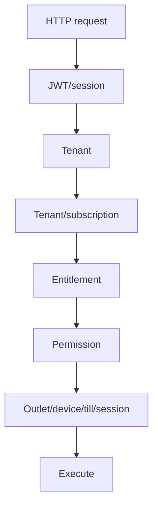

=== 03_USER_JOURNEYS/Tenant_Admin/09_Product_Management_Flow.md ===

<!-- title: Tenant Admin Product Management Flow -->
<!-- status: Active -->
<!-- system: OneVerz POS MVP -->
<!-- last_updated: 2026-08-11 -->

# Tenant Admin Product Management Flow

## Purpose

Defines the manual product management flows for the Tenant Admin, including the canonical 8-step wizard (Reference UI 2 alignment), draft saving, details overview, editing, duplicating, archiving, and manual popular product curation. Product import workflows are removed from this active interface scope.

## Actor

Tenant Admin

## Trigger

Tenant Admin opens product management navigation menu.

## Preconditions

- Tenant Admin has product management permissions (`catalog.products.view`, `catalog.products.create`, `catalog.products.update`, `catalog.variants.manage`).
- Categories and brands are seeded and available.

---

## Main Flow: Fixed 8-Step Product Creation Wizard

| Step | Wizard Step Name | System & User Behavior |
|---:|---|---|
| 1 | **Step 1 — Basic Details** | User inputs Product Name (mandatory), Category (mandatory), Brand (optional), Short Name / Internal Code, Short Description, Long Description, and Product Images. |
| 2 | **Step 2 — Product Type & Tracking** | User selects Product Type (`SIMPLE`, `VARIANT`, `BUNDLE`) and Inventory Tracking rules. Standard Quantity, Batch/Lot, Expiry, and Serial tracking combinations are validated. |
| 3 | **Step 3 — Units & Pack Conversion** | Applicable when Track Inventory = ON. Configures Single Unit Only or Multiple Units & Pack Conversion. Auto-bypassed when Track Inventory = OFF. SIMPLE + Track Inventory ON navigates to Step 5; VARIANT navigates to Step 4. BUNDLE products strictly skip this step (`NOT_APPLICABLE`). |
| 4 | **Step 4 — Product Configuration** | Simple Product auto-skips (`NOT_APPLICABLE`). Variant Product renders Variant Matrix, Options, Values, Display Labels, Include Variant toggles, and Image Overrides (`Tenant_Admin_Product_Variant_Configuration_Specification`). Bundle/Kit renders Component candidate search and assembly. |
| 5 | **Step 5 — Barcode & SKU** | Configures SKU and Barcodes (Global / UOM-specific). Enforces tenant-wide uniqueness. |
| 6 | **Step 6 — Pricing & Tax** | Inputs Cost Price, Standard Selling Price, promotional pricing, tax classes, and outlet price overrides. Calculates margins. |
| 7 | **Step 7 — Channel Visibility** | Sets visibility and orderability matrices for In-Store POS and Online Store sales channels. |
| 8 | **Step 8 — Review & Create** | Displays full review summary across all 7 preceding sections. User clicks Create/Publish to complete server validation and publish product. |

---

## Detailed Step 4 User Journey: Variant Configuration

### Entry & Applicability
- **VARIANT Product**: Enters Step 4 from Step 3 (if Track Inventory ON) or Step 2 (if Track Inventory OFF).
- **SIMPLE Product**: Auto-bypassed.
- **BUNDLE Product**: Renders Kit Component Assembly.

### Main Screen Actions & Matrix Generation
1. User defines attributes by selecting attribute name (e.g. Size, Colour) and picking active values (e.g. S, M, L / Red, Blue).
2. User clicks `Generate Variants`. Backend/Flutter computes Cartesian product ($3 \times 2 = 6$ combinations).
3. Summary card updates: `6 Variants Generated`, `2 Attributes Defined`, `6 Included`.
4. Generated Variants table displays `Variant` (e.g. `Red / S`), image thumbnail, and actions (`Edit`, `Delete`).
5. SKU, Barcode, Selling Price, Cost Price, Tax, and Channel Visibility are NOT displayed in Step 4.

### Edit Variant Right-Side Drawer
1. Clicking `Edit` opens right-side drawer.
2. User views read-only combination label and attribute badges.
3. User edits `Display Label` (e.g. `Home Jersey - Red / S`).
4. User toggles **`Include Variant`** (ON/OFF). (NEVER labeled Availability).
5. User manages variant image (uploads custom image, applies colour-group image, or removes override).
6. Clicking `Save Changes` applies edits to wizard state.

### Delete Variant Confirmation Modal
1. Clicking `Delete` opens centered confirmation modal.
2. User confirms deletion. Combination is archived as tombstone (`status = 'ARCHIVED'`).
3. Table and summary card update. Success toast is displayed.

---

## Access and Security Rules

- Strict server-side enforcement of tenant-isolation contexts.
- Permission enforcement: `catalog.products.create` / `catalog.products.update` + `catalog.variants.manage`.
- Feature entitlement enforcement: `product_catalog` (Module: `product_management`).

---

## Related Specifications

- [[../../04_MODULE_KNOWLEDGE/12_Product_Option_Variant_Configuration/Tenant_Admin_Product_Variant_Configuration_Specification]]
- [[../../04_MODULE_KNOWLEDGE/10_Product_Core/05_Tenant_Admin_Add_Product_8_Step_Contract]]


### Bundle / Kit Flow

The final canonical Bundle flow completely skips Step 3. The exact user journey is:

```text
Step 1 — Basic Details
        ↓
Step 2 — Product Type & Tracking
        ↓
Select Bundle / Kit
        ↓
Bundle parent inventory tracking forced OFF
        ↓
Step 3 — NOT_APPLICABLE
        ↓
DIRECT
Step 4 — Product Configuration
        ↓
Bundle / Kit Composition
        ↓
Step 5 — Barcode & SKU
        ↓
Step 6 — Pricing & Tax
        ↓
Step 7 — Channel Visibility
        ↓
Step 8 — Review & Create
```

**Navigation Rules**:
- BUNDLE: Step 2 → Step 4.
- Step 3 is never rendered. It is fully `NOT_APPLICABLE`.
- Back navigation from Step 4 returns to Step 2 for BUNDLE products.


=== 04_MODULE_KNOWLEDGE/10_Product_Core/01_Module_Overview.md ===

<!-- title: Product Core Module Overview -->
<!-- status: Active -->
<!-- system: OneVerz POS MVP Unified Commerce Scope -->
<!-- last_updated: 2026-06-29 -->

# Product Core Module Overview

## Purpose

Manage products and variants that can be sold in mobile POS, desktop POS, online store, click and collect, and temporary retail locations.

This module is part of the new OneVerz POS MVP scope: mobile and desktop EPOS,
responsive online store, offline-capable operation, click and collect, multi-device
support, and low-cost hardware usage for events, stalls, food and beverage,
merchandising, attractions, and temporary retail locations.

## MVP Position

| Item | Decision |
|---|---|
| Module | `Product_Core` |
| Module number | 10 |
| Primary users | Tenant Admin, Store Manager, Cashier consumer |
| Frontend surfaces | Product list, Product form, Variant management, POS product grid/search |
| API groups | `/api/v1/tenant-admin/products`, `/api/v1/tenant-admin/products/imports`, `/api/v1/pos/products`, `/api/v1/storefront/products` |

## Main Tables

| Table | Role |
|---|---|
| `products` | Stores parent product records, setup steps, status, and audit parameters. |
| `product_variants` | Stores sellable variant details, SKU, and barcode links. |
| `product_import_batches` | Stores metadata for CSV product import runs. |
| `product_import_rows` | Stores row-level parsed and validated import records. |

## Core Business Rules

- Product and variant identifiers are tenant-scoped.
- SKU and barcode uniqueness must be enforced by tenant and variant rules.
- Variants carry sellable identity; price and stock remain separate modules.
- Inactive products cannot be sold through POS or online store.
- POS may cache product reference data, but backend remains final authority.

### Bundle / Kit Core Domain Rules
- Bundle / Kit is defined as one sellable parent Product, one parent SKU, one parent Barcode, one Bundle selling price, and multiple existing Product / exact Variant components.
- Inventory is component-based; there is NO Bundle parent physical stock.
- The Bundle parent MUST have:
  - `products.product_structure = 'BUNDLE'`
  - `product_inventory_settings.is_stock_tracked = false`
  - `product_inventory_settings.requires_batch_tracking = false`
  - `product_inventory_settings.requires_expiry_tracking = false`
  - `product_inventory_settings.requires_serial_tracking = false`
- A Bundle parent MUST NOT have a physical stock ledger (`inventory_balances` directly for the bundle parent is non-existent). Inventory tracking at the parent level is strictly disabled. Component stock deduction does NOT imply parent stock tracking is enabled.

## Access Summary

| Control | Rule |
|---|---|
| Authentication | Required for protected staff/customer/admin actions |
| Tenant status | Tenant must be active or allowed for the requested operation |
| Feature entitlement | Required when this module is plan or add-on controlled |
| Permission | Required for staff/admin protected actions |
| Tenant isolation | Tenant-owned records must never leak across tenants |
| Audit/event history | Required for sensitive status, payment, inventory, auth, and access changes |

## Dependencies

- [[../09_Catalog_Master_Data/01_Module_Overview]]
- [[../14_Pricing_Tax_Management/01_Module_Overview]]
- [[../16_Inventory_Foundation_Stock_Availability/01_Module_Overview]]

## Out Of Scope

- Price list calculation
- Tax rule ownership
- Stock movement ledger
- Customer cart persistence

## Related Files

- [[04_MODULE_KNOWLEDGE/10_Product_Core/02_Functional_Rules]]
- [[04_MODULE_KNOWLEDGE/10_Product_Core/03_Technical_Contract]]
- [[04_MODULE_KNOWLEDGE/10_Product_Core/04_Tenant_Admin_Product_List_And_Import_Contract]]


=== 04_MODULE_KNOWLEDGE/10_Product_Core/02_Functional_Rules.md ===

<!-- title: Product Core Functional Rules -->
<!-- status: Active -->
<!-- system: OneVerz POS MVP Unified Commerce Scope -->
<!-- last_updated: 2026-08-11 -->

# Product Core Functional Rules

## Purpose

Defines business and UX rules for `Product_Core` in the OneVerz POS MVP scope.
These rules must be applied before creating backend APIs, Flutter screens, responsive online store screens, Angular/admin screens, tests, or database changes.

## Business Rules

- Product and variant identifiers are tenant-scoped.
- SKU and barcode uniqueness must be enforced by tenant and variant rules.
- Base sellable Simple Products carry primary catalog identity directly on `products` and do NOT require dummy or shadow rows in `product_variants`.
- Variants carry sellable identity for Variant products (`productStructure = VARIANT`); price and stock remain separate modules.
- Add Product Step 4 is polymorphic:
  - SIMPLE: Auto-bypassed / `NOT_APPLICABLE`.
  - VARIANT: Renders Variant Configuration (`Tenant_Admin_Product_Variant_Configuration_Specification`).
  - BUNDLE: Renders Kit Component Assembly.
- Step 4 for VARIANT mode defines options, values, Cartesian matrix, display labels, variant inclusion toggles (`Include Variant`), and variant image overrides. It does NOT configure SKU, Barcode, Selling Price, Cost Price, Tax, Opening Stock, Stock Quantity, or Channel Visibility (belonging to Steps 5, 6, and 7).
- Inactive products cannot be sold through POS or online store.
- POS may cache product reference data, but backend remains final authority.

## Related Specifications

- [[../12_Product_Option_Variant_Configuration/Tenant_Admin_Product_Variant_Configuration_Specification]]
- [[Tenant_Admin_Product_Type_Tracking_Specification]]
- [[Tenant_Admin_Product_Units_Pack_Conversion_Specification]]
- [[05_Tenant_Admin_Add_Product_8_Step_Contract]]

## Bundle / Kit Functional Rules

### Component Eligibility
Eligible Simple Product components must be:
- Same tenant
- ACTIVE
- Sellable
- Inventory tracked
- Accessible
- Not Bundle (Nested bundles blocked)
- Not deleted
- Not archived
- Not Draft

For Variant Products, the component MUST resolve to one exact ACTIVE Variant.

### Required Quantity
- Mandatory
- Greater than 0
- Blank/zero/negative are invalid.
- Whole UOM: integer only.
- Fractional UOM: decimal allowed according to existing precision rules.

### Duplicates
Duplicate identity is `componentProductId` (Simple) or `componentProductId + componentVariantId` (Variant).
If already configured:
`This component is already in the bundle. Update the existing quantity?`
- Add mode: new quantity increments existing.
- Edit mode: new quantity replaces existing.
- Do NOT create duplicate DB rows.

### Zero Stock
A valid ACTIVE component with zero current Outlet stock may still be configured.
Result: `Supports Bundles = 0` and `Bundle Available Quantity = 0`. Configuration remains valid, but sale is blocked. Negative stock is not allowed.

### Nested Bundle and Substitution
- Bundle cannot contain another Bundle in Release 1.
- Self-references are blocked.
- No POS component substitution in Release 1.

### Product Structure Change
Changing `BUNDLE` → `SIMPLE` or `VARIANT` requires destructive confirmation.
- **Confirm**: Removes/retires Bundle configuration (`combo_definitions`, `combo_components`), clears component mappings, resets Step 4 completion, clears derived state, and applies new structure rules.
- **Cancel**: Retains BUNDLE and its components.


=== 04_MODULE_KNOWLEDGE/10_Product_Core/03_Technical_Contract.md ===

<!-- title: Product Core Technical Contract -->
<!-- status: Active -->
<!-- system: OneVerz POS MVP Unified Commerce Scope -->
<!-- last_updated: 2026-08-11 -->

# Product Core Technical Contract

## Purpose

Defines the technical implementation contract for `Product_Core` in the OneVerz POS MVP scope.

## API Contract

| Area | Contract |
|---|---|
| API groups | `/api/v1/tenant-admin/products`, `/api/v1/tenant-admin/products/draft`, `/api/v1/tenant-admin/products/{id}/setup`, `/api/v1/pos/products`, `/api/v1/storefront/products` |
| Draft API Pipeline | Single `PUT /api/v1/tenant-admin/products/{productId}/draft` endpoint supporting polymorphic step graph payloads (`currentSetupStep=1..8`). |
| Request format | Typed request DTOs (`SaveProductDraftRequest`); step-specific graphs passed via polymorphic payload structures. |
| Response format | Typed `ProductDraftResponse` and `ProductSetupWizardDto` with full setup projections. |
| Tenant context | Resolved server-side for tenant-owned records. |
| Bundle Candidate Search | `GET /api/v1/tenant-admin/products/{productId}/bundle-component-candidates` with standard pagination (`items[]`, `page`, `pageSize`, `totalCount`). Includes `categoryId`, `categoryName`. |
| Exact Variant Selector | `GET /api/v1/tenant-admin/products/{bundleProductId}/bundle-component-candidates/{candidateProductId}/variants?outletId={outletId}` to return only eligible active Variants. |

### Bundle Configuration DTO
The canonical Step 4 payload structure:
```json
{
  "currentSetupStep": 4,
  "wizardAction": "SAVE_DRAFT",
  "expectedRowVersion": 7,
  "bundleConfiguration": {
    "comboDefinitionId": null,
    "components": [
      {
        "comboComponentId": null,
        "componentProductId": "uuid",
        "componentVariantId": null,
        "componentUomId": "uuid",
        "requiredQuantity": 2.0000,
        "sortOrder": 1
      }
    ]
  }
}
```
*Note: Derived fields like `availableStock`, `supportsBundles`, `bundleAvailableQuantity`, `limitingComponent`, `trackingLabel`, `estimatedCost` MUST NOT be sent in the persisted payload.*

## Database Contract

| Table | Role |
|---|---|
| `products` | Stores parent product records, setup steps (`current_setup_step`), status, and row version. |
| `product_variants` | Stores sellable variant details, SKU, `variant_name` (`displayLabel`), `is_sellable` (`included`), `option_combination_hash` (`char(64)`), and UOM links for VARIANT products. |
| `product_options` | Stores product option headers owned by tenant. |
| `product_option_values` | Stores product option values owned by tenant (`image_media_asset_id`). |
| `product_variant_option_values` | Maps `product_variants` to `product_option_values`. |

> [!NOTE]
> Database Migration Required: **NO**. All required tables and columns already exist in EF Core ModelSnapshot.

## Related Specifications

- [[../12_Product_Option_Variant_Configuration/Tenant_Admin_Product_Variant_Configuration_Specification]]
- [[Tenant_Admin_Product_Type_Tracking_Specification]]
- [[Tenant_Admin_Product_Units_Pack_Conversion_Specification]]
- [[05_Tenant_Admin_Add_Product_8_Step_Contract]]

## Bundle Technical Contract

### Structure-Aware Navigation
The navigation logic must NOT use a generic `nextStep = currentStep + 1` for Bundles.
Use a semantic resolver such as `ResolveNextApplicableSetupStep(...)`.
```text
If productStructure = BUNDLE:
    completedSetupStep = 2
    Step 3 applicability = NOT_APPLICABLE
    targetSetupStep = 4
```
Flutter must obey `targetSetupStep = 4`. 

### Legacy Draft Normalization
For stale historical drafts containing `productStructure = BUNDLE` and `currentSetupStep = 3`:
`GET setup` → detect BUNDLE + Step 3 → normalize navigation target to Step 4 → never render Units & Pack Conversion.

### Draft Resume
`GET /api/v1/tenant-admin/products/{productId}/setup` restores persisted fields (`comboDefinitionId`, `comboComponentId`, `componentProductId`, `componentVariantId`, `componentUomId`, `requiredQuantity`, `sortOrder`).
Display projection is derived from selected Outlet. Derived projections must not be stored as Bundle configuration truth.

### Error Contract
Canonical Bundle error codes mapping to `errorCode`, `field`, `message`, and `HTTP status`:
- `product.bundle.minimum_components_required`
- `product.bundle.component_quantity_invalid`
- `product.bundle.component_quantity_precision_invalid`
- `product.bundle.exact_variant_required`
- `product.bundle.variant_product_mismatch`
- `product.bundle.duplicate_component`
- `product.bundle.component_inactive`
- `product.bundle.component_archived`
- `product.bundle.component_not_inventory_tracked`
- `product.bundle.nested_bundle_not_allowed`
- `product.bundle.self_reference_not_allowed`
- `product.bundle.component_uom_invalid`
- `product.bundle.outlet_not_accessible`
- `product.bundle.component_no_longer_eligible`
- `product.bundle.permission_denied`
- `product.bundle.entitlement_required`
- `product.bundle.row_version_conflict` (HTTP 409)

### Audit Contract
Persisted mutations must trigger exact audit event names:
- `PRODUCT_BUNDLE_CONFIGURATION_SAVED`
- `PRODUCT_BUNDLE_COMPONENT_ADDED`
- `PRODUCT_BUNDLE_COMPONENT_UPDATED`
- `PRODUCT_BUNDLE_COMPONENT_REMOVED`
Metadata: `tenantId`, `ProductId`, `ComboDefinitionId`, `ComponentProductId`, `ComponentVariantId`, old quantity, new quantity, actor, timestamp, `rowVersion`. Unsaved drawer changes are not audited.

### NFR (Non-Functional Requirements)
- **Security**: Strict tenant isolation, server-side permissions/entitlement, Outlet authorization, no stock/cost leakage. Never trust client available stock or tracking type; server re-resolves them.
- **Performance**: Server-side paginated search, debounce, request cancellation. Avoid N+1 queries; batched inventory lookups only.
- **Reliability**: Failed API does not clear local components. Failed Save does not advance.
- **Consistency**: Final POS sale must revalidate actual inventory transactionally.
- **Concurrency & Atomicity**: Product rowVersion validation (409). Bundle save atomic. POS component deduction atomic.


=== 04_MODULE_KNOWLEDGE/10_Product_Core/05_Tenant_Admin_Add_Product_8_Step_Contract.md ===

<!-- title: Tenant Admin Add Product 8-Step Implementation Contract -->
<!-- status: Active -->
<!-- system: OneVerz POS MVP Unified Commerce Scope -->
<!-- last_updated: 2026-08-09 -->

# Tenant Admin Add Product 8-Step Implementation Contract

## 1. Executive Summary & Scope

This contract defines the authoritative specification for the **Tenant Admin Add Product / Product Setup** feature in OneVerz POS Unified Commerce. It replaces the legacy 4-step Product Add UI with a **FIXED 8-STEP WIZARD** aligned with **Reference UI 2**.

This document serves as the single source of truth for Frontend (Flutter), Backend (.NET Web API), Database Schema, Access Control, and QA teams.

---

## 2. Fixed 8-Step Wizard Lifecycle

The Add Product experience is structured into exactly 8 sequential steps:

1. **Step 1 — Basic Details** (General info, mandatory Category, optional Brand, Product Image upload, Status & Options quick toggles)
2. **Step 2 — Product Type & Tracking** (`SIMPLE`, `VARIANT`, `BUNDLE` selection and tracking combinations)
3. **Step 3 — Units & Pack Conversion** (Base UOM, purchase/sales UOM, and conversion factors)
4. **Step 4 — Product Configuration** (Simple: Not Applicable auto-skip; Variant: Variant Matrix & Options; Bundle: Component search & assembly)
5. **Step 5 — Barcode & SKU** (SKU, barcode type, UOM mapping, uniqueness rules)
6. **Step 6 — Pricing & Tax** (Cost price, standard selling price, tax classes, price lists, outlet overrides)
7. **Step 7 — Channel Visibility** (In-Store POS, Online Store matrices)
8. **Step 8 — Review & Create** (Verification summary across all sections, inline edit links, final atomic publish)

### Step 4 Canonical Naming Rule
- Canonical step title is **"Product Configuration"**.
- Do NOT label Step 4 as "Variants Configuration" globally.
- Simple Products mark Step 4 as **Not Applicable** and auto-skip to Step 5.
- Variant Products render Variant Matrix configuration inside Step 4.
- Bundle Products render Kit Component configuration inside Step 4.

---

## 3. Step 1 — Basic Details Contract (Reference UI 2 Alignment)

### Form Fields & Traceability Matrix

| UI Field Label | Mandatory | Data Type | Validation Rules | Default Value | API Request Property | Entity Property | Database Column | Notes |
|---|---|---|---|---|---|---|---|---|
| Product Name | YES | String | Max 200 chars, Non-empty | None | `productName` | `Product.ProductName` | `products.product_name` | Mandatory |
| Short Name / Internal Code | NO | String | Max 80 chars, Alphanumeric/dash | Auto-slug | `shortName` / `productCode` | `Product.ProductCode` | `products.product_code` | Auto-generated if blank upon Save |
| Category | YES | UUID | Must exist in `categories` | None | `categoryId` | `Product.CategoryId` | `product_categories.category_id` | Primary category map |
| Brand | NO (Optional) | UUID | Must exist in `brands` | NULL | `brandId` | `Product.BrandId` | `products.brand_id` | **Optional** |
| Short Description | NO | String | Max 500 chars | NULL | `shortDescription` | `Product.ShortDescription` | `products.short_description` | Text |
| Long Description | NO | String | Max 4000 chars | NULL | `longDescription` | `Product.LongDescription` | `products.long_description` | Rich text / markdown |
| Product Image | NO | File/URL | Max 10 images, ≤5MB each, PNG/JPG | Compact Card / Overlay | `mediaAssetId` / `stagedMediaAssets` | `ProductImage.MediaAssetId` | `product_images.media_asset_id` | Compact upload card opens Product Images Manager panel |

> [!IMPORTANT]
> SKU, Barcode, Unit Type, and Variant Templates DO NOT belong to Step 1. They are collected in Steps 3 and 5.

---

## 4. Product Image Upload Contract (Reference Image 1 Alignment)

- **UI Interaction Pattern**: Step 1 displays a compact **Product Image upload card**. Clicking `"Upload Product Image"` or `"Click to Upload Product Images"` opens native file browse dialogs.
- **Drag & Drop Removal**: Drag & Drop functionality and related UI hints/handles have been completely removed. Image upload relies exclusively on standard file selection.
- **Legacy UI Deprecation**: The permanently expanded large black gallery and multiple main-form empty Add Image tiles (Reference Image 2 style) are **LEGACY UI** and MUST NOT be used for Add Product Step 1.
- **Maximum Image Count**: Up to **10** product images (`TARGET — MAXIMUM 10 PRODUCT IMAGES`).
- **File Validation**: PNG, JPG (image/png, image/jpeg). Max file size **5 MB** per image. Recommended dimensions: 2000x2000 px.
- **Primary Image Rule**: First uploaded image automatically becomes Primary (`is_primary_image = true`). Reordering does not silently change Primary. Deleting Primary auto-designates the next remaining image as Primary.
- **Fresh Wizard Staging Strategy**: Fresh Add Product uploads use staged session uploads (`POST /api/v1/tenant-admin/products/images/stage`, permission `catalog.product_media.manage`) which are transactionally attached to the Product on `Save Draft` or `Save & Continue`.
- **Detailed Specification**: Refer to canonical document [[04_MODULE_KNOWLEDGE/11_Product_Media_Attributes_Channel_Visibility/Tenant_Admin_Product_Image_Manager_Specification]].

---

## 5. Status & Options Card & Cross-Step Synchronization

The right-side **Status & Options** card in Step 1 exposes 4 quick toggles that represent canonical state synchronized across the wizard:

1. **Active Status**: Represents desired state AFTER publication (`desired_publish_status` = `ACTIVE` / `INACTIVE`). During setup, DB `products.status` remains `DRAFT`.
2. **POS Sellable**: Synchronized with **Step 7 In-Store POS** channel visibility (`is_visible` & `is_orderable`).
3. **Track Inventory**: Synchronized with **Step 2 Inventory Tracking** toggle (`track_inventory`).
4. **Allow Online Sale**: Synchronized with **Step 7 Online Store** channel visibility (`is_visible` & `is_orderable`).

---

## 6. Save Draft & Resume Architecture

- **Save Draft Action**: User can save draft at any step (e.g. Step 1).
- **Backend Persistence**:
  - `products.status` = `DRAFT`
  - `products.current_setup_step` updated according to the rules below
  - `products.draft_saved_at` updated
  - `products.row_version` incremented
- **Nullable Constraints for DRAFT**: Database permits NULL for `product_type`, `product_code`, `product_slug` while `status = 'DRAFT'`. Mandatory checks are enforced only on **Publish** (Step 8).

### 6.1 `current_setup_step` Canonical Rules

| Operation | Result `current_setup_step` | Notes |
|---|---|---|
| Fresh Step 1 `POST .../draft` (Save Draft) | `1` | New incomplete draft |
| Step 1 Save Draft | `1` | Do **not** advance |
| Step 1 Save & Continue (`AdvanceStep=true`) | `2` | Only after Step 1 validation succeeds |
| Save Draft from Step N (via `PUT .../draft`, `CurrentSetupStep=N`) | `N` | Generic draft must **not** hard-reset to `1` |

### 6.2 Save Draft Product Name Placeholder Policy

When Product Name is empty during **Save Draft**:

- Backend MAY persist the deterministic draft placeholder: **`Untitled Product`**.
- The placeholder is **draft-only**.
- **Save & Continue** MUST reject blank names and MUST reject the literal placeholder `Untitled Product` (case-insensitive).
- An auto-generated placeholder MUST NOT satisfy Step 1 Product Name completion for Save & Continue.

### 6.3 Step 1 Save Draft vs Save & Continue Field Rules

| Field | Save Draft | Save & Continue (Step 1) |
|---|---|---|
| Product Name | Optional (placeholder if blank) | Required (real name; placeholder rejected) |
| Category | Optional (validate if supplied) | Required |
| Brand | Optional | Optional |
| Descriptions / Internal Code | Optional (+ length limits) | Optional (+ length limits) |

### 6.4 Strict DRY Shared Action & Save Pipeline Architecture

Both Backend (.NET) and Frontend (Flutter) MUST follow a single, unified reusable architecture for wizard actions and draft persistence.

#### A. BACKEND — ONE COMMON SAVE PIPELINE
- **No Step-Specific Save Methods**: The backend MUST NOT implement separate repository save methods such as `SaveStep1DraftAsync`, `SaveStep2DraftAsync`, `SaveStep3DraftAsync`, etc.
- **Unified Repository Save Pipeline**: All wizard step save requests are executed through a single repository pipeline method: `ITenantAdminProductRepository.SaveProductDraftAsync(tenantId, userId, command, now, ct)`.
- **Unified Save Command & Result**: All wizard save requests construct `SaveProductDraftCommand` (carrying `ProductId`, `CurrentSetupStep`, `AdvanceStep`, `ExpectedRowVersion`, and step payload data) and return `SaveProductDraftResult`.
- **Centralized Pipeline Enforcement**: Access policy evaluation (`ProductWizardAccessPolicy`), feature entitlement (`product_catalog`), concurrency validation (`expectedRowVersion`), entity creation/loading, category mapping, channel visibility, inventory settings, media asset linking, transactional audit logging (`AuditLog`), EF `SaveChangesAsync`, and DTO projection exist ONCE in the shared pipeline.
- **Business Processors**: Step-specific rules are executed by dedicated step processors (`IProductWizardStepProcessor` implementations like `Step1WizardProcessor`, `Step2WizardProcessor`) selected dynamically based on `CurrentSetupStep`.

#### B. FRONTEND (FLUTTER) — ONE SHARED ACTION FOOTER & CONTROLLER
- **Single Actions Footer Widget**: `ProductWizardActionsFooter` is shared across all 8 wizard steps. Creating independent button widgets per step (`Step1ContinueButton`, `Step2ContinueButton`, etc.) is strictly FORBIDDEN.
- **Single Controller Action**: `ProductWizardController.saveDraft()` handles saving for every step. The controller inspects `currentStep` and constructs the payload.
- **Save Draft vs Save & Continue**: `saveDraft()` sends `advanceStep: false` (persists state without step increment), while `saveAndContinue()` sends `advanceStep: true` (validates completion and advances `currentSetupStep` to `N + 1`).

---

## 7. Product Summary Card Rules

- **Fresh Add Product**: Summary card is hidden before the first draft persistence.
- **After First Save Draft / Resume / Edit**: Summary card is displayed on the top right showing:
  - Setup Status (`DRAFT` / `ACTIVE`)
  - Cover Image Thumbnail
  - Product Name (or placeholder `Untitled Product`)
  - Internal Product Code (or `Product Code: Pending`)
  - Product Structure Badge (`SIMPLE`, `VARIANT`, `BUNDLE`)
  - Primary Category & Brand
  - Inventory Tracking Badge (`Tracked` / `Not Tracked`)
  - Step Progress Indicator (e.g., "Step 2 of 8 Completed (25%)")
- **SKU Note**: SKU is assigned in Step 5. Product Summary displays `"SKU: Step 5"` or placeholder prior to Step 5.

---

## 8. Step 2 — Product Type & Tracking Setup Detailed Contract

### 8.1 Target Functional Overview
Step 2 configures the product structure classification and inventory tracking rules for the product.

- **Title**: Product Type & Tracking Setup
- **Subtitle**: Choose the product type and how this product should be tracked.
- **Product Type Cards (3 Cards)**:
  1. **Simple Product**: Single item with one SKU. No variants or components.
  2. **Variant Product**: Items with multiple variants such as size, color, material.
  3. **Bundle / Kit**: Pre-packaged items sold together as a bundle.
- **Tracking & Stock Rules (4 Toggles)**:
  1. **Track Inventory** (Master stock toggle)
  2. **Batch / Lot Tracking**
  3. **Expiry Tracking**
  4. **Serial Number Tracking**
- **Footer Actions**: `Back`, `Save Draft`, `Skip` (Disabled/Hidden — Step 2 is NON-SKIPPABLE), `Save & Continue`.

---

### 8.2 Product Type Domain Mapping (Canonical Rule)

The 3 UI options ("Simple Product", "Variant Product", "Bundle / Kit") map canonically to **Product Structure**, NOT `products.product_type`.

| UI Option Card | API Property (`productStructure`) | Domain Entity Enum (`ProductStructure`) | Database Column (`products.product_structure`) | Description |
|---|---|---|---|---|
| **Simple Product** | `"SIMPLE"` | `ProductStructure.SIMPLE` | `'SIMPLE'` | Single item with one SKU. No variants or components. |
| **Variant Product** | `"VARIANT"` | `ProductStructure.VARIANT` | `'VARIANT'` | Items with multiple variants (size, color, etc.). |
| **Bundle / Kit** | `"BUNDLE"` | `ProductStructure.BUNDLE` | `'BUNDLE'` | Assembly referencing component products/variants. |

> [!IMPORTANT]
> **Product Type vs Product Structure**:
> - `products.product_structure`: Represents physical catalog structure (`SIMPLE`, `VARIANT`, `BUNDLE`).
> - `products.product_type`: Represents merchandise type classification (e.g. `STANDARD`, `DIGITAL`, `SERVICE`). During wizard setup, `products.product_type` defaults to `'STANDARD'`.
> - The Second Brain NEVER uses "Product Type = SIMPLE/VARIANT/BUNDLE" when referring to database schema or backend domain models.

---

### 8.3 Step 2 Implementation Traceability Matrix

| UI Field / Control | Flutter State / DTO | API Property | Backend Request DTO | Domain Entity & Property | Database Table | Database Column | Validation Rules | Permission Code | Audit Event Field |
|---|---|---|---|---|---|---|---|---|---|
| **Product Structure** | `productStructure` | `productStructure` | `UpdateProductDraftStepRequestDto.ProductStructure` | `Product.ProductStructure` | `products` | `product_structure` | Required; Enum `SIMPLE`, `VARIANT`, `BUNDLE` | Initial Draft: `catalog.products.create`<br>Edit: `catalog.products.update` | `newProductStructure` |
| **Track Inventory** | `trackInventory` | `trackInventory` | `UpdateProductDraftStepRequestDto.TrackInventory` | `ProductInventorySetting.IsStockTracked` | `product_inventory_settings` | `is_stock_tracked` | Boolean; Default `true` (`ON`) | Same as above | `newTrackInventory` |
| **Batch / Lot Tracking** | `batchTracking` | `batchTracking` | `UpdateProductDraftStepRequestDto.BatchTracking` | `ProductInventorySetting.RequiresBatchTracking` | `product_inventory_settings` | `requires_batch_tracking` | Requires `TrackInventory = true`; Mutually exclusive with Serial | Same as above | `newBatchTracking` |
| **Expiry Tracking** | `expiryTracking` | `expiryTracking` | `UpdateProductDraftStepRequestDto.ExpiryTracking` | `ProductInventorySetting.RequiresExpiryTracking` | `product_inventory_settings` | `requires_expiry_tracking` | Requires `TrackInventory = true` AND `BatchTracking = true`; Mutually exclusive with Serial | Same as above | `newExpiryTracking` |
| **Serial Number Tracking** | `serialTracking` | `serialTracking` | `UpdateProductDraftStepRequestDto.SerialTracking` | `ProductInventorySetting.RequiresSerialTracking` | `product_inventory_settings` | `requires_serial_tracking` | Requires `TrackInventory = true`; Mutually exclusive with Batch and Expiry | Same as above | `newSerialTracking` |
| **Current Setup Step** | `currentSetupStep` | `currentSetupStep` | `UpdateProductDraftStepRequestDto.CurrentSetupStep` | `Product.CurrentSetupStep` | `products` | `current_setup_step` | 1 to 8; Set to 3 on `Save & Continue` | Same as above | N/A |
| **Draft Saved At** | N/A | `draftSavedAt` | N/A | `Product.DraftSavedAt` | `products` | `draft_saved_at` | Server UTC timestamp | Same as above | `timestamp` |
| **Row Version** | `rowVersion` | `expectedRowVersion` | `UpdateProductDraftStepRequestDto.ExpectedRowVersion` | `Product.RowVersion` | `products` | `row_version` | Optimistic concurrency token | Same as above | `rowVersion` |
| **Updated By** | N/A | N/A | N/A | `Product.UpdatedByTenantUserId` | `products` | `updated_by_tenant_user_id` | Server authenticated User ID | Same as above | `actorUserId` |
| **Updated At** | N/A | N/A | N/A | `Product.UpdatedAt` | `products` | `updated_at` | Server UTC timestamp | Same as above | `timestamp` |

---

### 8.4 Canonical Default State & Step 1 Synchronization

**Step 2 Canonical Default State**:
- `Product Structure`: `SIMPLE`
- `Track Inventory`: `true` (`ON`)
- `Batch / Lot Tracking`: `false` (`OFF`)
- `Expiry Tracking`: `false` (`OFF`)
- `Serial Number Tracking`: `false` (`OFF`)

**Synchronization with Step 1**:
- The `Track Inventory` toggle exposed on the Step 1 **Status & Options** card and the `Track Inventory` toggle on Step 2 share **ONE single canonical draft property** (`is_stock_tracked` in `product_inventory_settings`).
- Modifying `Track Inventory` on Step 1 immediately updates the persisted/local state for Step 2.
- The backend MUST NOT maintain separate Step 1 and Step 2 inventory tracking flags.

---

### 8.5 Full Tracking Business Rule Matrix

- **Rule 1 (Inventory Off Lock)**: If `Track Inventory = OFF` (`false`):
  - `Batch Tracking` MUST be set to `OFF` (`false`).
  - `Expiry Tracking` MUST be set to `OFF` (`false`).
  - `Serial Tracking` MUST be set to `OFF` (`false`).
  - UI controls for Batch, Expiry, and Serial tracking MUST become disabled/locked.
- **Rule 2 (Batch Requirement)**: `Batch Tracking = ON` requires `Track Inventory = ON`.
- **Rule 3 (Expiry Dependency)**: `Expiry Tracking = ON` requires `Track Inventory = ON` AND `Batch Tracking = ON`. Expiry tracking cannot be enabled independently without Batch tracking.
- **Rule 4 (Serial Requirement)**: `Serial Tracking = ON` requires `Track Inventory = ON`.
- **Rule 5 (Serial Mutual Exclusivity)**: In Release 1, `Serial Tracking` is **mutually exclusive** with both `Batch Tracking` and `Expiry Tracking`.
  - Serial + Batch $\rightarrow$ **FORBIDDEN**.
  - Serial + Expiry $\rightarrow$ **FORBIDDEN**.
- **Rule 6 (Serial Precedence Atomic Reset)**: If `Serial Tracking` is toggled `ON`:
  - `Batch Tracking` MUST automatically be forced to `OFF` (`false`).
  - `Expiry Tracking` MUST automatically be forced to `OFF` (`false`).
- **Rule 7 (Atomic Clearing on Inventory Off)**: If `Track Inventory` changes from `ON` to `OFF`, the system MUST atomically clear `Batch Tracking`, `Expiry Tracking`, and `Serial Tracking` to `false` before persisting. Invalid hidden combinations MUST NEVER be stored in the database.

---

### 8.6 Tracking Truth Table

| Track Inventory | Batch Tracking | Expiry Tracking | Serial Tracking | Evaluation Result | Backend Enforcement Action |
|---|---|---|---|---|---|
| **OFF** | **OFF** | **OFF** | **OFF** | **VALID** | Allowed and persisted. |
| **OFF** | **ON** | OFF | OFF | **INVALID** | Auto-normalize to all OFF or reject HTTP 400 (`TRACK_INVENTORY_REQUIRED_FOR_BATCH`). |
| **OFF** | OFF | **ON** | OFF | **INVALID** | Auto-normalize to all OFF or reject HTTP 400 (`TRACK_INVENTORY_REQUIRED_FOR_EXPIRY`). |
| **OFF** | OFF | OFF | **ON** | **INVALID** | Auto-normalize to all OFF or reject HTTP 400 (`TRACK_INVENTORY_REQUIRED_FOR_SERIAL`). |
| **ON** | **OFF** | **OFF** | **OFF** | **VALID** | Standard stock quantity tracking only. |
| **ON** | **ON** | **OFF** | **OFF** | **VALID** | Stock + Batch tracking. |
| **ON** | **ON** | **ON** | **OFF** | **VALID** | Stock + Batch + Expiry tracking. |
| **ON** | **OFF** | **OFF** | **ON** | **VALID** | Stock + Serial number tracking. |
| **ON** | **OFF** | **ON** | OFF | **INVALID** | Reject HTTP 400 (`BATCH_REQUIRED_FOR_EXPIRY`). |
| **ON** | **ON** | OFF | **ON** | **INVALID** | Reject HTTP 400 (`SERIAL_AND_BATCH_MUTUALLY_EXCLUSIVE`). |
| **ON** | **OFF** | **ON** | **ON** | **INVALID** | Reject HTTP 400 (`SERIAL_AND_EXPIRY_MUTUALLY_EXCLUSIVE`). |
| **ON** | **ON** | **ON** | **ON** | **INVALID** | Reject HTTP 400 (`SERIAL_AND_BATCH_MUTUALLY_EXCLUSIVE`). |

> [!NOTE]
> Client-side UI gating does NOT replace server-side validation. The backend API is the final authority and MUST re-evaluate this truth table on every draft update.

---

### 8.7 Footer Actions & Navigation Logic

#### BACK
- Navigates from Step 2 to Step 1.
- Preserves current local state in Flutter form state.
- Does NOT implicitly publish or commit unvalidated server changes.
- Row version remains unchanged on client until next explicit save.

#### SAVE DRAFT
- Validates Step 2 field syntax and tracking combination rules.
- Persists Step 2 values to the database.
- Keeps client on Step 2 (does NOT advance step).
- Retains lifecycle `status = 'DRAFT'`.
- Updates `draft_saved_at`, `updated_at`, `updated_by_tenant_user_id`.
- Increments `row_version` and returns the latest `rowVersion` in response.
- `current_setup_step` remains unchanged (or updated to max reached step if higher).

#### SAVE & CONTINUE
1. Validates Step 2 rules completely against the truth table.
2. Normalizes dependent tracking fields.
3. Persists Step 2 values atomically in a PostgreSQL transaction.
4. Updates `current_setup_step` from `2` to `3` (via request flag `advanceStep: true`).
5. Increments `row_version`.
6. Returns HTTP 200 OK with authoritative persisted draft state and new `rowVersion`.
7. Client navigates to Step 3 ONLY after receiving server success response.

#### SKIP
- **Canonical Decision**: Step 2 is **NON-SKIPPABLE**.
- The `Skip` footer button MUST be hidden or disabled on Step 2 in the UI.
- Product Structure selection and inventory tracking configuration require explicit user confirmation before advancing to Step 3.

---

### 8.8 Step 2 API Contract

#### Update Draft Step 2 Endpoint
`PUT /api/v1/tenant-admin/products/{productId}/draft`

**Headers**:
- `Authorization: Bearer <token>`
- `Content-Type: application/json`

**Request Body (`UpdateProductDraftStepRequestDto`)**:
```json
{
  "currentSetupStep": 2,
  "productStructure": "VARIANT",
  "trackInventory": true,
  "batchTracking": true,
  "expiryTracking": false,
  "serialTracking": false,
  "advanceStep": true,
  "expectedRowVersion": 4
}
```

**Field Specifications**:
- `currentSetupStep` (int, required): Current step being submitted (`2`).
- `productStructure` (string, required): Allowed enum values: `"SIMPLE"`, `"VARIANT"`, `"BUNDLE"`.
- `trackInventory` (boolean, required): Default `true`.
- `batchTracking` (boolean, required): Default `false`.
- `expiryTracking` (boolean, required): Default `false`.
- `serialTracking` (boolean, required): Default `false`.
- `advanceStep` (boolean, required): `false` for Save Draft; `true` for Save & Continue.
- `expectedRowVersion` (long, required): Optimistic concurrency token.

**Response Body (`ProductDraftResponseDto` — HTTP 200 OK)**:
```json
{
  "productId": "9b1deb4d-3b7d-4bad-9bdd-2b0d7b3dcb6d",
  "status": "DRAFT",
  "productName": "Wireless Headphones",
  "productStructure": "VARIANT",
  "trackInventory": true,
  "batchTracking": true,
  "expiryTracking": false,
  "serialTracking": false,
  "currentSetupStep": 3,
  "draftSavedAt": "2026-08-09T01:49:07Z",
  "rowVersion": 5
}
```

#### Get Wizard Setup State (Resume Endpoint)
`GET /api/v1/tenant-admin/products/{productId}/setup`

**Response Body (`ProductSetupWizardDto` — HTTP 200 OK)**:
Exposes all persisted Step 1 and Step 2 state (including `productStructure`, `trackInventory`, `batchTracking`, `expiryTracking`, `serialTracking`, `currentSetupStep`, `rowVersion`, category/brand metadata) to restore the wizard.

---

### 8.9 Step-Aware Backend Architecture & Atomic Persistence

- Step 2 processing MUST NOT be routed through Step 1-only commands or generic unvalidated updaters.
- Backend architecture defines dedicated step processing:
  - Command: `SaveStep2DraftCommand`
  - Validators: `ValidateStep2Draft`, `ValidateStep2SaveAndContinue`
  - Service/Repo Method: `SaveStep2DraftAsync`
- **Atomic Database Transaction Scope**:
  Updating Step 2 executes inside a single PostgreSQL transaction:
  ```sql
  BEGIN TRANSACTION;
  -- 1. Validate tenant ownership & lock product row FOR UPDATE
  -- 2. Verify expected row version (Product.row_version == expectedRowVersion)
  -- 3. Update products table: product_structure, current_setup_step, draft_saved_at, updated_at, updated_by_tenant_user_id, row_version = row_version + 1
  -- 4. Upsert product_inventory_settings: is_stock_tracked, requires_batch_tracking, requires_expiry_tracking, requires_serial_tracking, updated_at, updated_by_tenant_user_id
  -- 5. Write audit log entry (PRODUCT_DRAFT_STEP2_UPDATED)
  COMMIT TRANSACTION;
  ```
  *On any error, the entire transaction rolls back completely.*

---

### 8.10 Database Invariants & Constraints

In `product_inventory_settings`, database integrity is protected by:
```sql
-- Expiry requires Batch
CHECK (requires_expiry_tracking = FALSE OR requires_batch_tracking = TRUE),

-- Batch requires Stock Tracking
CHECK (requires_batch_tracking = FALSE OR is_stock_tracked = TRUE),

-- Serial requires Stock Tracking
CHECK (requires_serial_tracking = FALSE OR is_stock_tracked = TRUE),

-- RELEASE 1 INVARIANT: Serial cannot coexist with Batch or Expiry
CHECK (
  NOT (
    requires_serial_tracking = TRUE AND 
    (requires_batch_tracking = TRUE OR requires_expiry_tracking = TRUE)
  )
)
```

---

### 8.11 Inventory UOM Cross-Step Dependency Resolution

- `product_inventory_settings.inventory_uom_id` is mandatory (`NOT NULL` in DB schema).
- **Draft Creation Strategy**:
  - When Step 1/2 saves a new product draft before Step 3 (where UOMs are explicitly chosen), the backend resolves the tenant's default system base UOM (e.g. `PIECE` or `EACH` from `unit_of_measures` table where `uom_code = 'PIECE'`).
  - This system default UOM is set silently in `product_inventory_settings.inventory_uom_id`.
  - When the user completes Step 3 (Units & Pack Conversion), the selected Stock Counting UOM overwrites `inventory_uom_id`.
  - This internal fallback default is NOT exposed as an explicit user selection in Step 2 UI.

---

### 8.12 Draft Nullability & Default Fields

- `products.product_code`: Auto-slugged draft code generated on Step 1 (e.g., `PROD-DRAFT-XXXXX`).
- `products.product_slug`: Auto-generated slug.
- `products.product_type`: Defaults to `'STANDARD'` for merchandise items.
- `products.product_structure`: Defaults to `'SIMPLE'` until changed in Step 2.
- All 4 columns retain valid `NOT NULL` strings in PostgreSQL during draft states.

---

### 8.13 Product Structure Change Rules (Destructive Transitions)

When a user navigates back to Step 2 and changes `productStructure` after downstream data exists (from Steps 4–7):

| Transition | Impact on Downstream Data | Invalidation / Cleanup Action | User Prompt Required |
|---|---|---|---|
| **VARIANT $\rightarrow$ SIMPLE** | Destroys Variant Matrix, Option Values, Variant SKUs/Prices | Invalidates Step 4 Variant Options & Matrix. Archives/deletes draft `product_variants` rows (except default). Resets Step 4 to N/A. Forces revalidation of Steps 5 & 6. | **YES** ("Changing to Simple Product will remove all configured variants and option matrix. Proceed?") |
| **BUNDLE $\rightarrow$ SIMPLE** | Destroys Kit Component mappings | Invalidates Step 4 Kit Assembly. Clears `combo_components` records. Resets Step 4 to N/A. | **YES** ("Changing to Simple Product will remove all bundle component selections. Proceed?") |
| **SIMPLE $\rightarrow$ VARIANT** | Requires Variant Matrix configuration | Re-enables Step 4 (Product Configuration) for Variant setup. Requires completing Step 4 before publish. | No data loss warning needed, but alerts user Step 4 is now required. |
| **SIMPLE $\rightarrow$ BUNDLE** | Requires Kit Component assembly | Re-enables Step 4 (Product Configuration) for Component selection. | Alerts user Step 4 is now required. |
| **VARIANT $\rightarrow$ BUNDLE** | Destroys Variant Matrix, requires Components | Clears `product_variants` matrix. Switches Step 4 to Kit Component mode. | **YES** ("Changing from Variant to Bundle will remove all variant options. Proceed?") |
| **BUNDLE $\rightarrow$ VARIANT** | Destroys Components, requires Variant Matrix | Clears `combo_components` mappings. Switches Step 4 to Variant Matrix mode. | **YES** ("Changing from Bundle to Variant will remove all bundle components. Proceed?") |

---

### 8.14 Edit-Mode Safety Rules (Active Products with History)

When Step 2 is edited for an existing **`ACTIVE`** product (outside initial wizard draft):
- **Track Inventory ON $\rightarrow$ OFF**: BLOCKED if product has non-zero stock balances in `inventory_balances` or active historical `stock_movements`.
- **Batch Tracking ON $\rightarrow$ OFF**: BLOCKED if active batches with on-hand stock exist in `product_batches`.
- **Expiry Tracking ON $\rightarrow$ OFF**: BLOCKED if batches with expiry dates and stock exist.
- **Serial Tracking ON $\rightarrow$ OFF**: BLOCKED if active serialized items exist in `serial_numbers`.
- **VARIANT $\rightarrow$ SIMPLE / BUNDLE**: BLOCKED if multiple variants have historical sales orders or inventory ledgers.
- Fail-closed error code returned on violation: `400 product.structure_change_prohibited_has_history`.

---

### 8.15 Bundle / Kit Inventory Semantics (Release 1 Model)

- **Release 1 Choice**: **Derived Availability Model**.
- A Bundle/Kit product does NOT maintain independent physical stock ledgers.
- Available stock for a Bundle is **dynamically calculated** based on the lowest common denominator of its component products/variants availability:
  $$\text{Bundle Stock} = \min_{c \in \text{Components}} \left( \left\lfloor \frac{\text{Component Stock}_c}{\text{Required Quantity}_c} \right\rfloor \right)$$
- `Track Inventory` toggle for Bundle defaults to `OFF` (or set to `ON` if tracking component deductions). Batch/Serial/Expiry toggles on the Bundle parent are locked to `OFF` (since tracking applies to underlying components).

---

### 8.16 Product Summary Contract

Appears in the right-side rail (Desktop) for persisted drafts and edit mode:
- **Display Fields**:
  - Setup Status (`DRAFT` / `ACTIVE`)
  - Primary Product Image Thumbnail (or fallback placeholder icon)
  - Product Name (or `Untitled Product`)
  - Internal Product Code (or `Product Code: Pending`)
  - Product Structure Badge (`SIMPLE`, `VARIANT`, `BUNDLE`)
  - Primary Category & Brand
  - Inventory Tracking Badge (`Tracked` / `Not Tracked`)
  - Setup Step Progress Indicator (e.g. "Step 2 of 8 Completed")
- **SKU Note**: SKU is NOT assigned until Step 5. Product Summary displays `"SKU: Step 5"` or placeholder prior to Step 5.

---

### 8.17 Permission & Entitlement Model

- **Initial Wizard Creation (Steps 1–7)**: Authorized by `catalog.products.create`. A user with `catalog.products.create` can create drafts and execute `PUT /draft` calls on their own tenant drafts without requiring `catalog.products.update`.
- **Product List Edit Mode**: Authorized by `catalog.products.update`.
- **Tenant Entitlement**: Requires active feature entitlement `product_management`.
- **Missing Permission / Entitlement Failure**: Returns `403 Forbidden` with standard error body.

---

### 8.18 Audit Logging Requirements

Event logged on material Step 2 update: `PRODUCT_DRAFT_STEP2_UPDATED`.
- **Logged Properties**: `tenantId`, `productId`, `actorUserId`, `timestamp`, `oldProductStructure`, `newProductStructure`, `oldTrackInventory`, `newTrackInventory`, `oldBatchTracking`, `newBatchTracking`, `oldExpiryTracking`, `newExpiryTracking`, `oldSerialTracking`, `newSerialTracking`, `rowVersion`.

---

### 8.19 Error Contract & Error Codes

| HTTP Status | Canonical Error Code | Message | Description |
|---|---|---|---|
| **400** | `TRACK_INVENTORY_REQUIRED_FOR_BATCH` | Batch tracking requires Track Inventory to be enabled. | Validation failure. |
| **400** | `TRACK_INVENTORY_REQUIRED_FOR_EXPIRY` | Expiry tracking requires Track Inventory to be enabled. | Validation failure. |
| **400** | `TRACK_INVENTORY_REQUIRED_FOR_SERIAL` | Serial tracking requires Track Inventory to be enabled. | Validation failure. |
| **400** | `BATCH_REQUIRED_FOR_EXPIRY` | Expiry tracking requires Batch tracking to be enabled. | Validation failure. |
| **400** | `SERIAL_AND_BATCH_MUTUALLY_EXCLUSIVE` | Serial tracking cannot be combined with Batch tracking. | Release 1 restriction. |
| **400** | `SERIAL_AND_EXPIRY_MUTUALLY_EXCLUSIVE` | Serial tracking cannot be combined with Expiry tracking. | Release 1 restriction. |
| **400** | `INVALID_PRODUCT_STRUCTURE` | Selected product structure is invalid. | Enum validation failure. |
| **400** | `STRUCTURE_CHANGE_PROHIBITED_HAS_HISTORY` | Cannot change product structure because historical stock movements exist. | Edit safety failure. |
| **403** | `auth.forbidden` | Missing required permission or entitlement. | Permission/entitlement failure. |
| **404** | `product.not_found` | Product was not found or inaccessible. | Tenant isolation / invalid ID. |
| **409** | `product.concurrency_conflict` | Product was modified by another user. Refresh and try again. | Concurrency check failure. |

---

### 8.20 Optimistic Concurrency Control

- Every Step 2 update request MUST supply `expectedRowVersion`.
- Server compares `expectedRowVersion` against `products.row_version`.
- If mismatched, request fails with `409 Conflict`. Response returns latest server `rowVersion` and updated draft state for reload.

---

### 8.21 Non-Functional Requirements (NFR)

- **Atomicity**: Step 2 structure and tracking flags save in a single PostgreSQL transaction.
- **Consistency**: UI, API, Domain entity, and Database columns must remain strictly synchronized.
- **Tenant Isolation**: All queries filter by authenticated `tenant_id`.
- **Performance**: Save Step 2 operation executes under 100ms (no N+1 queries).
- **Idempotency**: Submitting the same Step 2 state repeatedly produces identical results without corrupting data.

---

### 8.22 Step 2 Automated Test Matrix

| Category | Test Case | Expected Result |
|---|---|---|
| **Structure** | Save `SIMPLE` structure | Database `products.product_structure = 'SIMPLE'`. |
| **Structure** | Save `VARIANT` structure | Database `products.product_structure = 'VARIANT'`. |
| **Structure** | Save `BUNDLE` structure | Database `products.product_structure = 'BUNDLE'`. |
| **Structure** | Submit invalid structure string | API returns `400 INVALID_PRODUCT_STRUCTURE`. |
| **Tracking** | Track Inventory OFF + all sub-tracking OFF | Valid save. All flags set to `false`. |
| **Tracking** | Track Inventory OFF + Batch ON | API returns `400 TRACK_INVENTORY_REQUIRED_FOR_BATCH`. |
| **Tracking** | Track Inventory OFF + Expiry ON | API returns `400 TRACK_INVENTORY_REQUIRED_FOR_EXPIRY`. |
| **Tracking** | Track Inventory OFF + Serial ON | API returns `400 TRACK_INVENTORY_REQUIRED_FOR_SERIAL`. |
| **Tracking** | Track Inventory ON + Batch ON + Expiry OFF | Valid save. Batch `true`, Expiry `false`. |
| **Tracking** | Track Inventory ON + Batch ON + Expiry ON | Valid save. Batch `true`, Expiry `true`. |
| **Tracking** | Track Inventory ON + Batch OFF + Expiry ON | API returns `400 BATCH_REQUIRED_FOR_EXPIRY`. |
| **Tracking** | Track Inventory ON + Serial ON + Batch OFF + Expiry OFF | Valid save. Serial `true`. |
| **Tracking** | Track Inventory ON + Serial ON + Batch ON | API returns `400 SERIAL_AND_BATCH_MUTUALLY_EXCLUSIVE`. |
| **Tracking** | Track Inventory ON + Serial ON + Expiry ON | API returns `400 SERIAL_AND_EXPIRY_MUTUALLY_EXCLUSIVE`. |
| **Navigation** | Save Draft from Step 2 | Step remains 2. `current_setup_step = 2`. `draft_saved_at` updated. |
| **Navigation** | Save & Continue from Step 2 | Step advances to 3. `current_setup_step = 3`. |
| **Concurrency** | Stale `expectedRowVersion` | API returns `409 product.concurrency_conflict`. |
| **Security** | Missing `catalog.products.create` | API returns `403 auth.forbidden`. |
| **Transitions** | `VARIANT` $\rightarrow$ `SIMPLE` with existing variants | Destructive prompt shown; draft variants cleared upon confirmation. |
| **Audit** | Step 2 update success | Audit event `PRODUCT_DRAFT_STEP2_UPDATED` written. |

---

## 9. Cross-Step Business Rules (Steps 3 - 8)

### Step 3 — Units & Pack Conversion Contract
- **Detailed Specification**: Refer to canonical specification [[Tenant_Admin_Product_Units_Pack_Conversion_Specification]].
- **Unit Models**: Supports `SINGLE_UNIT` (Single Unit Only) and `MULTIPLE_UNITS` (Multiple Units & Pack Conversion).
- **Product-Specific Rule**: Unit package sizes and conversion multipliers are strictly PRODUCT-SPECIFIC. 1 Pack = 6 Pieces for Product A does NOT dictate 1 Pack for Product B. Global `unit_of_measures` stores UOM master types only (`PCS`, `PK`, `CTN`, etc.). Product conversion factors are stored in `product_unit_settings` and `product_unit_conversions`.
- **Applicability & Navigation Matrix**:
  - `SIMPLE` + Track Inventory ON: Step 3 REQUIRED $\rightarrow$ target Step 5 (Step 4 `NOT_APPLICABLE`).
  - `VARIANT` + Track Inventory ON: Step 3 REQUIRED at parent product level (variants inherit) $\rightarrow$ target Step 4.
  - `SIMPLE` + Track Inventory OFF: Step 3 `NOT_APPLICABLE` $\rightarrow$ target Step 5.
  - `VARIANT` + Track Inventory OFF: Step 3 `NOT_APPLICABLE` $\rightarrow$ target Step 4.
  - `BUNDLE` (Release 1): Parent tracking is forced `false` / component-based $\rightarrow$ Step 3 `NOT_APPLICABLE` $\rightarrow$ target Step 4.
- **Selling Unit Constraint**: Selling Unit MUST match Base Unit, Purchase Unit, or Outer Pack Unit.
- **Base Unit & Stock Ledger**: Base Unit serves as primary stock ledger unit (`inventory_uom_id` in `product_inventory_settings` synchronizes with `base_uom_id`).
- **Conversion Mathematics**: purchaseToBaseFactor = itemsPerPurchaseUnit; outerPackToBaseFactor = itemsPerPurchaseUnit * purchaseUnitsPerOuterPack.


### Step 4 — Configuration
- `SIMPLE`: Auto-skips to Step 5.
- `VARIANT`: Generates Cartesian product of selected option values.
- `BUNDLE`: Selects component variants and fixed component quantities.

### Step 5 — Identifiers
- SKU & Barcode uniqueness enforced tenant-wide.

### Step 6 — Pricing & Tax
- Standard Selling Price, Cost Price, Tax Class assignment, Margin calculation.

### Step 7 — Channel Visibility
- In-Store POS and Online Store visibility matrices.

### Step 8 — Review & Create
- Performs full server-side validation graph. Atomically updates `status` to `ACTIVE` or `INACTIVE`, sets `published_at`, and returns final Product DTO.

---

## 10. API Contract Summary

| Operation | Endpoint | Method | Permission | DTO / Contract |
|---|---|---|---|---|
| Create Options | `/api/v1/tenant-admin/products/create-options` | GET | `catalog.products.create` | `TenantProductCreateOptionsDto` |
| Save Draft (create) | `/api/v1/tenant-admin/products/draft` | POST | `catalog.products.create` | `SaveProductDraftRequestDto` -> `ProductDraftResponseDto` |
| Resume Draft | `/api/v1/tenant-admin/products/{id}/setup` | GET | `catalog.products.view` | `ProductSetupWizardDto` |
| Update Draft Step | `/api/v1/tenant-admin/products/{id}/draft` | PUT | `catalog.products.update` | `UpdateProductDraftStepRequestDto` |
| Stage Image | `/api/v1/tenant-admin/products/images/stage` | POST | `catalog.product_media.manage` | Multipart -> `StagedImageResponseDto` |
| Final Publish | `/api/v1/tenant-admin/products/{id}/publish` | POST | `catalog.products.publish` | `PublishProductRequestDto` -> `TenantProductDetailDto` |

Canonical Product permissions for this wizard (no `tenant.products.*` fallback):

- `catalog.products.view`
- `catalog.products.create`
- `catalog.products.update`
- `catalog.products.publish`
- `catalog.product_media.manage`
- `catalog.product_channels.manage`

**Superseded (not canonical for Tenant Admin Add Product):**

- `POST /api/v1/tenant/catalog/media/stage`
- `POST /api/v1/media/stage`
- `tenant.products.create` / `tenant.products.update` as wizard authorization

---

## 11. Database Ownership & Traceability

- `products`: `current_setup_step`, `draft_saved_at`, `published_at`, `row_version`, `status`, `desired_publish_status`, `product_structure`
- `product_variants`: Variant sellable identities & SKUs
- `product_barcodes`: Barcode strings & UOM links
- `media_assets` + `product_images`: Canonical normalized Product media model (`STAGED` → `ACTIVE` on link)
- `product_channel_visibility`: POS and Online visibility flags
- `product_inventory_settings`: Track stock (`is_stock_tracked`), batch (`requires_batch_tracking`), expiry (`requires_expiry_tracking`), serial (`requires_serial_tracking`) flags

---

## 12. Validation Matrix

| Trigger | Rules Enforced | Failure Result |
|---|---|---|
| **Save Draft (Step 1)** | Category optional; Brand optional; blank Product Name $\rightarrow$ persist `Untitled Product` | HTTP 400 with field errors |
| **Save & Continue (Step 1)** | Real Product Name required; Category required; Brand optional; then `current_setup_step = 2` | UI stays on Step 1; step not advanced |
| **Save Draft (Step 2)** | Structure valid enum; Tracking combination valid according to truth table; `advanceStep = false` | Keeps on Step 2; returns updated `rowVersion` |
| **Save & Continue (Step 2)** | Structure valid enum; Tracking matrix valid according to truth table; `advanceStep = true` $\rightarrow$ `current_setup_step = 3` | Advances to Step 3 upon HTTP 200 OK |
| **Publish (Step 8)** | All 8 steps valid; SKU/Barcode unique; Price >= 0; Channels configured | HTTP 400/409 error envelope, transaction rolls back |

---

## 13. Related Documents
- [[../../03_USER_JOURNEYS/Tenant_Admin/09_Product_Management_Flow]]
- [[../../07_UI_UX_KNOWLEDGE/Tenant_Admin_Add_Product_8_Step_UI_UX_Specification]]
- [[../../08_FLUTTER_POS_KNOWLEDGE/Tenant_Admin_Add_Product_8_Step_Flutter_Implementation_Specification]]
- [[../../06_DATABASE_KNOWLEDGE/Tables/10_Catalog_Master_Data_And_Product_Core_UPDATED]]
- [[../../06_DATABASE_KNOWLEDGE/Tables/16_Inventory_Foundation_Product_Tracking_And_Stock_Availability]]

## Step 3 — Units & Pack Conversion (NOT_APPLICABLE for BUNDLE)
For `BUNDLE`: `Step 3 = NOT_APPLICABLE`.
The Bundle parent does not configure Base Unit, Purchase Unit, Stock Unit, Selling Unit Conversion, Outer Pack, Pack Conversion, Multiple Unit Conversion, or Parent inventory conversion.
The user must NEVER enter the Step 3 form.

## Step 4 — Bundle / Kit Composition

### Header
```text
Bundle / Kit Composition
```
Subheading: `Select the component items included in this bundle and define their required quantities.`

### Bundle Summary
- Product Image, Bundle Name
- SKU (Pending until Step 5)
- Product Structure: Bundle / Kit
- Inventory Method: Component-based
- Component Count

### Component Summary
- Total Components
- Total Units per Bundle
- Estimated Component Cost

### Components Table
Columns:
```text
#
Component Product
Variant / Option
Tracking Type
Unit
Required Qty
Available Stock
Contribution to Bundle / Supports Bundles
Actions
```
Actions: Edit, Remove.
Empty State: `No components added yet`.

### Bundle Availability Panel
```text
SupportsBundles = FLOOR(UsableAvailableStock / RequiredQuantity)
BundleAvailableQuantity = MIN(SupportsBundles for every mandatory component)
```
Ties for the limiting component are handled deterministically.

### Save Logic
- Save Draft allows 0, 1, or 2+ components. Stays on Step 4.
- Save & Continue requires minimum 2 valid distinct components. On success, `targetSetupStep = 5`.


=== 04_MODULE_KNOWLEDGE/10_Product_Core/Tenant_Admin_Product_Type_Tracking_Specification.md ===

# Tenant Admin Add Product — Product Type & Tracking Specification

<!-- title: Tenant Admin Add Product — Product Type & Tracking Specification -->
<!-- status: Active -->
<!-- system: OneVerz POS MVP Unified Commerce Scope -->
<!-- last_updated: 2026-08-10 -->

## 1. Executive Summary & Core Architectural Principles

This document defines the canonical Second Brain specification for **Stage 2: Product Type & Tracking** within the Tenant Admin **Add Product Wizard**.

### Canonical Architectural Principles
1. **ONE Unified Add Product Wizard**: Add Product is ONE single 8-stage wizard pipeline (`ProductId`, `CurrentSetupStep`, `RowVersion`, shared footer, shared save endpoints). Stages are configuration steps owned by the wizard, NOT eight independent backend/frontend features.
2. **Semantic Technical Naming Only**: Technical code symbols (Flutter widgets, controllers, DTOs, API endpoints, backend services, commands) MUST use semantic business terms (`ProductTypeTracking`, `product_type_tracking.dart`, `ValidateProductTypeTracking`, `ApplyProductTypeTracking`). Step-number names (e.g. `Step2ProductTypeTracking`, `SaveStep2DraftCommand`) are strictly forbidden in code.
3. **Product Type UI vs Product Structure Domain Mapping**:
   - UI Section Label: `Select Product Type` (Options: `Simple Product`, `Variant Product`, `Bundle / Kit`).
   - Domain & Database Mapping: `productStructure` (`SIMPLE`, `VARIANT`, `BUNDLE`).
   - `products.product_type`: Reserved for merchandise classification (`STANDARD`, `SERVICE`, `DIGITAL`). Default: `STANDARD`.
4. **Structure-Aware Stage Rendering**: The Product Type selection card is common at the top. The tracking content below renders dynamically based on the selected `productStructure`:
   - `SIMPLE`: Simple Inventory Tracking toggles (Track Inventory, Batch, Expiry, Serial).
   - `VARIANT`: Variant Inventory Tracking policy toggles + right-side contextual explanatory card.
   - `BUNDLE`: Read-only Bundle Inventory Behaviour informational cards (Component-based inventory, Component stock deduction, Component tracking rules).
5. **Stage Applicability & Navigation**:
   - `SIMPLE` + Track Inventory ON: Stage 3 (`Units & Pack Conversion`) is `REQUIRED`. Stage 4 (`Product Configuration`) is `NOT_APPLICABLE`. Save & Continue from Stage 3 navigates directly to Stage 5 (`Barcode & SKU`).
   - `VARIANT` + Track Inventory ON: Stage 3 (`Units & Pack Conversion`) is `REQUIRED`. Stage 4 (`Product Configuration`) is `REQUIRED`. Save & Continue from Stage 3 navigates to Stage 4.
   - `SIMPLE` / `VARIANT` + Track Inventory OFF: Stage 3 is `NOT_APPLICABLE` (bypassed).
   - `BUNDLE`: Parent tracking is forced `false` / component-based. Stage 3 is `NOT_APPLICABLE` (bypassed). Save & Continue from Stage 2 navigates directly to Stage 4 (`Product Configuration` — Kit Composition).


---

## 2. Product Structure Domain & Inventory Ownership Models

### 2.1 Simple Product (`productStructure = SIMPLE`)
- **Inventory Owner**: Base Product (`products.id` + `outlets.id`).
- **Identity & Sales**: 1 Product, 1 SKU, 1 Barcode, 1 Base Selling Price. No variant matrix, no bundle components.
- **Inventory Balances**: `inventory_balances.product_id = ProductId`, `product_variant_id = NULL`.
- **Tracking Scopes**:
  - `Track Inventory`: Master toggle. Default `ON`.
  - `Batch Tracking`: Belongs to base product (`product_batches.product_id = ProductId`, `product_variant_id = NULL`).
  - `Expiry Tracking`: Belongs to product batch (`product_batches.expiry_date`).
  - `Serial Tracking`: Belongs to physical product items (`serial_numbers.product_id = ProductId`, `product_variant_id = NULL`).
- **Database Canonical Invariant**: Base sellable Simple Products do NOT require dummy or shadow rows in `product_variants`.

### 2.2 Variant Product (`productStructure = VARIANT`)
- **Inventory Owner**: Each sellable Variant (`product_variants.id` + `outlets.id`).
- **Parent Product Role**: Stores common catalog details (Name, Category, Brand, Media, base tracking policy). Parent product MUST NOT maintain a physical stock ledger or outlet balance.
- **Identity & Sales**: Each Variant has its own SKU, Barcode, Selling Price override, Outlet stock, Batch records, Expiry records, Serial numbers, and active status.
- **Inventory Method (Derived Summary)**: `VARIANT_BASED` (Derived from `productStructure = VARIANT`).
- **Tracking Storage & Inheritance Policy**:
  - Stage 2 stores canonical policy in `product_inventory_settings` (`product_id = ProductId`, `product_variant_id = NULL`).
  - When variants are generated in Stage 4, each variant inherits this policy into variant-level inventory settings (`product_variant_id = VariantId`) where overrides apply.
  - Actual stock records (`inventory_balances`, `product_batches`, `serial_numbers`, `stock_movements`) MUST reference exact `product_variant_id`.

### 2.3 Bundle / Kit Product (`productStructure = BUNDLE`)
- **Inventory Owner**: Configured component products/variants (`combo_components`).
- **Parent Product Role**: 1 Bundle SKU, 1 Bundle Barcode, 1 Selling Price, BUT **NO direct physical bundle stock**.
- **Parent Tracking State Lock**:
  - `is_stock_tracked = false`
  - `requires_batch_tracking = false`
  - `requires_expiry_tracking = false`
  - `requires_serial_tracking = false`
  Backend normalizes/enforces parent tracking flags to `false`.
- **Inventory Method (Derived Summary)**: `COMPONENT_BASED` (Derived from `productStructure = BUNDLE`).
- **Component Deduction**: POS sale of 1 Bundle automatically deducts `configured_quantity × sold_bundle_qty` from component inventory balances using component-level tracking rules (FEFO for batch/expiry, exact serial selection for serials).

---

## 3. Detailed UI / UX Specification & Layout Contracts

### 3.1 Common Header & Product Type Cards
- **Section Heading**: Select Product Type (Mandatory).
- **Cards Grid (3 Selectable Options)**:
  1. `Simple Product`: "Single standalone item with one price and one SKU."
  2. `Variant Product`: "Item with multiple variations (e.g. Size, Color, Material)."
  3. `Bundle / Kit`: "Pre-packaged set composed of multiple items."
- **Visual State**: Radio button + highlight border on active selection.

### 3.2 Dynamic Structure-Aware Tracking Section

#### A. SIMPLE UI LAYOUT
- **Left/Main Card**: Tracking & Stock Rules
  - `Track Inventory` (Toggle, Default ON)
  - `Batch / Lot Tracking` (Toggle, Default OFF, disabled if Track Inventory OFF)
  - `Expiry Tracking` (Toggle, Default OFF, disabled if Batch OFF or Serial ON)
  - `Serial Number Tracking` (Toggle, Default OFF, disabled if Batch/Expiry ON or Track Inventory OFF)
- **Release 1 Mutual Exclusivity Rules**:
  - Expiry requires Batch (`Expiry ON` $\rightarrow$ auto `Batch ON`).
  - Serial is mutually exclusive with Batch and Expiry (`Serial ON` $\rightarrow$ `Batch OFF`, `Expiry OFF`).

#### B. VARIANT UI LAYOUT
- **Left Column**: Tracking & Stock Rules Toggles (Same toggles as Simple).
- **Right Column**: Contextual Explanatory Banner & Guidance Card:
  - Banner: *"Variant options (e.g., size, color) will be configured in Stage 4: Product Configuration."*
  - Contextual Explanations:
    - *Track Inventory*: Stock is tracked independently per Variant at Outlet level.
    - *Batch Tracking*: Policy is set at product level; actual batch ledgers belong to each generated Variant.
    - *Expiry Tracking*: Applies to individual Variant batch records (FEFO enabled).
    - *Serial Tracking*: Serials belong to individual physical Variant units.

#### C. BUNDLE UI LAYOUT
- **Left/Main Section**: Bundle Inventory Behaviour (Read-Only Informational Cards — Editable toggles hidden):
  1. **Component-based Inventory**: Bundle availability is calculated dynamically from available component stock.
  2. **Component Stock Deduction**: Selling a Bundle automatically deducts configured component quantities from physical inventory.
  3. **Component Tracking Rules**: Batch, Expiry, and Serial tracking follow the individual component Product / Variant settings.

---

## 4. Navigation, Actions & Skip Decision Matrix

### 4.1 Skip Decision Policy (Superseding Rule)
- **Product Structure Selection is NON-SKIPPABLE**: User MUST explicitly select `SIMPLE`, `VARIANT`, or `BUNDLE`. If no structure is selected, `Skip` button is DISABLED and API rejects advance requests.
- **Conditional Skip Allowed After Structure Selection**:
  - `SIMPLE` / `VARIANT` Skip: Persists selected `productStructure`, sets `TrackInventory = true`, `Batch = false`, `Expiry = false`, `Serial = false`. If `SIMPLE`, advances to Stage 3 (`Units & Pack Conversion`).
  - `BUNDLE` Skip: Persists `productStructure = BUNDLE`, parent tracking flags `false`, derived method `COMPONENT_BASED`, auto-bypasses Stage 3, and advances directly to Stage 4 (`Product Configuration` — Kit Composition).

### 4.2 Save Pipeline & Actions
- **Save Draft (`advanceStep: false`)**: Validates current stage inputs, persists draft atomically, updates `row_version` and `draft_saved_at`, refreshes persisted Product Summary, stays on current stage.
- **Save & Continue (`advanceStep: true`)**: Validates structure and tracking rules, normalizes dependent state, persists atomically, updates `current_setup_step` to next applicable stage, returns HTTP 200 with new `rowVersion`.

### 4.3 Stage Applicability Matrix

| Product Structure | Stage 3 (Units) | Stage 4 (Product Config) | Stage 5 (Barcode/SKU) | Stage 8 (Review/Create) |
|---|---|---|---|---|
| `SIMPLE` (Tracked) | Required | **NOT_APPLICABLE** (Auto-skip 3 $\rightarrow$ 5) | Required | Displays "Product Configuration: Not Applicable" |
| `VARIANT` (Tracked) | Required | **REQUIRED** (Variant Matrix) | Required | Validates Variant Matrix completion |
| `BUNDLE` | **NOT_APPLICABLE** (Auto-skip 2 $\rightarrow$ 4) | **REQUIRED** (Kit Composition) | Required | Validates Kit Composition ($\ge$ 2 valid components) |
| `SIMPLE` / `VARIANT` (Untracked) | **NOT_APPLICABLE** | Simple: N/A; Variant: REQUIRED | Required | Standard validation |


---

## 5. Structure Transition & Active Product Edit Safety

### 5.1 Structure Transition Rules (Draft Phase)
When user changes `productStructure` during Add Product draft setup:
- `SIMPLE` $\rightarrow$ `VARIANT`: Show confirmation: *"Changing to Variant Product requires defining variant options and SKU/stock per variant. Continue?"* Upon confirm, clear simple stock mapping, set Stage 4 status to `PENDING`.
- `SIMPLE` $\rightarrow$ `BUNDLE`: Show confirmation: *"Changing to Bundle / Kit replaces direct product stock with component-based availability. Continue?"* Upon confirm, clear simple stock mapping, set Stage 4 status to `PENDING`.
- `VARIANT` $\rightarrow$ `SIMPLE` / `BUNDLE`: Show confirmation: *"Changing structure will remove all configured variant options, combinations, and variant SKUs. Continue?"* Upon confirm, delete draft `product_options`, `product_variants`, reset Stage 4.
- `BUNDLE` $\rightarrow$ `SIMPLE` / `VARIANT`: Show confirmation: *"Changing structure will remove all configured bundle components (`combo_components`). Continue?"* Upon confirm, delete draft `combo_definitions` and `combo_components`, reset Stage 4.

### 5.2 Active Product Edit Safety (Post-Publish)
For published products (`products.status = 'ACTIVE'`):
- **Structural Invariant**: Modifying `productStructure` on an active product with historical sales, stock balances, batch ledgers, or serial numbers is **FORBIDDEN** (HTTP 409 Conflict).
- **Tracking Policy Invariant**: Disabling `track_inventory`, `batch_tracking`, `expiry_tracking`, or `serial_tracking` on an active product with non-zero stock or open transactions is **FORBIDDEN**.

---

## 6. Structure-Aware Product Summary Contract

Product Summary visibility is driven strictly by persistence state:
- **Fresh Unsaved Draft**: Summary panel hidden.
- **After First Successful Save Draft / Save & Continue**: Summary panel visible on responsive drawer/sidebar.

### Common Summary Fields
Status (`DRAFT`/`ACTIVE`), Primary Image Thumbnail, Product Name, Internal Code (`product_code`), Category, Brand, Created By, Created On. (SKU displays `Pending (Stage 5)` prior to Stage 5).

### Structure-Specific Summary Fields
- `SIMPLE`: Product Structure = `Simple Product` | Inventory Method = `Product-level` | Track Inventory = `Yes` / `No`.
- `VARIANT`: Product Structure = `Variant Product` | Inventory Method = `Variant-based` | Track Inventory = `Yes` / `No` (Parent Policy).
- `BUNDLE`: Product Structure = `Bundle / Kit` | Inventory Method = `Component-based` | Components = `Not Configured` / `N items`. (Does NOT display parent inventory tracking toggle).

---

## 7. Complete Traceability & Database Contract

### Traceability Matrix

| Concept | UI Label / Widget | Flutter State | API Property | Domain Entity Property | Database Table | Database Column | Constraints & Rules |
|---|---|---|---|---|---|---|---|
| Product Structure | Select Product Type Cards | `productStructure` | `productStructure` | `Product.ProductStructure` | `products` | `product_structure` | NOT NULL; Enum `'SIMPLE'`,`'VARIANT'`,`'BUNDLE'` |
| Stock Tracked | Track Inventory Toggle | `trackInventory` | `trackInventory` | `ProductInventorySetting.IsStockTracked` | `product_inventory_settings` | `is_stock_tracked` | NOT NULL; Default `true` |
| Batch Tracking | Batch / Lot Tracking Toggle | `batchTracking` | `batchTracking` | `ProductInventorySetting.RequiresBatchTracking` | `product_inventory_settings` | `requires_batch_tracking` | NOT NULL; Default `false` |
| Expiry Tracking | Expiry Tracking Toggle | `expiryTracking` | `expiryTracking` | `ProductInventorySetting.RequiresExpiryTracking` | `product_inventory_settings` | `requires_expiry_tracking` | NOT NULL; Default `false` |
| Serial Tracking | Serial Number Tracking Toggle | `serialTracking` | `serialTracking` | `ProductInventorySetting.RequiresSerialTracking` | `product_inventory_settings` | `requires_serial_tracking` | NOT NULL; Default `false` |
| Setup Stage | Wizard Stepper Header | `currentSetupStep` | `currentSetupStep` | `Product.CurrentSetupStep` | `products` | `current_setup_step` | INT 1–8 |
| Concurrency Token | Hidden State | `rowVersion` | `expectedRowVersion` | `Product.RowVersion` | `products` | `row_version` | BIGINT / Timestamp |

### Database Core Schema Alignment
- `products`: `id`, `tenant_id`, `product_name`, `product_code`, `product_type` (default `'STANDARD'`), `product_structure` (`SIMPLE`/`VARIANT`/`BUNDLE`), `status`, `current_setup_step`, `row_version`, `created_at`, `updated_at`.
- `product_inventory_settings`: `id`, `tenant_id`, `product_id`, `product_variant_id` (NULL for parent policy/simple), `is_stock_tracked`, `requires_batch_tracking`, `requires_expiry_tracking`, `requires_serial_tracking`, `inventory_uom_id`.
- `product_variants`: `id`, `tenant_id`, `product_id`, `variant_sku`, `variant_barcode`, `selling_price`, `status`, `row_version`.
- `combo_definitions`: `id`, `tenant_id`, `product_id` (bundle parent), `combo_definitions.pricing_mode / combo_definitions.inventory_deduction_mode`, `status`.
- `combo_components`: `id`, `tenant_id`, `combo_definition_id`, `component_product_id`, `component_variant_id`, `quantity`, `uom_id`.

---

## 8. Permissions, Entitlements & API Endpoints

### 8.1 Permissions Matrix
- Initial Wizard Creation & Draft Save: `catalog.products.create`
- Edit Mode Active Product: `catalog.products.update`
- Resume / View Draft: `catalog.products.view`
- Stage 4 Variant Configuration: `catalog.variants.manage`
- Stage 4 Bundle Configuration: `catalog.combo_components.manage`

### 8.2 Feature Entitlements
- Runtime Feature Entitlement Code: `product_catalog` (Module Code: `product_management`).
- Inventory Tracking Controls: Enforces `inventory_tracking` entitlement where advanced stock tracking (batch/expiry/serial) is enabled.

### 8.3 Unified API Contract

#### Shared Draft Endpoint
- `POST /api/v1/tenant-admin/products/draft`
- `PUT /api/v1/tenant-admin/products/{productId}/draft`
- `GET /api/v1/tenant-admin/products/{productId}/setup`

#### Payload Schema (Stage 2 Focus)
```json
{
  "productId": "3fa85f64-5717-4562-b3fc-2c963f66afa6",
  "currentSetupStep": 2,
  "productStructure": "VARIANT",
  "trackInventory": true,
  "batchTracking": true,
  "expiryTracking": true,
  "serialTracking": false,
  "advanceStep": true,
  "expectedRowVersion": 1042
}
```

---

## 9. Non-Functional Requirements (NFR)

1. **Atomic Transactionality**: Saving Stage 2 draft updates `products` and `product_inventory_settings` within a single database transaction.
2. **Optimistic Concurrency**: Enforced via `row_version` matching. Conflicting edits return HTTP 409.
3. **Tenant Isolation**: Every backend query and mutation includes strict `tenant_id` filter from authenticated JWT claims.
4. **Performance**: Setup query response time $< 150\text{ms}$ at 95th percentile. Bundle availability calculation batched per selected outlet.
5. **Accessibility & Responsive UI**: 44x44 pt minimum touch targets for all toggles and cards; screen reader semantic labels for toggles; keyboard tab order.

---

## 10. Test Matrix

1. **Simple Product Tests**: Structure saved as `SIMPLE`; stock balance owned by product; Stage 4 marked `NOT_APPLICABLE`; Stage 3 Save & Continue skips Stage 4 and navigates to Stage 5.
2. **Variant Product Tests**: Structure saved as `VARIANT`; parent product has 0 physical stock balance; tracking policy saved to product level; Stage 4 marked `REQUIRED`.
3. **Bundle Product Tests**: Structure saved as `BUNDLE`; parent tracking toggles set to `false`; informational behaviour cards rendered; Stage 4 marked `REQUIRED`; bundle availability derived from component MIN usable stock.
4. **Skip & Validation Tests**: Skip rejected if structure unselected; Skip with structure selected persists structure + default toggles; Batch/Expiry/Serial mutual exclusivity enforced.
5. **Concurrency & Auth Tests**: Stale `rowVersion` returns HTTP 409; missing `product_catalog` entitlement returns HTTP 403.

---

## 11. Architecture Specifications for Implementation

### 11.1 Flutter Semantic Naming Architecture
File Structure:
```text
lib/features/tenant_admin/products/
├── presentation/
│   ├── widgets/
│   │   ├── basic_details.dart
│   │   ├── product_type_tracking.dart
│   │   ├── units_pack_conversion.dart
│   │   ├── product_configuration.dart
│   │   ├── barcode_sku.dart
│   │   ├── pricing_tax.dart
│   │   ├── channel_visibility.dart
│   │   ├── review_create.dart
│   │   ├── product_wizard_stepper.dart
│   │   ├── product_wizard_actions_footer.dart
│   │   └── product_wizard_summary.dart
│   └── controllers/
│       └── add_product_wizard_controller.dart
```

### 11.2 Backend Architecture (.NET Core)
Single Unified Wizard Pipeline (`SaveProductWizardAsync`) with semantic stage helper methods:
- `ValidateProductTypeTracking(SaveProductDraftCommand command)`
- `ApplyProductTypeTracking(Product product, SaveProductDraftCommand command)`
- `ResolveNextApplicableStage(ProductStructure structure, int currentStage)`

## Step 2 Bundle UI Contract
For `Product Structure = Bundle / Kit`, the following UI is displayed:
```text
Product Structure: Bundle / Kit
Inventory Method: Component-based
```
Helper texts:
- `Bundle availability is calculated from component stock.`
- `Selling this bundle deducts the configured component quantities.`
- `Batch, expiry and serial tracking follow component settings.`
- `Add and manage bundle components in Step 4 — Product Configuration.`

Do NOT expose Bundle parent controls for: Track Inventory, Batch Tracking, Expiry Tracking, Serial Tracking, Unit & Pack Conversion, Bundle Pricing, SKU Prefix, Barcode, Component substitution, Sell when component unavailable.


=== 04_MODULE_KNOWLEDGE/10_Product_Core/Tenant_Admin_Product_Units_Pack_Conversion_Specification.md ===

# Tenant Admin Add Product — Step 3: Units & Pack Conversion Specification

<!-- title: Tenant Admin Add Product — Step 3: Units & Pack Conversion Specification -->
<!-- status: Active -->
<!-- system: OneVerz POS MVP Unified Commerce Scope -->
<!-- last_updated: 2026-08-11 -->

## 1. Executive Summary & Core Architectural Principles

This document defines the final canonical Second Brain specification for **Step 3: Units & Pack Conversion** within the Tenant Admin **Add Product Wizard**.

### 1.1 Core Business Purpose
Step 3 defines how a product is **purchased**, **sold**, and **counted** in inventory stock ledgers. It bridges supplier receiving (purchase units), internal warehouse counting (base stock units), POS cashier checkout (selling units), and online ordering.

### 1.2 Supported Unit Models
Step 3 supports two distinct Unit Models:
1. **Single Unit Only (`SINGLE_UNIT`)**: The product is bought, sold, and inventoried using one single Unit of Measure (UOM) (e.g. Piece, Each, Kilogram). No conversion multipliers are applied.
2. **Multiple Units & Pack Conversion (`MULTIPLE_UNITS`)**: The product has a multi-tier package hierarchy (e.g. Base Unit = Piece, Purchase Unit = Pack of 6 Pieces, Outer Pack Unit = Carton of 12 Packs / 72 Pieces).

### 1.3 Product-Specific Persistence Principle (CRITICAL INVARIANT)
- **Unit Configuration is PRODUCT-SPECIFIC**: Package sizes and conversion multipliers belong strictly to individual product records (`product_unit_settings` and `product_unit_conversions`).
- **Example**: `Home Jersey` where `1 Pack = 6 Pieces` does **NOT** mean every "Pack" in the tenant equals 6 pieces. `Socks` may define `1 Pack = 12 Pieces`.
- **Architectural Invariant**: Never store a product-specific pack size as a global UOM conversion rule in `unit_of_measures`. The global `unit_of_measures` table stores standard UOM definitions (e.g. `PCS`, `PK`, `CTN`), while product-specific conversion multipliers are stored in `product_unit_settings` and `product_unit_conversions`.

---

## 2. Step Applicability & Navigation Matrix

### 2.1 Applicability Rules
1. **SIMPLE Product + Track Inventory ON (`is_stock_tracked = true`)**:
   - Step 3 is **REQUIRED**.
   - Step 4 (`Product Configuration`) is **NOT_APPLICABLE** (bypassed).
   - Save & Continue from Step 3 targets **Step 5** (`Barcode & SKU`).
2. **VARIANT Product + Track Inventory ON (`is_stock_tracked = true`)**:
   - Step 3 is **REQUIRED** at Parent Product level. All variants inherit the parent unit configuration.
   - Step 4 (`Product Configuration`) is **REQUIRED** (Variant options & matrix generation).
   - Save & Continue from Step 3 targets **Step 4**.
3. **SIMPLE Product + Track Inventory OFF (`is_stock_tracked = false`)**:
   - Step 3 is **NOT_APPLICABLE** (auto-bypassed).
   - Step 4 is **NOT_APPLICABLE** (auto-bypassed).
   - Save & Continue from Step 2 targets **Step 5** (`Barcode & SKU`).
4. **VARIANT Product + Track Inventory OFF (`is_stock_tracked = false`)**:
   - Step 3 is **NOT_APPLICABLE** (auto-bypassed).
   - Step 4 is **REQUIRED** (Variant options & matrix generation).
   - Save & Continue from Step 2 targets **Step 4**.
5. **BUNDLE / Kit Product (`product_structure = BUNDLE`)** — **RELEASE 1 CANONICAL RULE**:
   - Release 1 Bundle parents own **no physical stock**, use **component-based inventory**, and have **no parent stock UOM**.
   - Parent tracking flags are forced `false` (`is_stock_tracked = false`, `requires_batch_tracking = false`, `requires_expiry_tracking = false`, `requires_serial_tracking = false`).
   - Step 3 is **NOT_APPLICABLE / AUTO_COMPLETED** for Bundle parents. No parent pack conversions exist in Release 1.
   - Step 4 (`Product Configuration`) is **REQUIRED** (Kit component assembly).
   - Save & Continue from Step 2 targets **Step 4**.

### 2.2 Canonical Applicability & Navigation Matrix Table

| Product Structure (`product_structure`) | Track Inventory (`is_stock_tracked`) | Step 3 Status | Step 4 Status | Save & Continue Target from Step 2 | Save & Continue Target from Step 3 |
|---|---|---|---|---|---|
| `SIMPLE` | `true` (ON) | **REQUIRED** | `NOT_APPLICABLE` (Skipped) | **Step 3** | **Step 5** (Barcode & SKU) |
| `VARIANT` | `true` (ON) | **REQUIRED** | `REQUIRED` | **Step 3** | **Step 4** (Product Configuration) |
| `BUNDLE` | `false` (Forced) | **NOT_APPLICABLE** | `REQUIRED` | **Step 4** (Product Configuration) | N/A (Step 3 auto-bypassed) |
| `SIMPLE` | `false` (OFF) | **NOT_APPLICABLE** | `NOT_APPLICABLE` (Skipped) | **Step 5** (Barcode & SKU) | N/A (Step 3 auto-bypassed) |
| `VARIANT` | `false` (OFF) | **NOT_APPLICABLE** | `REQUIRED` | **Step 4** (Product Configuration) | N/A (Step 3 auto-bypassed) |

> [!IMPORTANT]
> **Backend Navigation Resolver Authority**: Frontend MUST NOT determine step navigation or bypass logic independently using `currentStep + 1`. The backend API response from `Save & Continue` evaluates product structure and inventory tracking to return the authoritative `targetSetupStep`.

---

## 3. Variant Unit Inheritance Contract

### 3.1 Parent-Level Single Source of Truth
- Unit configuration is defined **ONCE** at the Parent Product level in Step 3 (`product_unit_settings` where `product_id = ProductId`, `product_variant_id = NULL`).
- All generated variants inherit the exact same Unit Model (`SINGLE_UNIT` or `MULTIPLE_UNITS`) and conversion factors.
- Physical inventory ledgers (`inventory_balances`, `stock_movements`, `product_batches`, `serial_numbers`) reference the exact `product_variant_id` and maintain stock in the shared **Base Unit** (`product_variants.stock_uom_id = base_uom_id`).
- Default variant sales UOM maps to `product_variants.sales_uom_id = selling_uom_id`.
- **Release 1 Limitation**: Per-variant UOM conversion overrides are NOT supported. Do NOT create `product_unit_settings` rows per variant.

---

## 4. Selling Unit Conversion Rule (BLOCKER RESOLVED)

### 4.1 UI Input Surface Boundary
Step 3 provides input fields for:
- Base Unit
- Selling Unit
- Purchase Unit
- Items per Purchase Unit
- Outer Pack Unit (Optional)
- Purchase Units per Outer Pack (Conditional)

Step 3 does **NOT** expose a separate "Items per Selling Unit" text field.

### 4.2 Canonical Selling Unit Constraint
To ensure deterministic conversion to Base Unit without guessing unconfigured multipliers:
- **Rule**: The selected **Selling Unit** MUST be one of the configured conversion tiers:
  1. **Base Unit** ($\text{conversionToBaseFactor} = 1.0$)
  2. **Purchase Unit** ($\text{conversionToBaseFactor} = \text{itemsPerPurchaseUnit}$)
  3. **Outer Pack Unit** (when Outer Pack exists) ($\text{conversionToBaseFactor} = \text{itemsPerPurchaseUnit} \times \text{purchaseUnitsPerOuterPack}$)

### 4.3 Validator Enforcement & Failure Contract
If a user selects a Selling Unit that does not match the Base Unit, Purchase Unit, or Outer Pack Unit:
- Backend validator `ValidateUnitsPackConversionContinue` rejects the request.
- Returns HTTP 400 with field error:
  `{ "field": "sellingUnitId", "code": "unit.selling_unit_must_match_configured_tier", "message": "Selling Unit must match Base Unit, Purchase Unit, or Outer Pack Unit." }`

### 4.4 Conversion Row Flag Mapping
In `product_unit_conversions`:
- The row matching `selling_uom_id` sets `is_selling_unit = true`.
- If `Selling Unit == Base Unit`, the Base Unit row sets `is_base_unit = true` AND `is_selling_unit = true`.

---

## 5. Unit Model Specifications

### 5.1 Single Unit Only (`SINGLE_UNIT`)
- **Fields**:
  - `unitModel`: `SINGLE_UNIT`
  - `productUnitId` *: Required UOM selection from UOM option source.
  - `allowDecimalQuantity`: Boolean toggle (`true` / `false`).
- **Derived Values**:
  - `baseUomId` = `productUnitId`
  - `purchaseUomId` = `productUnitId`
  - `sellingUomId` = `productUnitId`
  - `inventoryUomId` (Stock Counting UOM in `product_inventory_settings`) = `productUnitId`
  - `outerPackUomId` = `NULL`, `itemsPerPurchaseUnit` = `1.0`, `purchaseUnitsPerOuterPack` = `NULL`.
- **Persisted Conversions**: 1 row in `product_unit_conversions` (`unit_level = 'BASE'`, `conversion_to_base_factor = 1.0`, `is_base_unit = true`, `is_selling_unit = true`, `is_purchase_unit = true`).

### 5.2 Multiple Units & Pack Conversion (`MULTIPLE_UNITS`)
- **Fields**:
  - `unitModel`: `MULTIPLE_UNITS`
  - `baseUnitId` *: Mandatory Base UOM (e.g. Piece).
  - `sellingUnitId` *: Mandatory Selling UOM (must match Base, Purchase, or Outer Pack).
  - `purchaseUnitId` *: Mandatory Purchase UOM (must differ from Base Unit).
  - `itemsPerPurchaseUnit` *: Mandatory multiplier > 0.
  - `outerPackUnitId`: Optional Outer Pack UOM (e.g. Carton).
  - `purchaseUnitsPerOuterPack`: Mandatory multiplier > 0 if Outer Pack selected.
  - `allowDecimalQuantity`: Boolean toggle.
- **Conversion Mathematics**:
  $$\text{purchaseToBaseFactor} = \text{itemsPerPurchaseUnit}$$
  $$\text{outerPackToBaseFactor} = \text{itemsPerPurchaseUnit} \times \text{purchaseUnitsPerOuterPack}$$

---

## 6. Decimal Quantity & Integral Conversion Consistency

### 6.1 Recommended UOM Defaults
- Discrete UOMs (`PCS`, `EACH`, `PR`, `PK`, `CTN`, `BOX`): Default `allowDecimalQuantity = false`.
- Weight/Volume/Length UOMs (`KG`, `G`, `L`, `ML`, `M`): Default `allowDecimalQuantity = true`.

### 6.2 Integral Conversion Factor Constraint
- **Rule**: When `allowDecimalQuantity = false`, every effective `conversionToBaseFactor` MUST be a whole integral number ($\text{factor} \pmod 1 = 0$).
- **Example Rejection**: A multiplier of `1 Pack = 2.5 Pieces` when `allowDecimalQuantity = false` is REJECTED by backend validation (`400 unit.fractional_conversion_requires_decimal_quantity`).
- **Precision & Scale**: Stored using C# `decimal` and PostgreSQL `numeric(18,4)`. Maximum factor value is `99999999994.9999`.

---

## 7. Save Draft Nullability & Draft Architecture

### 7.1 Architecture Principle
`Save Draft` (`wizardAction = "SAVE_DRAFT"` or `advanceStep = false`) allows saving incomplete progress without blocking the user. `Save & Continue` (`wizardAction = "SAVE_AND_CONTINUE"` or `advanceStep = true`) enforces complete validation.

### 7.2 Database Nullability for `product_unit_settings`

| Column Name | Data Type | DB Nullability | Save Draft (`SAVE_DRAFT`) | Save & Continue (`SAVE_AND_CONTINUE`) | Notes |
|---|---|---|---|---|---|
| `unit_model` | `varchar(40)` | **NOT NULL** | Defaults to `'SINGLE_UNIT'` if omitted | Required enum (`SINGLE_UNIT` / `MULTIPLE_UNITS`) | Primary model flag |
| `base_uom_id` | `uuid` | **NULLABLE** | Optional (can be NULL) | **REQUIRED** | Base inventory unit |
| `selling_uom_id` | `uuid` | **NULLABLE** | Optional (can be NULL) | **REQUIRED** | Must match configured tier |
| `purchase_uom_id` | `uuid` | **NULLABLE** | Optional (can be NULL) | **REQUIRED** (in `MULTIPLE_UNITS`) | Purchase unit |
| `outer_pack_uom_id` | `uuid` | **NULLABLE** | Optional | Optional (Required if factor given) | Outer packaging |
| `items_per_purchase_unit` | `numeric(18,4)` | **NULLABLE** | Optional | **REQUIRED > 0** (in `MULTIPLE_UNITS`) | Pack multiplier |
| `purchase_units_per_outer_pack` | `numeric(18,4)` | **NULLABLE** | Optional | **REQUIRED > 0** (if Outer Pack set) | Outer pack multiplier |
| `allow_decimal_quantity` | `boolean` | **NOT NULL** | Default `false` | Required | Fractional switch |

---

## 8. Database Schema & Integrity Contract

### 8.1 Table `product_unit_settings`

```sql
CREATE TABLE product_unit_settings (
    id UUID PRIMARY KEY,
    tenant_id UUID NOT NULL REFERENCES tenants(id),
    product_id UUID NOT NULL REFERENCES products(id) ON DELETE CASCADE,
    unit_model VARCHAR(40) NOT NULL CHECK (unit_model IN ('SINGLE_UNIT', 'MULTIPLE_UNITS')),
    base_uom_id UUID NULL REFERENCES unit_of_measures(id),
    selling_uom_id UUID NULL REFERENCES unit_of_measures(id),
    purchase_uom_id UUID NULL REFERENCES unit_of_measures(id),
    outer_pack_uom_id UUID NULL REFERENCES unit_of_measures(id),
    items_per_purchase_unit NUMERIC(18,4) NULL,
    purchase_units_per_outer_pack NUMERIC(18,4) NULL,
    allow_decimal_quantity BOOLEAN NOT NULL DEFAULT FALSE,
    status VARCHAR(30) NOT NULL DEFAULT 'ACTIVE' CHECK (status IN ('ACTIVE', 'INACTIVE', 'DELETED')),
    created_at TIMESTAMPTZ NOT NULL,
    created_by_tenant_user_id UUID NULL REFERENCES tenant_users(id),
    updated_at TIMESTAMPTZ NOT NULL,
    updated_by_tenant_user_id UUID NULL REFERENCES tenant_users(id),

    CONSTRAINT uq_product_unit_settings_tenant_product UNIQUE (tenant_id, product_id),
    CONSTRAINT ck_product_unit_settings_purchase_factor CHECK (items_per_purchase_unit IS NULL OR items_per_purchase_unit > 0),
    CONSTRAINT ck_product_unit_settings_outer_pack_factor CHECK (purchase_units_per_outer_pack IS NULL OR purchase_units_per_outer_pack > 0)
);

CREATE INDEX idx_product_unit_settings_tenant_product ON product_unit_settings(tenant_id, product_id);
```

### 8.2 Table `product_unit_conversions` (Derived Persisted Projection)

```sql
CREATE TABLE product_unit_conversions (
    id UUID PRIMARY KEY,
    tenant_id UUID NOT NULL REFERENCES tenants(id),
    product_id UUID NOT NULL REFERENCES products(id) ON DELETE CASCADE,
    uom_id UUID NOT NULL REFERENCES unit_of_measures(id),
    unit_level VARCHAR(40) NOT NULL CHECK (unit_level IN ('BASE', 'SELLING', 'PURCHASE', 'OUTER_PACK')),
    conversion_to_base_factor NUMERIC(18,4) NOT NULL CHECK (conversion_to_base_factor > 0),
    is_base_unit BOOLEAN NOT NULL DEFAULT FALSE,
    is_selling_unit BOOLEAN NOT NULL DEFAULT FALSE,
    is_purchase_unit BOOLEAN NOT NULL DEFAULT FALSE,
    is_outer_pack_unit BOOLEAN NOT NULL DEFAULT FALSE,
    status VARCHAR(30) NOT NULL DEFAULT 'ACTIVE' CHECK (status IN ('ACTIVE', 'INACTIVE', 'DELETED')),
    created_at TIMESTAMPTZ NOT NULL,
    created_by_tenant_user_id UUID NULL REFERENCES tenant_users(id),
    updated_at TIMESTAMPTZ NOT NULL,
    updated_by_tenant_user_id UUID NULL REFERENCES tenant_users(id),

    CONSTRAINT uq_product_unit_conversions_tenant_product_uom UNIQUE (tenant_id, product_id, uom_id)
);

CREATE INDEX idx_product_unit_conversions_tenant_product ON product_unit_conversions(tenant_id, product_id);
```

### 8.3 Child Row Lifecycle & Status Constraint
- **Child Row Status Rule**: `product_unit_settings` and `product_unit_conversions` rows use `status = 'ACTIVE'` (or `'INACTIVE'` / `'DELETED'`).
- Product lifecycle status (`DRAFT`, `ACTIVE`, `INACTIVE`) is owned strictly by `products.status`. Child unit configuration rows do NOT store `status = 'DRAFT'`.

---

## 9. Derived Conversion Row Lifecycle & Projection Rebuild

- `product_unit_settings` is the **authoritative domain entity**. `product_unit_conversions` is a **derived persisted projection**.
- Client applications do NOT edit `product_unit_conversions` directly.
- **Server Projection Rebuild Algorithm**:
  Whenever `product_unit_settings` is updated inside the pipeline:
  1. Delete or soft-delete existing `product_unit_conversions` rows for `(tenant_id, product_id)`.
  2. If `base_uom_id` is non-null, recalculate active unit tiers (Base, Selling, Purchase, Outer Pack).
  3. UPSERT active tier rows into `product_unit_conversions` with `status = 'ACTIVE'`.
  4. Execute projection rebuild inside the primary PostgreSQL transaction.

---

## 10. Mode Switch & Track Inventory Cleanup

### 10.1 Unit Model Switch (`MULTIPLE_UNITS` $\rightarrow$ `SINGLE_UNIT`)
- In-session UI state retains entered multi-unit values in local Flutter memory during active session.
- Server persistence clears inactive multi-unit fields: `outer_pack_uom_id`, `items_per_purchase_unit`, `purchase_units_per_outer_pack` are set to `NULL`.
- `product_unit_conversions` non-base rows are marked `DELETED`.

### 10.2 Track Inventory Toggle (`ON` $\rightarrow$ `OFF` in Step 2)
- `product_inventory_settings.is_stock_tracked` = `false`.
- Step 3 status becomes `NOT_APPLICABLE` (auto-bypassed).
- Existing `product_unit_settings` remains preserved in DB, but ignored by stock ledger calculations.
- Re-enabling Track Inventory restores previously configured Step 3 settings.

---

## 11. Canonical UOM Master Data & Tenancy Predicate

### 11.1 Standard System UOM Codes

| Canonical Code | Display Name | UOM Type | Symbol | Recommended Decimal | Aliases |
|---|---|---|---|---|---|
| `PCS` | Piece | Discrete | pc | `false` | `PIECE` |
| `EACH` | Each | Discrete | ea | `false` | `EA` |
| `PR` | Pair | Discrete | pr | `false` | `PAIR` |
| `PK` | Pack | Package | pk | `false` | `PACK` |
| `BOX` | Box | Package | box | `false` | `BX` |
| `CTN` | Carton | Package | ctn | `false` | `CARTON` |
| `KG` | Kilogram | Weight | kg | `true` | `KILOGRAM` |
| `G` | Gram | Weight | g | `true` | `GRAM` |
| `L` | Litre | Volume | l | `true` | `LITRE` |
| `ML` | Millilitre | Volume | ml | `true` | `MILLILITRE` |
| `M` | Metre | Length | m | `true` | `METRE` |

- `PCS` is the canonical system code for Piece. `PIECE` is mapped as an alias.
- **Default Resolution**: Fresh draft creation resolves the global UOM where `uom_code = 'PCS'`.

### 11.2 Tenancy Query Predicate & Validation
- **Selectable UOM Query**:
  `WHERE (uom.tenant_id IS NULL OR uom.tenant_id = @CurrentTenantId) AND uom.status = 'ACTIVE'`
- **Submitted Ownership Check**: Backend verifies submitted `uomId` satisfies the predicate. Cross-tenant UOM IDs return `404 unit.uom_not_found`.

---

## 12. Create-Options API Metadata DTO Extension

Endpoint `GET /api/v1/tenant-admin/products/create-options` exposes UOM options:

```json
{
  "unitsOfMeasure": [
    {
      "unitId": "3fa85f64-5717-4562-b3fc-2c963f66afa6",
      "unitCode": "PCS",
      "unitName": "Piece",
      "unitType": "Discrete",
      "symbol": "pc",
      "recommendedAllowDecimalQuantity": false
    },
    {
      "unitId": "4bb96f75-6828-5673-c4ad-3da74f77bfb7",
      "unitCode": "KG",
      "unitName": "Kilogram",
      "unitType": "Weight",
      "symbol": "kg",
      "recommendedAllowDecimalQuantity": true
    }
  ]
}
```

---

## 13. Semantic Technical Naming Conventions

All technical code symbols MUST use semantic business terms. Step-number class names are strictly FORBIDDEN:

| Generic Step-Number Name (FORBIDDEN) | Semantic Canonical Name (REQUIRED) |
|---|---|
| `ValidateStep3Draft` | `ValidateUnitsPackConversionDraft` |
| `ValidateStep3SaveAndContinue` | `ValidateUnitsPackConversionContinue` |
| `SaveStep3DraftCommand` | `SaveUnitsPackConversionCommand` |
| `Step3WizardProcessor` | `UnitsPackConversionWizardProcessor` |
| `Step3UnitsWidget` | `UnitsPackConversionFormWidget` |

---

## 14. Full Attribute Traceability Matrix

| UI Field | Business Meaning | Req Draft? | Req Cont? | API JSON Field | Request DTO Property | Application Property | Domain Property | DB Table | DB Column | Data Type | Null DB? | Validation | Permission | Audit Field | Response Field |
|---|---|---|---|---|---|---|---|---|---|---|---|---|---|---|---|
| Unit Model | Model selection | No | Yes | `unitModel` | `UnitModel` | `UnitModel` | `ProductUnitSettings.UnitModel` | `product_unit_settings` | `unit_model` | varchar(40) | No | Enum | `catalog.products.create` | `unitModel` | `unitModel` |
| Product Unit | Single UOM | No | Yes (Single) | `productUnitId` | `ProductUnitId` | `ProductUnitId` | `ProductUnitSettings.BaseUomId` | `product_unit_settings` | `base_uom_id` | uuid | Yes | FK Valid | Same | `baseUomId` | `productUnitId` |
| Base Unit | Base stock UOM | No | Yes (Multi) | `baseUnitId` | `BaseUnitId` | `BaseUnitId` | `ProductUnitSettings.BaseUomId` | `product_unit_settings` | `base_uom_id` | uuid | Yes | FK Valid | Same | `baseUomId` | `baseUnitId` |
| Selling Unit | Default sale UOM | No | Yes (Multi) | `sellingUnitId` | `SellingUnitId` | `SellingUnitId` | `ProductUnitSettings.SellingUomId` | `product_unit_settings` | `selling_uom_id` | uuid | Yes | Must match tier | Same | `sellingUomId` | `sellingUnitId` |
| Purchase Unit | Purchase UOM | No | Yes (Multi) | `purchaseUnitId` | `PurchaseUnitId` | `PurchaseUnitId` | `ProductUnitSettings.PurchaseUomId` | `product_unit_settings` | `purchase_uom_id` | uuid | Yes | Differs Base | Same | `purchaseUomId` | `purchaseUnitId` |
| Items/Purchase Unit | Pack multiplier | No | Yes (Multi) | `itemsPerPurchaseUnit` | `ItemsPerPurchaseUnit` | `ItemsPerPurchaseUnit` | `ProductUnitSettings.ItemsPerPurchaseUnit` | `product_unit_settings` | `items_per_purchase_unit` | numeric(18,4) | Yes | > 0 | Same | `itemsPerPurchaseUnit` | `itemsPerPurchaseUnit` |
| Outer Pack Unit | Bulk UOM | No | No | `outerPackUnitId` | `OuterPackUnitId` | `OuterPackUnitId` | `ProductUnitSettings.OuterPackUomId` | `product_unit_settings` | `outer_pack_uom_id` | uuid | Yes | FK Valid | Same | `outerPackUomId` | `outerPackUnitId` |
| Units/Outer Pack | Bulk multiplier | No | Cond | `purchaseUnitsPerOuterPack` | `PurchaseUnitsPerOuterPack` | `PurchaseUnitsPerOuterPack` | `ProductUnitSettings.PurchaseUnitsPerOuterPack` | `product_unit_settings` | `purchase_units_per_outer_pack` | numeric(18,4) | Yes | > 0 if Outer | Same | `purchaseUnitsPerOuterPack` | `purchaseUnitsPerOuterPack` |
| Decimal Qty | Fractional switch | No | Yes | `allowDecimalQuantity` | `AllowDecimalQuantity` | `AllowDecimalQuantity` | `ProductUnitSettings.AllowDecimalQuantity` | `product_unit_settings` | `allow_decimal_quantity` | boolean | No | Bool | Same | `allowDecimalQuantity` | `allowDecimalQuantity` |

---

## 15. API Request & Response Contracts

### 15.1 Action Protocol
- `WizardAction`: `"SAVE_DRAFT"` or `"SAVE_AND_CONTINUE"`.
- `AdvanceStep`: `false` for Save Draft, `true` for Save & Continue.

### 15.2 Update Request Payload (`SaveProductDraftRequest`)

```json
{
  "productId": "9b1deb4d-3b7d-4bad-9bdd-2b0d7b3dcb6d",
  "currentSetupStep": 3,
  "wizardAction": "SAVE_AND_CONTINUE",
  "advanceStep": true,
  "unitModel": "MULTIPLE_UNITS",
  "baseUnitId": "3fa85f64-5717-4562-b3fc-2c963f66afa6",
  "sellingUnitId": "3fa85f64-5717-4562-b3fc-2c963f66afa6",
  "purchaseUnitId": "4bb96f75-6828-5673-c4ad-3da74f77bfb7",
  "outerPackUnitId": "5cc07f86-7939-6784-d5be-4eb85f88cfc8",
  "itemsPerPurchaseUnit": 6.0,
  "purchaseUnitsPerOuterPack": 12.0,
  "allowDecimalQuantity": false,
  "expectedRowVersion": 5
}
```

### 15.3 Response Body (`ProductDraftResponse` — HTTP 200 OK)

```json
{
  "productId": "9b1deb4d-3b7d-4bad-9bdd-2b0d7b3dcb6d",
  "status": "DRAFT",
  "currentSetupStep": 3,
  "targetSetupStep": 5,
  "lastCompletedSetupStep": 3,
  "unitModel": "MULTIPLE_UNITS",
  "baseUnitId": "3fa85f64-5717-4562-b3fc-2c963f66afa6",
  "baseUnitName": "Piece",
  "sellingUnitId": "3fa85f64-5717-4562-b3fc-2c963f66afa6",
  "sellingUnitName": "Piece",
  "purchaseUnitId": "4bb96f75-6828-5673-c4ad-3da74f77bfb7",
  "purchaseUnitName": "Pack",
  "outerPackUnitId": "5cc07f86-7939-6784-d5be-4eb85f88cfc8",
  "outerPackUnitName": "Carton",
  "itemsPerPurchaseUnit": 6.0,
  "purchaseUnitsPerOuterPack": 12.0,
  "allowDecimalQuantity": false,
  "unitConversions": [
    {
      "uomId": "3fa85f64-5717-4562-b3fc-2c963f66afa6",
      "uomCode": "PCS",
      "uomName": "Piece",
      "unitLevel": "BASE",
      "conversionToBaseFactor": 1.0,
      "isBaseUnit": true,
      "isSellingUnit": true,
      "isPurchaseUnit": false,
      "isOuterPackUnit": false
    },
    {
      "uomId": "4bb96f75-6828-5673-c4ad-3da74f77bfb7",
      "uomCode": "PK",
      "uomName": "Pack",
      "unitLevel": "PURCHASE",
      "conversionToBaseFactor": 6.0,
      "isBaseUnit": false,
      "isSellingUnit": false,
      "isPurchaseUnit": true,
      "isOuterPackUnit": false
    },
    {
      "uomId": "5cc07f86-7939-6784-d5be-4eb85f88cfc8",
      "uomCode": "CTN",
      "uomName": "Carton",
      "unitLevel": "OUTER_PACK",
      "conversionToBaseFactor": 72.0,
      "isBaseUnit": false,
      "isSellingUnit": false,
      "isPurchaseUnit": false,
      "isOuterPackUnit": true
    }
  ],
  "rowVersion": 6,
  "draftSavedAt": "2026-08-11T00:00:00Z"
}
```

---

## 16. Standardized Error Contract

Top-level HTTP status codes and standardized error response envelope:

```json
{
  "code": "product.validation_failed",
  "message": "One or more validation errors occurred.",
  "fieldErrors": [
    {
      "field": "sellingUnitId",
      "code": "unit.selling_unit_must_match_configured_tier",
      "message": "Selling Unit must match Base Unit, Purchase Unit, or Outer Pack Unit."
    }
  ]
}
```

| HTTP Status | Canonical Code | Field Key | Cause |
|---|---|---|---|
| **400** | `product.validation_failed` | `unitModel` | Invalid or missing unit model |
| **400** | `product.validation_failed` | `baseUnitId` | Base unit missing on Save & Continue |
| **400** | `product.validation_failed` | `purchaseUnitId` | Purchase unit equals Base unit in MULTI mode |
| **400** | `product.validation_failed` | `sellingUnitId` | Selling unit does not match any configured tier |
| **400** | `product.validation_failed` | `itemsPerPurchaseUnit` | Items per purchase unit <= 0 or invalid decimal |
| **403** | `auth.forbidden` | N/A | User lacks `catalog.products.create` or `product_catalog` entitlement |
| **404** | `product.not_found` | N/A | Product not found or foreign tenant ID |
| **404** | `unit.uom_not_found` | `baseUnitId` / `purchaseUnitId` | Selected UOM ID invalid or foreign tenant |
| **409** | `product.concurrency_conflict` | `expectedRowVersion` | `expectedRowVersion` does not match server `row_version` |

---

## 17. Workflow-Aware Permission & Entitlement Model

- **Initial Product Wizard Draft Creation & Step Updates**: Authorized by staff permission `catalog.products.create`.
- **Editing Existing Published Product**: Authorized by staff permission `catalog.products.update`.
- **Resume GET `/setup`**: Authorized by `catalog.products.view` OR `catalog.products.create` OR `catalog.products.update`.
- **Runtime Feature Entitlement Code**: `product_catalog` (checked via `ProductWizardAccessPolicy`).
- **Module Code**: `product_management`.

---

## 18. Audit Logging Contract

- **Audit Event Name**: `PRODUCT_UNITS_PACK_CONVERSION_SAVED`
- **Logged Properties**: `tenantId`, `productId`, `actorUserId`, `timestamp`, `unitModel`, `baseUomId`, `sellingUomId`, `purchaseUomId`, `outerPackUomId`, `itemsPerPurchaseUnit`, `purchaseUnitsPerOuterPack`, `allowDecimalQuantity`, `rowVersion`.

---

## 19. Non-Functional & Security Requirements

1. **Transaction Atomicity**: Updating Step 3 executes inside a single PostgreSQL transaction covering `products`, `product_unit_settings`, `product_unit_conversions`, `product_inventory_settings`, and `audit_logs`.
2. **Decimal Math Safety**: C# `decimal` and PostgreSQL `numeric(18,4)` ONLY. IEEE `float`/`double` are forbidden.
3. **Tenant Isolation**: All queries enforce `WHERE tenant_id = @CurrentTenantId`.
4. **Idempotency**: Executing identical Save Draft or Save & Continue requests repeatedly produces deterministic results.
5. **No N+1 Queries**: Single query fetch for product, inventory settings, and existing unit settings.

---

## 20. Backend Implementation Gap Analysis (READ ONLY FINDINGS)

1. **Missing DB Tables**: `product_unit_settings` and `product_unit_conversions` missing in EF models and migrations.
2. **Missing DTO Fields**: `SaveProductDraftRequest`, `SaveProductDraftCommand`, `ProductDraftResponse`, `ProductSetupWizardDto` lack Step 3 unit attributes and `unitConversions` array.
3. **Missing Validators**: `TenantAdminProductRequestValidator` lacks `ValidateUnitsPackConversionDraft` and `ValidateUnitsPackConversionContinue`.
4. **Missing Processor**: `TenantAdminProductRepository` lacks `UnitsPackConversionWizardProcessor`.
5. **Missing Projection**: `GetSetupAsync` does not project unit settings into wizard DTO.

---

## 21. Complete Test Matrix

### 21.1 Backend Unit & Integration Tests
- `SINGLE_UNIT` Save & Continue with valid Piece $\rightarrow$ success, `base_uom_id = Piece`, `inventory_uom_id = Piece`.
- `MULTIPLE_UNITS` Save & Continue: Base=Piece, Purchase=Pack (6), Outer=Carton (12) $\rightarrow$ calculates `outerPackToBaseFactor = 72`.
- Selling Unit = Piece (Base) $\rightarrow$ valid.
- Selling Unit = Pack (Purchase) $\rightarrow$ valid.
- Selling Unit = Carton (Outer) $\rightarrow$ valid.
- Selling Unit = Unrelated UOM (e.g. Kilogram) $\rightarrow$ returns `400 unit.selling_unit_must_match_configured_tier`.
- `itemsPerPurchaseUnit = 0` $\rightarrow$ returns `400 unit.items_per_purchase_unit_invalid`.
- `baseUnitId == purchaseUnitId` in `MULTIPLE_UNITS` $\rightarrow$ returns `400 unit.base_and_purchase_must_differ`.
- `allowDecimalQuantity = false` with fractional multiplier (2.5) $\rightarrow$ returns `400 unit.fractional_conversion_requires_decimal_quantity`.
- Target Step Resolution: `SIMPLE` + Track Inventory ON $\rightarrow$ `targetSetupStep = 5`. `VARIANT` + Track Inventory ON $\rightarrow$ `targetSetupStep = 4`.
- Concurrency: Mismatched `expectedRowVersion` $\rightarrow$ returns `409 Conflict`.
- Foreign tenant UOM selection $\rightarrow$ returns `404 unit.uom_not_found`.

### 21.2 Frontend Widget & Unit Tests
- Default rendering displays `SINGLE_UNIT`.
- Switching to `MULTIPLE_UNITS` reveals Base, Selling, Purchase, and Outer Pack dropdowns.
- Dynamic conversion summary card updates immediately upon multiplier text field edit.
- Validation error displays inline on selling unit mismatch or missing base unit.

---

## 22. Cleaned & Synchronized Second Brain Documents

The following active canonical documents have been fully synchronized with this specification:
1. [[05_Tenant_Admin_Add_Product_8_Step_Contract]]
2. [[Tenant_Admin_Product_Type_Tracking_Specification]]
3. [[09_Product_Management_Flow]]
4. [[Tenant_Admin_Add_Product_8_Step_UI_UX_Specification]]
5. [[10_Catalog_Master_Data_And_Product_Core_UPDATED]]
6. [[16_Inventory_Foundation_Product_Tracking_And_Stock_Availability]]
7. [[02_Functional_Rules]]
8. [[03_Technical_Contract]]
9. [[Full_Feature_Status_Index]]

## Step 3 SKIP Rule
For `productStructure = BUNDLE`:
`Step 3 = NOT_APPLICABLE`.
A Bundle parent does NOT own physical inventory, thus Step 3 conversions are not supported. Component UOM is derived directly from the selected components during Step 4.


=== 04_MODULE_KNOWLEDGE/13_Product_Combo_Choice_Inventory_Impact/01_Module_Overview.md ===

<!-- title: Product Combo, Choice Options & Inventory Impact Module Overview -->
<!-- status: Active -->
<!-- system: OneVerz POS MVP Unified Commerce Scope -->
<!-- last_updated: 2026-06-29 -->

# Product Combo, Choice Options & Inventory Impact Module Overview

## Purpose

Support combo meals/bundles, combo components, combo groups, choice options, product choice groups, and inventory impact from selected choices.

This module is part of the new OneVerz POS MVP scope: mobile and desktop EPOS,
responsive online store, offline-capable operation, click and collect, multi-device
support, and low-cost hardware usage for events, stalls, food and beverage,
merchandising, attractions, and temporary retail locations.

## MVP Position

| Item | Decision |
|---|---|
| Module | `Product_Combo_Choice_Inventory_Impact` |
| Module number | 13 |
| Primary users | Tenant Admin, Food stall manager, Cashier |
| Frontend surfaces | Combo builder, Choice group setup, POS combo selection, Online combo selection |
| API groups | `/api/v1/product-combos`, `/api/v1/choice-groups`, `/api/v1/products/{id}/choices`, `/api/v1/pos/combo-selection` |

## Main Tables

| Table | Role |
|---|---|
| `combo_definitions` | Used by this module |
| `combo_components` | Used by this module |
| `combo_groups` | Used by this module |
| `combo_group_items` | Used by this module |
| `choice_groups` | Used by this module |
| `choice_options` | Used by this module |
| `product_choice_groups` | Used by this module |
| `product_choice_options` | Used by this module |
| `choice_option_inventory_impacts` | Used by this module |

## Core Business Rules

- Combo definitions describe the sellable bundle.
- Choice groups control allowed customer/cashier selections.
- Choice option inventory impacts must reduce the correct ingredient/product stock.
- Combo selections must snapshot selected options into cart/order lines.
- Do not model advanced coupon or promotion stacking in combo logic.

## Access Summary

| Control | Rule |
|---|---|
| Authentication | Required for protected staff/customer/admin actions |
| Tenant status | Tenant must be active or allowed for the requested operation |
| Feature entitlement | Required when this module is plan or add-on controlled |
| Permission | Required for staff/admin protected actions |
| Tenant isolation | Tenant-owned records must never leak across tenants |
| Audit/event history | Required for sensitive status, payment, inventory, auth, and access changes |

## Dependencies

- [[../10_Product_Core/01_Module_Overview]]
- [[../16_Inventory_Foundation_Stock_Availability/01_Module_Overview]]
- [[../22_Online_Store_Cart_Checkout/01_Module_Overview]]

## Out Of Scope

- Supplier recipe costing
- AI menu extraction
- Full kitchen display system
- Delivery driver workflow

## Related Files

- [[04_MODULE_KNOWLEDGE/13_Product_Combo_Choice_Inventory_Impact/02_Functional_Rules]]
- [[04_MODULE_KNOWLEDGE/13_Product_Combo_Choice_Inventory_Impact/03_Technical_Contract]]

## Component Unit Rule
Component Unit comes from the selected Product/Variant's existing UOM setup. It is read-only in Bundle Step 4.
Persisted as: `component_uom_id` in the `combo_components` table.

## POS Downstream Contract
```text
ComponentDeduction = BundleSaleQuantity × RequiredComponentQuantity
```
Bundle parent stock is never deducted. If one component cannot satisfy deduction, the entire Bundle sale fails. No partial deductions. No negative stock. Batch/Expiry/Serial follow the normal component inventory engine.


=== 04_MODULE_KNOWLEDGE/13_Product_Combo_Choice_Inventory_Impact/02_Functional_Rules.md ===

<!-- title: Product Combo, Choice Options & Inventory Impact Functional Rules -->
<!-- status: Active -->
<!-- system: OneVerz POS MVP Unified Commerce Scope -->
<!-- last_updated: 2026-06-29 -->

# Product Combo, Choice Options & Inventory Impact Functional Rules

## Purpose

Defines business and UX rules for `Product_Combo_Choice_Inventory_Impact` in the new OneVerz POS MVP scope.
These rules must be applied before creating backend APIs, Flutter screens,
responsive online store screens, Angular/admin screens, tests, or database changes.

## Business Rules

- Combo definitions describe the sellable bundle.
- Choice groups control allowed customer/cashier selections.
- Choice option inventory impacts must reduce the correct ingredient/product stock.
- Combo selections must snapshot selected options into cart/order lines.
- Do not model advanced coupon or promotion stacking in combo logic.

## User Rules

| User Type | Rule |
|---|---|
| Platform Admin | May manage platform-owned setup only when platform permission exists |
| Tenant Admin | May manage tenant-owned configuration only when entitlement and permission pass |
| Cashier / Stall Operator | May perform POS actions only with outlet, trusted device, and till context |
| Customer | May access online store/customer actions only through customer-facing APIs |
| Backend Worker | May process derived records, sync, notifications, or reports using service identity and audit |

## UI Rules

- Show this module only when the tenant plan, feature entitlement, and user permission allow it.
- Use loading, empty, error, permission-denied, feature-disabled, offline, and conflict states where relevant.
- Do not hardcode role names such as cashier, manager, or administrator as authorization logic.
- Do not show fake data, fake counts, fake success states, or hardcoded module rows.
- Mobile, tablet, iPad, laptop, and desktop layouts must keep the same business rules.

## Backend Rules

- Resolve tenant context server-side for every tenant-owned mutation.
- Validate foreign-key ownership within the same tenant before saving.
- Use typed request/response DTOs and map them to domain models/entities.
- Return standard 400, 401, 403, 404, 409, and 500 responses.
- Never expose passwords, POS PINs, token hashes, payment secrets, card data, or cross-tenant records.

## Offline And Cache Rules

- Cache can speed up safe reference data only.
- Backend database remains final truth for sale totals, stock, payments, refunds, exchanges, permissions, and sync acceptance.
- Offline operations must be marked pending until accepted by backend sync.
- Conflicts must be visible; do not silently overwrite backend truth.

## Error Rules

| Case | Expected Behavior |
|---|---|
| Missing login | Return 401 and send user to login/session recovery |
| Permission denied | Return 403 and show access denied state |
| Feature disabled | Return 403 and show feature not enabled state |
| Invalid business data | Return 400 with safe field/form errors |
| Duplicate or conflict | Return 409 with safe conflict message |
| Offline blocked action | Explain that online backend validation is required |

## Out Of Scope

- Supplier recipe costing
- AI menu extraction
- Full kitchen display system
- Delivery driver workflow

## Related Files

- [[04_MODULE_KNOWLEDGE/13_Product_Combo_Choice_Inventory_Impact/01_Module_Overview]]
- [[04_MODULE_KNOWLEDGE/13_Product_Combo_Choice_Inventory_Impact/03_Technical_Contract]]

## Selected Outlet and Inventory Logic
Use the Tenant Admin header Outlet. Available Stock is Outlet-specific.
Changing Outlet: refreshes candidate stock, configured component stock, recalculates Supports Bundles, Bundle availability, and Limiting Component. Changing Outlet does NOT modify Bundle component configuration.

## Batch / Expiry / Serial Inherited Behavior
- **Batch**: Use component usable batch stock.
- **Expiry**: Expired stock excluded. Actual sale follows FEFO.
- **Serial**: No serial selected during Bundle setup. Usable serial count controls availability. Exact serial selected at POS sale.


=== 04_MODULE_KNOWLEDGE/13_Product_Combo_Choice_Inventory_Impact/03_Technical_Contract.md ===

<!-- title: Product Combo, Choice Options & Inventory Impact Technical Contract -->
<!-- status: Active -->
<!-- system: OneVerz POS MVP Unified Commerce Scope -->
<!-- last_updated: 2026-06-29 -->

# Product Combo, Choice Options & Inventory Impact Technical Contract

## Purpose

Defines the implementation contract for `Product_Combo_Choice_Inventory_Impact`. This contract is based on
new OneVerz POS MVP scope images and the uploaded Unified Commerce database design.

## API Contract

| Area | Contract |
|---|---|
| API groups | `/api/v1/product-combos`, `/api/v1/choice-groups`, `/api/v1/products/{id}/choices`, `/api/v1/pos/combo-selection` |
| Request format | Typed request DTOs; no raw map payloads in application layer |
| Response format | Typed response DTOs with safe fields only |
| Error format | Standard API error response |
| Tenant context | Resolved server-side for tenant-owned records |
| Auth | Staff/customer/platform auth boundary must match module surface |

## API Groups

| API Group | Purpose |
|---|---|
| `/api/v1/product-combos` | Module API group |
| `/api/v1/choice-groups` | Module API group |
| `/api/v1/products/{id}/choices` | Module API group |
| `/api/v1/pos/combo-selection` | Module API group |

## Database Contract

| Table | Contract |
|---|---|
| `combo_definitions` | Used by this module |
| `combo_components` | Used by this module |
| `combo_groups` | Used by this module |
| `combo_group_items` | Used by this module |
| `choice_groups` | Used by this module |
| `choice_options` | Used by this module |
| `product_choice_groups` | Used by this module |
| `product_choice_options` | Used by this module |
| `choice_option_inventory_impacts` | Used by this module |

Entity mappings must preserve exact table names, column names, tenant foreign keys,
unique constraints, CHECK constraints, hash-only token rules, and append-only
history/ledger behavior where applicable.

## Frontend Contract

- Use feature-owned folders and typed services/providers.
- Widgets/components must not call HTTP APIs directly.
- Use DTOs in data layer, domain/view models in UI layer.
- Permission and entitlement checks are UX helpers only; backend remains final authority.
- Browser online store and Flutter business app must share backend rules but keep separate user/auth surfaces.

## Backend Contract

- Controllers stay thin.
- Application services own use cases.
- Domain entities/value objects hold stable business invariants.
- Repository interfaces stay in application layer; EF implementations stay in infrastructure layer.
- Audit/event rows are written for sensitive state changes.
- Idempotency keys are required for retryable commands that can create duplicates.

## Permission And Entitlement Contract

- Permission codes must be database-seeded and module-scoped.
- Do not create one giant global enum as the source of truth.
- Tenant feature entitlement must be checked before tenant staff permission where the feature is plan-controlled.
- Customer-facing actions use customer account/session rules, not tenant staff role permissions.

## Test Contract

Test coverage must include:

- Happy path for each primary API group.
- Missing authentication.
- Permission denied or customer access denied.
- Feature disabled / entitlement missing.
- Tenant isolation failure.
- Validation failure.
- Duplicate/conflict behavior.
- Safe error display.
- Audit/event/history creation where required.
- Offline/cache behavior where this module touches POS, checkout, order, inventory, payment, or sync.

## Implementation Sequence

1. Confirm scope and table coverage from this module file.
2. Create DTOs, validators, and application service methods.
3. Create repository interface and EF repository/mapping if missing.
4. Add entitlement, permission, tenant, outlet, till, device, customer, or offline checks as relevant.
5. Build frontend route/screen/component/provider/service.
6. Add loading, empty, error, denied, feature-disabled, offline, and conflict states.
7. Add unit/integration/API/widget tests.
8. Review against new OneVerz POS MVP module boundaries.

## Out Of Scope

- Supplier recipe costing
- AI menu extraction
- Full kitchen display system
- Delivery driver workflow

## Related Files

- [[04_MODULE_KNOWLEDGE/13_Product_Combo_Choice_Inventory_Impact/01_Module_Overview]]
- [[04_MODULE_KNOWLEDGE/13_Product_Combo_Choice_Inventory_Impact/02_Functional_Rules]]

## Persisted vs Derived Fields

### Persisted Fields
- `productStructure`
- `comboDefinitionId`
- `comboComponentId`
- `componentProductId`
- `componentVariantId`
- `componentUomId`
- `requiredQuantity`
- `sortOrder`
- `status`
- `rowVersion`
- `audit data`

### Derived Fields (DO NOT persist in DB)
- Inventory Method display
- Available Stock
- Supports Bundles
- Bundle Available Quantity
- Limiting Component
- Tracking label
- Total Components
- Total Units
- Estimated Component Cost


=== 02_ACCESS_CONTROL/Permission_Code_List.md ===

<!-- title: Permission Code List -->
<!-- status: Active -->
<!-- system: OneVerz POS MVP -->
<!-- last_updated: 2026-08-12 -->

# Permission Code List

## Purpose

This file defines the Release 1 permission-code strategy.

The database `permissions` and `platform_permissions` tables are the source of
truth.

The catalog hierarchy (module → feature → permission) is seeded in
`platform_modules`, `platform_features`, and the permission tables, then
exposed through backend catalog APIs. Frontends must not duplicate this tree in
code. See [[Backend_Driven_Permission_Catalog]].

Code constants are only safe references for API attributes, services, seed data,
and tests.

## Permission Code Rule

Do not create one large `PermissionCode` enum.

Do not place permission codes inside generic `Domain/Enums`.

Platform Admin uses **Option A** permission strategy (OneVerz POS MVP):

- Plural domain codes for tenant lifecycle, users, settings, billing, audit, dashboard.
- **Granular action codes** for subscription plans, platform roles, and permission catalog (already implemented in backend and Angular).
- Do **not** collapse implemented granular codes into umbrella codes such as `platform.subscriptions.manage`.
- Do **not** use legacy singular codes such as `platform.tenant.create`.

Use module-wise static constants inside the Domain module folder for permission
code references.

### Platform dashboard and tenants

| Code | Meaning |
|---|---|
| platform.dashboard.view | View platform dashboard |
| platform.tenants.view | View tenant list, summary, filters |
| platform.tenants.create | Create tenant |
| platform.tenants.update | Update tenant profile/setup |
| platform.tenants.activate | Activate tenant |
| platform.tenants.suspend | Suspend tenant |
| platform.tenants.entitlements.update | Assign or update tenant feature entitlements |
| platform.tenant_subscriptions.view | View tenant subscriptions (subscription lifecycle + dashboard subscription widgets) |

### Platform selected-tenant bootstrap (added 2026-08-12)

Selected-Tenant Mode uses **platform bootstrap permissions** — distinct from tenant permission codes used by Tenant Admin.

| Code | Meaning | Journey / Screen |
|---|---|---|
| platform.tenants.bootstrap.access | Enter Selected-Tenant Mode and view Setup Hub | SA-ST-UJ-001 / ST-01 |
| platform.tenants.bootstrap.outlets.manage | Create bootstrap outlet for selected tenant | SA-ST-UJ-005 / ST-02 |
| platform.tenants.bootstrap.tills.manage | Create bootstrap till for selected tenant | SA-ST-UJ-006 / ST-03 |
| platform.tenants.bootstrap.roles.manage | Create bootstrap tenant role | SA-ST-UJ-007 / ST-04 |
| platform.tenants.bootstrap.users.manage | Add additional bootstrap tenant user | SA-ST-UJ-008 / ST-05 |
| platform.tenants.bootstrap.products.manage | Manual bootstrap product onboarding | SA-ST-UJ-009 / ST-06A |
| platform.tenants.bootstrap.products.import | CSV bootstrap product import | SA-ST-UJ-010 / ST-06B |

**Entry also requires** `platform.tenants.view`.

Default assignment (target seed — **NOT IMPLEMENTED**):

| Platform Role | bootstrap.access | outlets | tills | roles | users | products | import |
|---|---|---|---|---|---|---|---|
| Super Administrator | Grant | Grant | Grant | Grant | Grant | Grant | Grant |
| Support Admin | Explicit only | Explicit | Explicit | Explicit | Explicit | Explicit | Explicit |
| Billing Admin | Deny | Deny | Deny | Deny | Deny | Deny | Deny |

Contract: [[../03_USER_JOURNEYS/Platform_Admin/Selected_Tenant_Mode_Contract]]

#### Platform Dashboard page vs widget permissions

Page access and widget data/destination access are separate.

| Surface | Required permission | Notes |
|---|---|---|
| Open `/admin/dashboard` / call dashboard API / R1 basic System Health summary | `platform.dashboard.view` | Broad category: Platform User; actor: Platform Admin. Roles do not bypass this code. |
| Tenant metrics / attention / Recent Tenants data and navigation | `platform.tenants.view` | Without it: non-sensitive summary only if allowed; **disable** navigation (no dead-end 403). |
| MRR, Pending Billing, Past Due commercial values; open Billing | `platform.billing.view` | Without it: **hide** sensitive commercial widgets/values and links. |
| Platform Users footprint count / nav | `platform.users.view` | Distinct from tenant-user count (`totalUsers`). |
| Tenant subscription metric widgets (Active Paid / Trial / Past Due / trend / subscription navigation) | `platform.tenant_subscriptions.view` | Subscription lifecycle + subscription summary widgets and subscription-aware navigation are protected by this permission. MRR additionally requires `platform.billing.view` (§14). |

Default role assignment for `platform.tenant_subscriptions.view` (approved; **Partially Implemented** — Super Administrator seed/migration present; FE gating incomplete):

| Platform Role | Default Assignment |
|---|---|
| Super Administrator (`super_administrator`) | Grant (by default once seeded) |
| Billing Admin | Explicit assignment only |
| Support Admin | Explicit assignment only |
| Custom platform roles | Explicit assignment only |

Runtime authorization remains permission-based, not role-name-based. Do not mark SA-DASH-GAP-13 Completed and Verified until Frontend gating, omit/hide semantics, and E2E tests pass.

Full matrix and gaps: [[03_USER_JOURNEYS/Platform_Admin/02_Platform_Dashboard_Flow]] §14 / SA-DASH-GAP-13. Audit: [[15_IMPLEMENTATION_TRACKING/99_AUDITS/2026-07-29-platform-dashboard/Platform_Dashboard_Second_Brain_Gap_Completion_Audit]].

### Platform subscription plans (granular — implemented)

| Code | Meaning |
|---|---|
| platform.subscription_plans.view | View subscription plans |
| platform.subscription_plans.create | Create draft plan |
| platform.subscription_plans.edit | Edit/publish draft plan |
| platform.subscription_plans.duplicate | Duplicate plan |
| platform.subscription_plans.archive | Archive/retire plan |
| platform.subscription_plans.delete | Delete draft plan |

`platform.subscription_plans.edit` also authorizes publishing an eligible
draft. `platform.subscription_plans.archive` authorizes both archiving an
active plan and reactivating an archived plan; there is no separate live
reactivate permission code.

### Platform return-policy templates

| Code | Meaning |
|---|---|
| platform.return_policy_templates.view | View platform return policy templates |
| platform.return_policy_templates.create | Create platform return policy templates |
| platform.return_policy_templates.update | Update platform return policy templates |
| platform.return_policy_templates.delete | Delete platform return policy templates |
| platform.return_policy_templates.manage | Manage all platform return policy template actions |

### Platform catalog (granular — implemented)

| Code | Meaning |
|---|---|
| platform.permissions.view | View permission catalog tree |
| platform.modules.view | View modules catalog |
| platform.features.view | View features catalog |

### Platform roles (granular — implemented)

| Code | Meaning |
|---|---|
| platform.roles.view | View platform roles |
| platform.roles.create | Create platform roles |
| platform.roles.update | Update platform role metadata |
| platform.roles.permissions.view | View role permission assignments |
| platform.roles.permissions.update | Replace role permission assignments |

### Platform users, settings, billing, audit, integrations

| Code | Meaning |
|---|---|
| platform.users.view | View platform users |
| platform.users.create | Create platform users |
| platform.users.update | Update platform users |
| platform.users.roles.assign | Assign platform roles to users |
| platform.settings.view | View platform settings |
| platform.settings.update | Update platform settings |
| platform.billing.view | View tenant billing |
| platform.billing.manage | Manage current billing mutations; reserved for payment-link management when that capability is implemented |
| platform.audit.view | View platform audit logs |
| platform.integrations.manage | Manage platform integrations |

#### Platform Billing page and action mapping

This table describes the current implemented Platform Admin Billing surface.

| Page or Action | Required Permission |
|---|---|
| View Billing menu | `platform.billing.view` |
| Open Billing page | `platform.billing.view` |
| View summary | `platform.billing.view` |
| View invoices | `platform.billing.view` |
| View invoice details | `platform.billing.view` |
| View payment history | `platform.billing.view` |
| Issue invoice | `platform.billing.manage` |
| Mark invoice paid | `platform.billing.manage` |

Angular menu, route, and action visibility are UX enforcement only. The backend
must enforce the applicable permission on every Billing request.

Exact current endpoints and lifecycle rules are documented in
[[../05_BACKEND_ARCHITECTURE/Platform_Billing_API_Contract]].

### Deprecated platform codes (do not seed or use)

| Code | Replacement |
|---|---|
| platform.tenant.create | platform.tenants.create |
| platform.tenant.update | platform.tenants.update |
| platform.tenant.activate | platform.tenants.activate |
| platform.subscription.manage | platform.subscription_plans.* |
| platform.feature.entitle | platform.features.view / platform.tenants.entitlements.update |

### Super Administrator seed expectation

Development role `super_administrator` should receive all **36** codes exposed by
`PlatformPermissionCodes.All` when the platform admin permission foundation is
fully seeded, plus bootstrap `platform.admin.access` for login routing.

Angular Platform Admin static `platformPermissions` lists **36** codes including
all five `platform.return_policy_templates.*` codes guarded on routes, menus, and
actions. See [[SA-P1-04_Return_Policy_Template_UI_Implementation]] and
[[Platform_Admin_Permission_Catalogue_Alignment]].

Do not generate C# enum classes for database status/type/check-value columns.
Those Domain properties remain strings, while allowed values are enforced through
Application validation and database CHECK constraints. Permission catalog values
must be seeded and stored in the database.
## Tenant Admin Permissions

| Code | Meaning |
|---|---|
| tenant.dashboard.view | View tenant dashboard |
| tenant.settings.manage | Manage tenant settings |
| tenant.outlets.view | View outlets |
| tenant.outlets.manage | Manage outlets |
| tenant.tills.view | View tills |
| tenant.tills.create | Create tills |
| tenant.tills.update | Update tills |
| tenant.tills.delete | Delete tills |
| tenant.tills.manage | Manage all till actions |
| tenant.devices.manage | Manage POS devices |
| tenant.hardware.manage | Manage hardware profiles/devices |
| tenant.users.manage | Manage tenant users |
| tenant.roles.manage | Manage roles and permissions |

## Code Ownership Pattern

| Module | Constant File |
|---|---|
| Platform | `PlatformPermissionCodes.cs` |
| Tenant | `TenantPermissionCodes.cs` |
| Catalog | `CatalogPermissionCodes.cs` |
| Inventory | `InventoryPermissionCodes.cs` |
| Discounts | `DiscountPermissionCodes.cs` |
| Sales | `SalesPermissionCodes.cs` |
| Returns | `ReturnsPermissionCodes.cs` |
| Customer | `CustomerPermissionCodes.cs` |
| Loyalty (future/deferred; not Release 1) | `LoyaltyPermissionCodes.cs` |
| Reports | `ReportPermissionCodes.cs` |
| Hardware | `HardwarePermissionCodes.cs` |

## Confirmed Example Codes

| Area | Permission Code | Usage |
|---|---|---|
| Platform | `platform.tenants.create` | Create tenant |
| Catalog | `catalog.product.create` | Create product |
| Catalog | `catalog.product.update` | Update product |
| Inventory | `inventory.adjust` | Adjust stock |
| Sales | `pos.sale.create` | Create POS sale |
| Sales | `pos.sale.discount.apply` | Apply discount |
| Refund | `pos.refund.approve` | Approve refund |
| Loyalty (future/deferred; not Release 1) | `loyalty.redeem` | Reserved future code; not a Release 1 Cashier Customer Management permission |
| Platform catalog | `platform.permissions.view` | View platform permission catalog (Angular `/admin/roles-permissions`) |
| Tenant roles | `roles.permissions.view` | View tenant permission catalog and role assignments |
| Tenant roles | `roles.permissions.update` | Update role permission assignments |

## Alias Rule

Canonical seeded codes remain authoritative. Newer or plural alias names may be
accepted in the application layer for compatibility. Do not insert duplicate
permission rows for aliases.

## Required Permission Groups

| Group | Scope |
|---|---|
| Platform | Tenant, subscription, entitlement, audit |
| Tenant | Tenant profile and setup |
| User/role | Users, roles, permissions |
| Outlet | Outlet management and assignment |
| Till | Till setup, activation code, session |
| Device | Pairing, trust, hardware testing |
| Catalog | Product, category, variant, import |
| Inventory | Stock, adjustment, stocktake, expiry |
| Discount | Product, POS, approval, expiry |
| Sales | Sale, park, recall, complete, void |
| Payment | Payment capture and allocation |
| Receipt | Generate, print, reprint |
| Return/refund | Return, refund, approval |
| Exchange | Exchange creation and completion |
| Loyalty (future/deferred; not Release 1) | Reserved earn, redeem, and membership architecture only |
| Reports | Dashboard, report, export |
| Cash drawer | Cash in/out and till close |

## Platform Examples

| Code Pattern | Meaning |
|---|---|
| `platform.tenants.create` | Create tenant |
| `platform.tenants.update` | Update tenant setup |
| `platform.tenants.activate` | Activate tenant |
| `platform.subscription_plans.*` | Granular subscription-plan lifecycle actions |
| `platform.tenants.entitlements.update` | Assign tenant feature entitlement |
| `platform.audit.view` | View audit logs |

## Subscription Plans (Implemented 2026-06-17)

| Code | Meaning |
|---|---|
| `platform.subscription_plans.view` | View subscription plans list and detail |
| `platform.subscription_plans.create` | Create subscription plans |
| `platform.subscription_plans.edit` | Edit and publish draft subscription plans |
| `platform.subscription_plans.duplicate` | Duplicate subscription plans |
| `platform.subscription_plans.archive` | Archive or reactivate subscription plans |
| `platform.subscription_plans.delete` | Delete eligible unused draft plans |

## Catalog and Inventory Codes Present in the Current Permission Catalog

| Code | Meaning |
|---|---|
| catalog.departments.view | View departments |
| catalog.departments.create | Create departments |
| catalog.departments.update | Update departments |
| catalog.departments.delete | Delete/deactivate departments |
| catalog.departments.manage | Manage all department actions |
| catalog.categories.view | View categories |
| catalog.categories.create | Create categories |
| catalog.categories.update | Update categories |
| catalog.categories.delete | Delete/deactivate categories |
| catalog.categories.manage | Manage all category actions |
| catalog.brands.view | View brands |
| catalog.brands.create | Create brands |
| catalog.brands.update | Update brands |
| catalog.brands.delete | Delete/deactivate brands |
| catalog.brands.manage | Manage all brand actions |
| catalog.collections.view | View collections |
| catalog.collections.create | Create collections |
| catalog.collections.update | Update collections |
| catalog.collections.delete | Delete/deactivate collections |
| catalog.collections.manage | Manage all collection actions |
| catalog.return_policies.view | View tenant return policies |
| catalog.return_policies.create | Create tenant return policies |
| catalog.return_policies.update | Update tenant return policies |
| catalog.return_policies.delete | Delete/deactivate tenant return policies |
| catalog.return_policies.manage | Manage all tenant return policy actions |
| catalog.products.view | View products |
| catalog.products.create | Create product drafts |
| catalog.products.update | Update product drafts/fields |
| catalog.products.delete | Archive products |
| catalog.products.publish | Publish completed drafts to POS/storefront |
| catalog.products.restore | Restore archived products to inactive |
| catalog.products.duplicate | Duplicate product settings to draft |
| catalog.products.import | Import products from CSV templates |
| catalog.variants.manage | Manage variant configuration combinations |
| catalog.barcodes.manage | Manage SKU and barcode identifiers |
| catalog.product_media.manage | Manage product images and uploads |
| catalog.product_pricing.manage | Manage price lists and overrides |
| catalog.product_cost.view | View sensitive cost details |
| catalog.product_channels.manage | Manage channel visibility matrices |
| catalog.product_audit.view | View standard product audit histories |
| catalog.product_audit_sensitive.view | View sensitive product audit details |
| catalog.combo_components.manage | Manage bundle kits and component rules |
| catalog.tax_classes.view | Read tax classes |
| catalog.price_lists.view | Read price list setups |
| inventory.stock.view | View stock levels |
| inventory.stock.adjust | Adjust stock |
| inventory.movements.view | View movement history |
| inventory.alerts.view | View low/expiry stock alerts |

Only confirmed platform actions should be seeded.

## Tenant Examples

| Code Pattern | Meaning |
|---|---|
| `tenant.outlet.manage` | Manage outlets |
| `tenant.till.manage` | Manage tills |
| `tenant.user.manage` | Manage users |
| `tenant.role.manage` | Manage roles |
| `tenant.permission.manage` | Manage permissions |
| `tenant.product.import` | Import products |

Exact seed list must be reviewed against UI journeys before production seeding.

## Tenant Admin Catalog Verification 2026-06-23

Final verification found that `sales.*` permissions were assigned to the
development `tenant_admin_dev` role but were not linked to the tenant-admin
`sales` catalog feature. Migration
`20260623103000_LinkTenantAdminSalesPermissions` links these codes to the
correct feature so role-permission saves can pass entitlement validation.

Verified through real backend APIs, not mock data:

- Tenant Admin catalog returned 5 modules and 99 permissions.
- `tenant_admin_dev` returned 84 assigned permissions.
- `activity.view` was removed with `PUT /api/v1/tenant-admin/roles/{roleId}/permissions`.
- `activity.view` was restored with the same PUT endpoint.
- Search codes `role.view`, `roles.permissions.view`, and `outlet.view` were present.

## POS Examples

| Code Pattern | Meaning |
|---|---|
| `pos.sale.create` | Start sale |
| `pos.sale.complete` | Complete sale |
| `pos.sale.park` | Legacy / demoted — use `sales.park.create` |
| `pos.sale.recall` | Legacy / demoted — use `sales.park.recall` |
| `pos.sale.discount.apply` | Apply POS discount |
| `pos.payment.capture` | Take payment |
| `pos.receipt.print` | Print receipt |
| `pos.cash.movement` | Cash in/out |

## POS New Sale Codes (Seeded + Used in Flutter)

These codes are seeded in `DevelopmentPosNewSalePermissionsSeedData` plus
`DevelopmentPosPaymentReceiptPermissionsSeedData` and referenced
in `lib/core/access/pos_access_codes.dart` for cashier New Sale UI.

| Code | Flutter usage |
|---|---|
| `pos.home.view` | POS home route and sidebar |
| `pos.dashboard.view` | POS home route/sidebar alias |
| `pos.new_sale.view` | New Sale route and sidebar |
| `sales.create` | New Sale route/sidebar alias |
| `products.view` | Product grid |
| `products.search` | Top-bar search on New Sale |
| `sales.cart.manage` | Add/update/remove/clear cart alias |
| `sales.cart.add_item` | Add product to cart |
| `sales.cart.update_item` | Change cart quantity |
| `sales.cart.remove_item` | Remove cart line |
| `sales.cart.clear` | Clear cart |
| `customers.view` | Customers nav / action visibility |
| `customers.create` | Create customer from POS/Customer Management. Approved for the normal Cashier New Sale flow, but the current definition/role seed was removed and must be restored before checkout Add Customer can be enabled. **APPROVED REQUIREMENT — IMPLEMENTATION/PERMISSION SEED FIX PENDING.** |
| `customers.update` | Edit customer on POS Customer Management (`77777777-0338-4000-8000-000000000001`; Cashier seed assignment) |
| `sales.discount.apply` | Current Release MANUAL list/context, validate, apply and cancel; offline snapshot is provisional |
| `sales.discount.approve` | Existing/deferred approval capability; not used by current Cashier Discount flow |
| `sales.park.create` | Create Park Sale; also authorizes cancel (no separate cancel code) |
| `sales.park.view` | View active Parked Sales and home/list count |
| `sales.park.recall` | Recall an eligible Parked Sale |
| `sales.checkout` | Proceed to Payment button |
| `payments.cash.accept` | Cash in payment sheet |
| `payments.card.accept` | Show Card method when granted; current payment route is still a placeholder |
| `payments.qr.accept` | Show QR method when granted; current payment route is still a placeholder |
| `payments.split.accept` | Show Split method when granted; current payment route is still a placeholder |
| `sales.view` | Completed payment sale summary and line items |
| `receipts.view` | Payment success / email receipt access |
| `receipts.print` | Print receipt screen and print action |
| `receipts.reprint` | Authorized Receipt History reprint with reason/audit |
| `orders.view` | Orders sidebar (no route yet) |
| `returns.view` | Returns & Exchanges nav, Step 1 Search Original Sale, shared early Returns workflow |
| `returns.create` | Continue from Step 1 into Step 2 Sale Summary and later shared create steps |
| `refunds.view` / `exchanges.view` | Branch view only; do not unlock shared Step 1 search |
| `refunds.create` / `exchanges.create` | Branch processing after resolution is selected |
| `cash_drawer.view` / `cash_drawer.manage` | Cash drawer nav |
| `cash_drawer.movement.create` | Create authorized Cash In/Out movement when backend flow exists |
| `notifications.view` | Notification bell |
| `pos.till.open` | Till open flow (`canOpenPosTill`) |
| `pos.till.close` | End Shift / close currently assigned open till session |
| `pos.hardware.settings` | Configure/test Local Print Agent for the activated POS device |
| `tenant.till.manage` | Device activation gate (`canActivatePosDevice`) |
| `till.session.view` | Home header till status chip |

`canActivatePosDevice` is a Flutter visibility/action capability only. The
backend `POST /api/v1/devices/activate` independently enforces
`tenant.till.manage`. The service gate and canonical 403 response were
runtime-verified on 2026-08-11. No new permission was introduced.

Park/Recall: canonical trio `sales.park.create|view|recall` is required for
Flutter home and New Sale Park actions. Legacy `pos.sale.park*` aliases are
demoted and must not authorize those UI paths. Seed/catalogue evidence
(2026-08-06): definitions present in `DevelopmentPosNewSalePermissionsSeedData`,
Cashier assignment, and seed tests.
`sales.park.view` also covers the read-only View action; `sales.create` protects
Start New Sale. No `sales.park.cancel` is approved. Screen mapping:
[[../08_FLUTTER_POS_KNOWLEDGE/Flutter_Parked_Sales_Recall_Screen_Implementation_Specification]].

Implementation map: [[../08_FLUTTER_POS_KNOWLEDGE/Flutter/Flutter_Cashier_New_Sale_Implementation]].

POS permission alone is not enough; device and till-session checks still apply.

Receipt printing and hardware configuration are separate:
`receipts.print` protects printing, while `pos.hardware.settings` protects the
activated-device Local Print Agent settings/testing surface.

Permission visibility does not prove implementation. In particular,
`cash_drawer.manage` currently gates Flutter surfaces without verified drawer
pulse execution. `pos.hardware.settings` exists, but backend hardware-test-log
persistence is not wired. No distinct merchant-copy or sensitive-reprint
permission is approved; do not invent one.

## Seed Data Rule

Seeded permissions must match database codes, module constants, role-permission
setup, API authorization attributes, UI checks, and test cases.

Never rename a permission code casually after development starts.

## Related Files

- [[Backend_Driven_Permission_Catalog]]
- [[Access_Control_Overview]]
- [[Feature_Entitlement_Matrix]]
- [[API_Authorization_Rules]]
- [[../05_BACKEND_ARCHITECTURE/Authorization_And_Permissions]]
- [[../06_DATABASE_KNOWLEDGE/Tables/Permissions]]


## Tenant Admin Till / Hardware Permission Alignment (2026-08-01)

Seeded / Backend constants (migration `SeedTenantAdminTillHardwarePermissions` + `TenantAdminTillPermissions`):

| Code | Meaning |
|---|---|
| `tenant.tills.view` | View tills / summary / list |
| `tenant.tills.create` | Create tills |
| `tenant.tills.update` | Update tills |
| `tenant.tills.delete` | Delete tills |
| `tenant.tills.manage` | Manage umbrella |
| `tenant.tills.details.view` | View till details panel |
| `tenant.tills.assign_outlet` | Assign till outlet |
| `tenant.hardware.view` | View hardware connections/status/warnings/alerts |
| `tenant.hardware.manage` | Register/edit/assign/release hardware; initiate supported tests |

**Note:** The Tenant Admin Permissions table above previously listed only `tenant.hardware.manage`. `tenant.hardware.view`, `tenant.tills.details.view`, and `tenant.tills.assign_outlet` are confirmed seeded codes and must be treated as canonical.

Feature entitlement for till management APIs: **`till_management`** (see platform module catalog seed). Peripheral capability may also be gated by **`device_hardware`**.

Hardware-denied users must still view permitted Till list/summary; show hardware-restricted state instead of failing the whole page.

### Bundle Feature Permissions
```text
catalog.products.view
catalog.products.create
catalog.products.update
catalog.bundle_components.manage
inventory.stock.view
catalog.product_cost.view
```


=== 02_ACCESS_CONTROL/API_Authorization_Rules.md ===

<!-- title: API Authorization Rules -->
<!-- status: Active -->
<!-- system: OneVerz POS MVP -->
<!-- last_updated: 2026-08-12 -->

# API Authorization Rules

## Purpose

This file defines how Release 1 APIs must enforce authentication,
authorization, tenant isolation, entitlement, permission, device, outlet, and
till-session rules.

Controllers must stay thin.

Application services and access-decision services must enforce access rules.

## Principle

A valid JWT is necessary but not sufficient.

## Standard Request Gate



## Tenant Context Rule

Tenant-owned APIs must not accept frontend `tenant_id` as source of truth.

Tenant context must be resolved from token/session and applied in services and repositories.

## Platform API Rules

Platform APIs require platform JWT authentication and explicit platform permission codes.

Frontend route guards and menu filtering are UX only. Backend service checks are mandatory.

### Implemented platform permission mapping (Option A)

| API Area | Required permission(s) |
|---|---|
| Platform dashboard page / aggregate API / R1 basic System Health | `platform.dashboard.view` |
| Dashboard → tenant metrics / attention navigation | `platform.tenants.view` (destination/data; page may still load without it) |
| Dashboard commercial widgets (MRR, pending billing, past-due values) | `platform.billing.view` (MRR additionally requires `platform.tenant_subscriptions.view`; hide when absent) |
| Dashboard Platform Users count | `platform.users.view` |
| Dashboard tenant-subscription metric widgets | `platform.tenant_subscriptions.view` (approved; **Partially Implemented** — catalogue/seed/Super Administrator grant + Backend Dashboard filtering present; Frontend widget/nav gating incomplete). Default grant: `super_administrator` only; Billing Admin, Support Admin, custom roles require explicit assignment. Permission-hidden sections must be omitted/hidden — not returned as authentic-looking zeros. |
| Tenant list/summary/filter | `platform.tenants.view` |
| Tenant create | `platform.tenants.create` |
| Tenant update | `platform.tenants.update` |
| Tenant activate | `platform.tenants.activate` |
| Tenant suspend | `platform.tenants.suspend` |
| Tenant entitlements | `platform.tenants.entitlements.update` |
| Subscription plan list/catalog | `platform.subscription_plans.view` |
| Subscription plan create/edit/publish | `platform.subscription_plans.create`, `platform.subscription_plans.edit` |
| Subscription plan duplicate/archive/delete | respective `platform.subscription_plans.*` codes |
| Permission catalog | `platform.permissions.view` |
| Platform roles | `platform.roles.view`, `platform.roles.create`, `platform.roles.update` |
| Platform role permissions | `platform.roles.permissions.view`, `platform.roles.permissions.update` |
| Platform users | `platform.users.view`, `platform.users.create`, `platform.users.update`, `platform.users.roles.assign` |
| Platform settings | `platform.settings.view`, `platform.settings.update` |
| Platform billing | `platform.billing.view`, `platform.billing.manage` |
| Platform audit logs (R1 login/security) | `platform.audit.view` → `GET /api/v1/platform-admin/audit-logs` |
| Platform integrations | `platform.integrations.manage` |
| Return policy templates | Respective `platform.return_policy_templates.*` action code |
| Selected-Tenant bootstrap summary | `platform.tenants.bootstrap.access` + `platform.tenants.view` |
| Selected-Tenant bootstrap outlet create | `platform.tenants.bootstrap.outlets.manage` |
| Selected-Tenant bootstrap till create | `platform.tenants.bootstrap.tills.manage` |
| Selected-Tenant bootstrap role create | `platform.tenants.bootstrap.roles.manage` |
| Selected-Tenant bootstrap user create | `platform.tenants.bootstrap.users.manage` |
| Selected-Tenant bootstrap product create | `platform.tenants.bootstrap.products.manage` |
| Selected-Tenant bootstrap product import | `platform.tenants.bootstrap.products.import` |

Selected-Tenant bootstrap APIs additionally require:

- Valid platform JWT (not tenant-user token)
- Route `tenantId` authorized for caller
- Tenant lifecycle allows mutation (block `SUSPENDED` / `CANCELLED` mutations)
- Effective feature entitlement for module
- Audit attribution with `platform_user_id` + `tenant_id`

Contract: [[../05_BACKEND_ARCHITECTURE/Platform_Selected_Tenant_API_Contract]]

## Tenant Admin API Rules

| API Area | Required Checks |
|---|---|
| Outlet management | Tenant active, entitlement, permission |
| Till management | Tenant active, entitlement, permission |
| Device setup | Tenant active, entitlement, device permission |
| User management | Tenant active, entitlement, permission |
| Role/permission management | Tenant active, entitlement, permission |
| Permission catalog read | Tenant active, `roles.permissions.view`; catalog filtered by tenant entitlements |
| Role permission update | Tenant active, `roles.permissions.update`; assigned codes must stay within entitlements |
| Product management | Catalog entitlement and permission `catalog.products.view`, `catalog.products.create`, `catalog.products.update`, `catalog.products.delete`, `catalog.products.publish`, `catalog.products.restore`, or `catalog.products.duplicate` (Note: `catalog.products.import` remains in schema but is deferred and excluded from the active Tenant Admin UI scope). Legacy permission codes starting with `tenant.products.*` must be mapped to their canonical `catalog.products.*` equivalents in the Flutter client per ADR 007. |
| Catalog master data | Catalog entitlement and respective department, category, brand, collection, or return-policy permission |
| Inventory management | Inventory entitlement and inventory permission |
| Loyalty setup | Future/deferred; not active Release 1 Cashier Customer Management |
| Reports | Reports entitlement and report permission |

## POS API Rules

### POS Device Activation authorization

| Endpoint | Canonical authorization |
|---|---|
| `GET /api/v1/devices/current` | Authenticated `TenantOnly`; tenant from claims; fingerprint resolves only a same-tenant active trusted device and active assignment |
| `POST /api/v1/devices/activate` | Authenticated `TenantOnly` **and** `tenant.till.manage`; tenant from claims; code/till/device/assignment/fingerprint validation |

No new permission is required. Flutter `canActivatePosDevice` is a UX gate only;
backend enforcement of `tenant.till.manage` is authoritative. Backend service
enforcement and canonical 403 mapping were implemented and runtime-verified on
2026-08-11. `GET /devices/current` remains `TenantOnly` and does not require the
activation permission.

Activation must never accept client tenant identity as authority, log/store the
raw activation code, or persist partial trusted state after failure. Existing
same-device trusted resolution may be idempotent; a `USED` code must not re-pair
a changed fingerprint.

### POS Customer API authorization

Current implementation applies `[Authorize(Policy = "TenantOnly")]`, resolves
tenant/user from claims, checks the action permission in `PosCustomerService`,
and requires a valid trusted device assigned to a till with an open session for
every endpoint below. No separate customer entitlement check exists in the
current controller/service; this is an implementation gap if product policy
requires one.

| Endpoint | Permission | Device/till context |
|---|---|---|
| `GET /api/v1/customers/summary` | `customers.view` | Trusted device, assigned till, open session |
| `GET /api/v1/customers` | `customers.view` | Trusted device, assigned till, open session |
| `GET /api/v1/customers/{customerId}` | `customers.view` | Trusted device, assigned till, open session |
| `GET /api/v1/customers/{customerId}/orders` | `customers.view` | Trusted device, assigned till, open session |
| `POST /api/v1/customers` | `customers.create` | Trusted device, assigned till, open session |
| `PUT /api/v1/customers/{customerId}` | `customers.update` | Trusted device, assigned till, open session |
| `POST /api/v1/customers/{customerId}/attach-to-sale` | `customers.view` + `sales.cart.manage` | Trusted device, assigned till, open session |

Frontend route/button gating is UX only. Repository tenant predicates and
service status checks remain security authority.

| API Action | Required Checks |
|---|---|
| Create sale | POS entitlement, sale permission, outlet, trusted device, assigned till, open session |
| Park Sale | POS entitlement, `sales.park.create`, tenant context, trusted device, assigned till, open session |
| List Parked Sales | POS entitlement, `sales.park.view`; tenant + current till + holding cashier + HELD + non-expired (home count same predicate) |
| Recall Sale | POS entitlement, `sales.park.recall`, trusted device, same till, open session |
| Cancel Parked Sale | POS entitlement, `sales.park.create`; Cancel Reason mandatory at service |

Canonical codes: `sales.park.create`, `sales.park.view`, `sales.park.recall`.
Legacy aliases `pos.sale.park`, `pos.sale.park.view`, and `pos.sale.recall` are
demoted compatibility codes and must not authorize Flutter home/Park actions.
Frontend hiding is UX only; backend authorization is final. Cancel uses
`sales.park.create`; no separate cancel permission is approved.
Parked-sale detail uses `sales.park.view`; Start New Sale uses verified
`sales.create`. The exact list-screen mapping is documented in
[[../08_FLUTTER_POS_KNOWLEDGE/Flutter_Parked_Sales_Recall_Screen_Implementation_Specification]].
| Apply/cancel current cashier Discount | Discount entitlement, `sales.discount.apply`, tenant/outlet/device/till/session, user authority, cart/target, currency, one-discount and idempotency checks |
| Approve discount | Existing/deferred `sales.discount.approve`; not invoked by current cashier flow |

Offline permission/authority context is a cached snapshot only. Generic sync must
revalidate all gates and expose rejection/conflict. Current above-authority
cashier input is directly rejected, not routed to manager approval. See
[[../13_DECISIONS_AND_CHANGES/POS_CASHIER_DISCOUNT_CURRENT_RELEASE_DECISION_2026-08-09]].
| Take payment | Payment entitlement, permission, open till session |
| Print receipt | Receipt entitlement, permission, device context |
| Return/refund | POS entitlement, exact `returns.view` for shared Step 1 search/eligibility load, open till/outlet isolation, original sale validation |
| Exchange | POS entitlement, permission, exchange validation |
| Cash in/out | Cash drawer entitlement, permission, open till |
| Close till | Till permission, open till, cash count validation |

## Storefront Customer Authentication Rules

Customer authentication APIs are customer-facing online store APIs. They are not
platform admin auth and they are not tenant staff auth.

| API Area | Required Checks |
|---|---|
| Register | Storefront tenant context present, tenant active, unique email/phone inside tenant, valid password, terms/privacy consent captured, verification email delivery available. |
| Verify email | Storefront tenant context present, tenant/customer/OTP match, active tenant and customer, latest pending OTP, expiry and attempt limits enforced. |
| Resend verification | Storefront tenant context present, tenant active, account exists and is not already verified, previous pending OTPs invalidated before new OTP is sent. |
| Forgot password | Storefront tenant context present, tenant active, safe non-enumerating response where applicable, reset token stored only as hash, email delivery available. |
| Reset password | Storefront tenant context present, active reset token hash match, tenant/customer/account still active, token consumed after success. |
| Login | Storefront tenant context present, tenant/customer/account active, password valid, email verified before sign-in, lockout rules enforced. |
| Refresh | Storefront tenant context present, valid refresh cookie, token hash and session active, rotation and reuse detection enforced. |
| Logout | `CustomerOnly` JWT, tenant_id/sub/session_id from token, current session revoked, refresh cookie cleared. |
| Customer profile read/update | `CustomerOnly` JWT, tenant_id and customer id from token only, profile scoped to current customer and tenant. |

Customer auth APIs must not accept `tenant_id`, `customer_id`, raw OTP hashes,
password hashes, refresh-token hashes, or reset-token hashes from request bodies
as source of truth. Frontend route guards are UX helpers only; backend auth and
repository tenant filters remain the authority.

Current implementation status and QA gaps are tracked in
[[../15_IMPLEMENTATION_TRACKING/Backend/ECommerce/Customer_Auth_Implementation_Status]].
## Storefront Collection And Checkout Rules

Storefront public catalog and collection-option reads may use the storefront tenant context, but the backend must still validate that the tenant is active and that required entitlements are effective.

| API Area | Required Checks |
|---|---|
| Collection options read | Active tenant, effective `online_store`, effective `click_collect`, outlet belongs to tenant, collection enabled for outlet. |
| Checkout from cart/read/update/confirm | Customer JWT, active tenant, tenant/customer from token, session/cart scoped to same tenant and customer. |
| Checkout collection update | Existing checkout session, selected outlet belongs to tenant, requested time is generated/valid for outlet configuration, inventory reservation moved atomically when outlet changes. |
| Checkout confirm | Existing session, requested collection window present, collection timezone snapshot still matches outlet timezone, order created inside same tenant/customer scope. |
| Tenant admin enabling outlet collection | Tenant active, outlet-management access, effective `click_collect`, valid current open business-hours configuration. |

Checkout APIs must not accept tenant id or customer id from request payload as source of truth. Cross-tenant or cross-customer checkout session access returns not found. This release stores a requested collection window only; it does not reserve pickup-slot capacity.

## POS Payment And Receipt Rules

Verified current backend behavior:

| Endpoint / Action | Required Permission Behavior | Notes |
|---|---|---|
| `POST /api/v1/pos/cart/calculate` | `sales.cart.update_item` | Direct cart calculate controller path. Needs Verification against intended `sales.cart.manage` alias. |
| `POST /api/v1/pos/checkout/summary` | `sales.checkout` | Recalculates totals and returns permitted payment methods. |
| `POST /api/v1/pos/checkout/start-payment` | `sales.checkout` plus selected method permission such as `payments.cash.accept` | Current Flutter cash completion path. |
| `POST /api/v1/pos/sales` | `sales.checkout` | Creates draft sale only. |
| `POST /api/v1/pos/sales/checkout` | `sales.checkout` | Alias for draft sale creation; not the full paid checkout flow. |
| `GET /api/v1/pos/sales/{saleId}` | `sales.view` | Returns sale/receipt detail for same tenant scope. |
| `GET /api/v1/pos/returns/sales/search` | exact `returns.view` | Outlet from open till session; supports date/payment/amount filters and pagination. |
| `GET /api/v1/pos/returns/sales/{saleId}/eligibility` | exact `returns.view` | Same-outlet completed sale only; returns safe masked payment reference. |
| `POST /api/v1/pos/returns/sales/{saleId}/eligibility-check` | exact `returns.view` | Selected-line eligibility; non-mutating; same outlet isolation as GET. Checklist evaluates receipt (`requires_receipt`), payment settlement, product return policy, preliminary inspection, and manager-approval review. |
| `POST /api/v1/pos/payments` | Selected payment method permission | Records payment for existing draft sale; cash completion generates receipt. |
| `GET /api/v1/pos/receipts/{saleId}` | `receipts.view` or `receipts.print` | Receipt preview/detail endpoint. |
| `POST /api/v1/pos/receipts/{saleId}/print` | `receipts.print` | Updates print metadata and inserts `receipt_print_logs`. |

## Device and Till Rules

POS APIs must validate trusted device, same tenant, same outlet, requested till
assignment where required, active till, one open till session, and user outlet
access.

## Payment Rule

Payment APIs must validate enabled tenant payment method, supported method type,
open till session where required, valid amount, correct split allocation, safe
provider reference storage, and no sensitive card-data storage.

## Post-Sale Rule

Return, refund, and exchange APIs must validate original sale inside same tenant,
returnable quantity, refundable amount, exchange values, difference direction,
customer credit where required, and consistent stock/payment records.

## Response Codes

| Case | Status |
|---|---|
| Missing/invalid token | 401 |
| Authenticated but not allowed | 403 |
| Validation error | 400 or 422 depending on endpoint convention |
| Invalid return-search filters / search type | 422 |
| Not found inside tenant/outlet scope | 404 |
| Duplicate/conflict | 409 |
| Unexpected server error | 500 |

## Standard Error Shape

```json
{
  "success": false,
  "message": "Access denied",
  "errorCode": "FORBIDDEN",
  "errors": [],
  "traceId": "00-..."
}
```

Do not expose stack traces, tokens, secrets, raw PINs, card data, or payment
secrets in API responses.

## Audit Rule

Audit tenant activation, payment status change, permission change, device
activation, till open/close, discount approval, refund approval, exchange
completion, cash movement, and report export where required.

### Platform Admin audit read (R1)

- Permission: `platform.audit.view`
- Endpoint: `GET /api/v1/platform-admin/audit-logs`
- R1 reads `platform_login_audits` only (`auditScope: platform_login_security`).
- Generic `audit_logs` business audit is not implemented in Unified Commerce R1.

## Related Files

- [[Backend_Driven_Permission_Catalog]]
- [[Access_Control_Overview]]
- [[Permission_Code_List]]
- [[Feature_Entitlement_Matrix]]
- [[../05_BACKEND_ARCHITECTURE/API_Standards]]
- [[../05_BACKEND_ARCHITECTURE/Error_Response_Standards]]

### Exact Permission Matrix for Bundles
Candidate search endpoint (`GET /api/v1/tenant-admin/products/{productId}/bundle-component-candidates`) and Step 4 endpoints have exact authorization:
- `catalog.bundle_components.manage` is required for modifications.
- `catalog.products.update` (or `create`) is required depending on the draft state.
- Cost must NOT leak without `catalog.product_cost.view`.
- Stock must NOT leak without `inventory.stock.view`.

Entitlement code mapping between `product_catalog` and `product_management` must be explicitly resolved according to the runtime feature entitlement code.


=== 06_DATABASE_KNOWLEDGE/Tables/13_Product_Combo_Choice_Options_Inventory_Impact.md ===

<!-- title: Product Combo, Choice Options & Inventory Impact -->
<!-- status: Active -->
<!-- system: OneVerz POS MVP -->
<!-- last_updated: 2026-07-04 -->
<!-- source: Uploaded ERD Image: 13_Product Combo, Choice Options & Inventory Impact -->

# 13. Product Combo, Choice Options & Inventory Impact

## Purpose

This file documents the database tables and attributes for the **Product Combo, Choice Options & Inventory Impact** module.

This module handles:

- Fixed combo definitions and fixed components.
- Configurable combo groups and selectable combo group items.
- Reusable choice groups and choice options.
- Product-specific choice configuration.
- Inventory impact caused by selected choice options.

## Important Design Rules

- Custom enum/database enum types are not used in this document.
- Status/type columns are written as `varchar(40)` and must be controlled by `CHECK(...)` constraints or backend constants.
- All tenant-owned tables include `tenant_id` for tenant data isolation.
- Product variant references must belong to the same product where applicable.
- No duplicate combo, group, choice, or inventory impact rows should be allowed.

## Entity Tables

| Table | Purpose |
| --- | --- |
| `combo_definitions` | Defines combo products or variant-specific combo definitions. |
| `combo_components` | Stores fixed components included in a combo. |
| `combo_groups` | Stores configurable groups inside a combo. |
| `combo_group_items` | Stores selectable items inside configurable combo groups. |
| `choice_groups` | Stores reusable choice groups. |
| `choice_options` | Stores options under reusable choice groups. |
| `product_choice_groups` | Applies reusable choice groups to products or variants. |
| `product_choice_options` | Configures choice options available for a product choice group. |
| `choice_option_inventory_impacts` | Defines inventory deduction/impact caused by selected choice options. |

## combo_definitions

Module: Product Combo, Choice Options & Inventory Impact

Purpose: Defines combo configuration for a product or a specific product variant.

| Attribute | Type | Key / Constraint | Reference / Note |
| --- | --- | --- | --- |
| id | uuid | PK NOT NULL | Primary key. |
| tenant_id | uuid | FK NOT NULL | References `tenants(id)`. |
| product_id | uuid | FK NOT NULL | References `products(id)`. Combo parent product. |
| product_variant_id | uuid | FK NULL | References `product_variants(id)`. Variant-specific combo definition. |
| combo_code | varchar(80) | NOT NULL | Combo business code. |
| combo_name | varchar(200) | NOT NULL | Combo display name. |
| pricing_mode | varchar(40) | NOT NULL | Combo pricing mode. |
| inventory_deduction_mode | varchar(40) | NOT NULL | Inventory deduction mode for the combo. |
| status | varchar(40) | NOT NULL | Record lifecycle status. |
| created_at | timestamptz | NOT NULL | Creation timestamp. |
| created_by_tenant_user_id | uuid | FK NULL | References `tenant_users(id)`. |
| updated_at | timestamptz | NOT NULL | Last update timestamp. |
| updated_by_tenant_user_id | uuid | FK NULL | References `tenant_users(id)`. |

Source constraints from uploaded design:

```text
PK(id)
FK(tenant_id) REFERENCES tenants(id)
FK(product_id) REFERENCES products(id)
FK(product_variant_id) REFERENCES product_variants(id)
FK(created_by_tenant_user_id) REFERENCES tenant_users(id)
FK(updated_by_tenant_user_id) REFERENCES tenant_users(id)
UNIQUE(tenant_id, product_id, combo_code) WHERE product_variant_id IS NULL
UNIQUE(tenant_id, product_variant_id, combo_code) WHERE product_variant_id IS NOT NULL
CHECK(status IN ('ACTIVE', 'INACTIVE', 'DELETED'))
-- One active combo definition per product or per variant must be enforced by partial unique index/business rule.
-- If product_variant_id is present, it must belong to product_id.
```

## combo_components

Module: Product Combo, Choice Options & Inventory Impact

Purpose: Stores fixed products/variants that are always included in a combo.

| Attribute | Type | Key / Constraint | Reference / Note |
| --- | --- | --- | --- |
| id | uuid | PK NOT NULL | Primary key. |
| tenant_id | uuid | FK NOT NULL | References `tenants(id)`. |
| combo_definition_id | uuid | FK NOT NULL | References `combo_definitions(id)`. |
| component_product_id | uuid | FK NOT NULL | References `products(id)`. Fixed component product. |
| component_variant_id | uuid | FK NULL | References `product_variants(id)`. Fixed component variant. |
| component_uom_id | uuid | FK NOT NULL | References `unit_of_measures(id)`. |
| quantity | numeric(18,4) | NOT NULL | Component quantity. |
| base_price_adjustment | numeric(18,4) | NOT NULL DEFAULT 0 | Price adjustment for this component. |
| sort_order | int | NOT NULL DEFAULT 0 | Display order. |
| status | varchar(40) | NOT NULL | Record lifecycle status. |
| created_at | timestamptz | NOT NULL | Creation timestamp. |
| created_by_tenant_user_id | uuid | FK NULL | References `tenant_users(id)`. |
| updated_at | timestamptz | NOT NULL | Last update timestamp. |
| updated_by_tenant_user_id | uuid | FK NULL | References `tenant_users(id)`. |

Source constraints from uploaded design:

```text
PK(id)
FK(tenant_id) REFERENCES tenants(id)
FK(combo_definition_id) REFERENCES combo_definitions(id)
FK(component_product_id) REFERENCES products(id)
FK(component_variant_id) REFERENCES product_variants(id)
FK(component_uom_id) REFERENCES unit_of_measures(id)
FK(created_by_tenant_user_id) REFERENCES tenant_users(id)
FK(updated_by_tenant_user_id) REFERENCES tenant_users(id)
UNIQUE(combo_definition_id, component_product_id, component_uom_id) WHERE component_variant_id IS NULL
UNIQUE(combo_definition_id, component_variant_id, component_uom_id) WHERE component_variant_id IS NOT NULL
CHECK(quantity > 0)
CHECK(sort_order >= 0)
CHECK(status IN ('ACTIVE', 'INACTIVE', 'DELETED'))
-- If component_variant_id is present, it must belong to component_product_id.
```

## combo_groups

Module: Product Combo, Choice Options & Inventory Impact

Purpose: Stores configurable choice groups inside a combo definition.

| Attribute | Type | Key / Constraint | Reference / Note |
| --- | --- | --- | --- |
| id | uuid | PK NOT NULL | Primary key. |
| tenant_id | uuid | FK NOT NULL | References `tenants(id)`. |
| combo_definition_id | uuid | FK NOT NULL | References `combo_definitions(id)`. |
| group_code | varchar(80) | NOT NULL | Combo group business code. |
| group_name | varchar(150) | NOT NULL | Combo group display name. |
| min_select | int | NOT NULL DEFAULT 0 | Minimum selectable item count. |
| max_select | int | NOT NULL | Maximum selectable item count. |
| sort_order | int | NOT NULL DEFAULT 0 | Display order. |
| status | varchar(40) | NOT NULL | Record lifecycle status. |
| created_at | timestamptz | NOT NULL | Creation timestamp. |
| created_by_tenant_user_id | uuid | FK NULL | References `tenant_users(id)`. |
| updated_at | timestamptz | NOT NULL | Last update timestamp. |
| updated_by_tenant_user_id | uuid | FK NULL | References `tenant_users(id)`. |

Source constraints from uploaded design:

```text
PK(id)
FK(tenant_id) REFERENCES tenants(id)
FK(combo_definition_id) REFERENCES combo_definitions(id)
FK(created_by_tenant_user_id) REFERENCES tenant_users(id)
FK(updated_by_tenant_user_id) REFERENCES tenant_users(id)
UNIQUE(tenant_id, combo_definition_id, group_code)
CHECK(min_select >= 0)
CHECK(max_select > 0)
CHECK(max_select >= min_select)
CHECK(sort_order >= 0)
CHECK(status IN ('ACTIVE', 'INACTIVE', 'DELETED'))
```

## combo_group_items

Module: Product Combo, Choice Options & Inventory Impact

Purpose: Stores selectable products/variants inside configurable combo groups.

| Attribute | Type | Key / Constraint | Reference / Note |
| --- | --- | --- | --- |
| id | uuid | PK NOT NULL | Primary key. |
| tenant_id | uuid | FK NOT NULL | References `tenants(id)`. |
| combo_group_id | uuid | FK NOT NULL | References `combo_groups(id)`. |
| item_product_id | uuid | FK NOT NULL | References `products(id)`. Selectable product item. |
| item_variant_id | uuid | FK NULL | References `product_variants(id)`. Selectable variant item. |
| item_uom_id | uuid | FK NOT NULL | References `unit_of_measures(id)`. |
| quantity | numeric(18,4) | NOT NULL | Item quantity. |
| base_price_adjustment | numeric(18,4) | NOT NULL DEFAULT 0 | Price adjustment for this item. |
| is_default_item | boolean | NOT NULL DEFAULT false | Indicates default item in the group. |
| sort_order | int | NOT NULL DEFAULT 0 | Display order. |
| status | varchar(40) | NOT NULL | Record lifecycle status. |
| created_at | timestamptz | NOT NULL | Creation timestamp. |
| created_by_tenant_user_id | uuid | FK NULL | References `tenant_users(id)`. |
| updated_at | timestamptz | NOT NULL | Last update timestamp. |
| updated_by_tenant_user_id | uuid | FK NULL | References `tenant_users(id)`. |

Source constraints from uploaded design:

```text
PK(id)
FK(tenant_id) REFERENCES tenants(id)
FK(combo_group_id) REFERENCES combo_groups(id)
FK(item_product_id) REFERENCES products(id)
FK(item_variant_id) REFERENCES product_variants(id)
FK(item_uom_id) REFERENCES unit_of_measures(id)
FK(created_by_tenant_user_id) REFERENCES tenant_users(id)
FK(updated_by_tenant_user_id) REFERENCES tenant_users(id)
UNIQUE(combo_group_id, item_product_id, item_uom_id) WHERE item_variant_id IS NULL
UNIQUE(combo_group_id, item_variant_id, item_uom_id) WHERE item_variant_id IS NOT NULL
CHECK(quantity > 0)
CHECK(sort_order >= 0)
CHECK(status IN ('ACTIVE', 'INACTIVE', 'DELETED'))
-- If item_variant_id is present, it must belong to item_product_id.
```

## choice_groups

Module: Product Combo, Choice Options & Inventory Impact

Purpose: Stores reusable choice groups that can be applied to products or variants.

| Attribute | Type | Key / Constraint | Reference / Note |
| --- | --- | --- | --- |
| id | uuid | PK NOT NULL | Primary key. |
| tenant_id | uuid | FK NOT NULL | References `tenants(id)`. |
| group_code | varchar(80) | NOT NULL | Choice group business code. |
| group_name | varchar(150) | NOT NULL | Choice group display name. |
| min_select | int | NOT NULL DEFAULT 0 | Minimum selectable option count. |
| max_select | int | NOT NULL | Maximum selectable option count. |
| sort_order | int | NOT NULL DEFAULT 0 | Display order. |
| status | varchar(40) | NOT NULL | Record lifecycle status. |
| created_at | timestamptz | NOT NULL | Creation timestamp. |
| created_by_tenant_user_id | uuid | FK NULL | References `tenant_users(id)`. |
| updated_at | timestamptz | NOT NULL | Last update timestamp. |
| updated_by_tenant_user_id | uuid | FK NULL | References `tenant_users(id)`. |

Source constraints from uploaded design:

```text
PK(id)
FK(tenant_id) REFERENCES tenants(id)
FK(created_by_tenant_user_id) REFERENCES tenant_users(id)
FK(updated_by_tenant_user_id) REFERENCES tenant_users(id)
UNIQUE(tenant_id, group_code)
CHECK(min_select >= 0)
CHECK(max_select > 0)
CHECK(max_select >= min_select)
CHECK(sort_order >= 0)
CHECK(status IN ('ACTIVE', 'INACTIVE', 'DELETED'))
```

## choice_options

Module: Product Combo, Choice Options & Inventory Impact

Purpose: Stores selectable options under a reusable choice group.

| Attribute | Type | Key / Constraint | Reference / Note |
| --- | --- | --- | --- |
| id | uuid | PK NOT NULL | Primary key. |
| tenant_id | uuid | FK NOT NULL | References `tenants(id)`. |
| choice_group_id | uuid | FK NOT NULL | References `choice_groups(id)`. |
| option_code | varchar(80) | NOT NULL | Choice option business code. |
| option_name | varchar(150) | NOT NULL | Choice option display name. |
| default_price_adjustment | numeric(18,4) | NOT NULL DEFAULT 0 | Default price adjustment for this option. |
| sort_order | int | NOT NULL DEFAULT 0 | Display order. |
| status | varchar(40) | NOT NULL | Record lifecycle status. |
| created_at | timestamptz | NOT NULL | Creation timestamp. |
| created_by_tenant_user_id | uuid | FK NULL | References `tenant_users(id)`. |
| updated_at | timestamptz | NOT NULL | Last update timestamp. |
| updated_by_tenant_user_id | uuid | FK NULL | References `tenant_users(id)`. |

Source constraints from uploaded design:

```text
PK(id)
FK(tenant_id) REFERENCES tenants(id)
FK(choice_group_id) REFERENCES choice_groups(id)
FK(created_by_tenant_user_id) REFERENCES tenant_users(id)
FK(updated_by_tenant_user_id) REFERENCES tenant_users(id)
UNIQUE(tenant_id, choice_group_id, option_code)
CHECK(sort_order >= 0)
CHECK(status IN ('ACTIVE', 'INACTIVE', 'DELETED'))
```

## product_choice_groups

Module: Product Combo, Choice Options & Inventory Impact

Purpose: Applies reusable choice groups to a product or a specific product variant.

| Attribute | Type | Key / Constraint | Reference / Note |
| --- | --- | --- | --- |
| id | uuid | PK NOT NULL | Primary key. |
| tenant_id | uuid | FK NOT NULL | References `tenants(id)`. |
| product_id | uuid | FK NOT NULL | References `products(id)`. |
| product_variant_id | uuid | FK NULL | References `product_variants(id)`. Variant-specific choice group. |
| choice_group_id | uuid | FK NOT NULL | References `choice_groups(id)`. |
| min_select_override | int | NULL | Product-specific minimum selection override. |
| max_select_override | int | NULL | Product-specific maximum selection override. |
| sort_order | int | NOT NULL DEFAULT 0 | Display order. |
| status | varchar(40) | NOT NULL | Record lifecycle status. |
| created_at | timestamptz | NOT NULL | Creation timestamp. |
| created_by_tenant_user_id | uuid | FK NULL | References `tenant_users(id)`. |
| updated_at | timestamptz | NOT NULL | Last update timestamp. |
| updated_by_tenant_user_id | uuid | FK NULL | References `tenant_users(id)`. |

Source constraints from uploaded design:

```text
PK(id)
FK(tenant_id) REFERENCES tenants(id)
FK(product_id) REFERENCES products(id)
FK(product_variant_id) REFERENCES product_variants(id)
FK(choice_group_id) REFERENCES choice_groups(id)
FK(created_by_tenant_user_id) REFERENCES tenant_users(id)
FK(updated_by_tenant_user_id) REFERENCES tenant_users(id)
UNIQUE(tenant_id, product_id, choice_group_id) WHERE product_variant_id IS NULL
UNIQUE(tenant_id, product_variant_id, choice_group_id) WHERE product_variant_id IS NOT NULL
CHECK(min_select_override IS NULL OR min_select_override >= 0)
CHECK(max_select_override IS NULL OR max_select_override > 0)
CHECK(max_select_override IS NULL OR min_select_override IS NULL OR max_select_override >= min_select_override)
CHECK(sort_order >= 0)
CHECK(status IN ('ACTIVE', 'INACTIVE', 'DELETED'))
-- If product_variant_id is present, it must belong to product_id.
```

## product_choice_options

Module: Product Combo, Choice Options & Inventory Impact

Purpose: Configures which options are available under an applied product choice group.

| Attribute | Type | Key / Constraint | Reference / Note |
| --- | --- | --- | --- |
| id | uuid | PK NOT NULL | Primary key. |
| tenant_id | uuid | FK NOT NULL | References `tenants(id)`. |
| product_choice_group_id | uuid | FK NOT NULL | References `product_choice_groups(id)`. |
| choice_group_id | uuid | FK NOT NULL | References `choice_groups(id)`. |
| choice_option_id | uuid | FK NOT NULL | References `choice_options(id)`. |
| price_adjustment_override | numeric(18,4) | NULL | Product-specific price adjustment override. |
| is_default_option | boolean | NOT NULL DEFAULT false | Indicates default option. |
| is_available | boolean | NOT NULL DEFAULT true | Indicates option availability for this product. |
| sort_order_override | int | NULL | Product-specific sort order override. |
| status | varchar(40) | NOT NULL | Record lifecycle status. |
| created_at | timestamptz | NOT NULL | Creation timestamp. |
| created_by_tenant_user_id | uuid | FK NULL | References `tenant_users(id)`. |
| updated_at | timestamptz | NOT NULL | Last update timestamp. |
| updated_by_tenant_user_id | uuid | FK NULL | References `tenant_users(id)`. |

Source constraints from uploaded design:

```text
PK(id)
FK(tenant_id) REFERENCES tenants(id)
FK(product_choice_group_id) REFERENCES product_choice_groups(id)
FK(choice_group_id) REFERENCES choice_groups(id)
FK(choice_option_id) REFERENCES choice_options(id)
FK(created_by_tenant_user_id) REFERENCES tenant_users(id)
FK(updated_by_tenant_user_id) REFERENCES tenant_users(id)
UNIQUE(tenant_id, product_choice_group_id, choice_option_id)
CHECK(sort_order_override IS NULL OR sort_order_override >= 0)
CHECK(status IN ('ACTIVE', 'INACTIVE', 'DELETED'))
-- choice_option_id must belong to the same choice_group_id referenced by product_choice_group_id.
```

## choice_option_inventory_impacts

Module: Product Combo, Choice Options & Inventory Impact

Purpose: Defines inventory impact/deduction caused by selecting a product choice option.

| Attribute | Type | Key / Constraint | Reference / Note |
| --- | --- | --- | --- |
| id | uuid | PK NOT NULL | Primary key. |
| tenant_id | uuid | FK NOT NULL | References `tenants(id)`. |
| product_choice_option_id | uuid | FK NOT NULL | References `product_choice_options(id)`. |
| impact_product_id | uuid | FK NOT NULL | References `products(id)`. Inventory product affected by this option. |
| impact_variant_id | uuid | FK NULL | References `product_variants(id)`. Inventory variant affected by this option. |
| impact_uom_id | uuid | FK NOT NULL | References `unit_of_measures(id)`. |
| inventory_effect_type | varchar(40) | NOT NULL | Inventory effect type. |
| quantity | numeric(18,4) | NOT NULL | Quantity affected. |
| status | varchar(40) | NOT NULL | Record lifecycle status. |
| created_at | timestamptz | NOT NULL | Creation timestamp. |
| created_by_tenant_user_id | uuid | FK NULL | References `tenant_users(id)`. |
| updated_at | timestamptz | NOT NULL | Last update timestamp. |
| updated_by_tenant_user_id | uuid | FK NULL | References `tenant_users(id)`. |

Source constraints from uploaded design:

```text
PK(id)
FK(tenant_id) REFERENCES tenants(id)
FK(product_choice_option_id) REFERENCES product_choice_options(id)
FK(impact_product_id) REFERENCES products(id)
FK(impact_variant_id) REFERENCES product_variants(id)
FK(impact_uom_id) REFERENCES unit_of_measures(id)
FK(created_by_tenant_user_id) REFERENCES tenant_users(id)
FK(updated_by_tenant_user_id) REFERENCES tenant_users(id)
UNIQUE(product_choice_option_id, impact_product_id, impact_uom_id, inventory_effect_type) WHERE impact_variant_id IS NULL
UNIQUE(product_choice_option_id, impact_variant_id, impact_uom_id, inventory_effect_type) WHERE impact_variant_id IS NOT NULL
CHECK(quantity > 0)
CHECK(status IN ('ACTIVE', 'INACTIVE', 'DELETED'))
-- If impact_variant_id is present, it must belong to impact_product_id.
```

## Correct Relationships

```text
combo_definitions 1 -> many combo_components
combo_definitions 1 -> many combo_groups
combo_groups 1 -> many combo_group_items
choice_groups 1 -> many choice_options
choice_groups 1 -> many product_choice_groups
product_choice_groups 1 -> many product_choice_options
choice_options 1 -> many product_choice_options
product_choice_options 1 -> many choice_option_inventory_impacts
```

## External Reference Entities

```text
products
product_variants
tenants
tenant_users
unit_of_measures
```

## Related Files

- [[../Database_Overview]]
- [[../Status_And_Type_Check_Rules]]
- [[../Migration_Rules]]

## Database Markdown - Real Schema

`combo_definitions` relevant fields:
```text
id
tenant_id
product_id
product_variant_id
combo_code
combo_name
pricing_mode
inventory_deduction_mode
status
audit fields
```

`combo_components` relevant fields:
```text
id
tenant_id
combo_definition_id
component_product_id
component_variant_id
component_uom_id
quantity
base_price_adjustment
sort_order
status
audit fields
```
**Database Lifecycle**: `combo_definitions` is created upon the first successful Save Draft. During DRAFT status, these records follow the draft product lifecycle. Removing a component physically deletes or logically retires the `combo_components` row. Structure change (BUNDLE -> SIMPLE) retires the entire Bundle configuration.


=== 06_DATABASE_KNOWLEDGE/Tables/16_Inventory_Foundation_Product_Tracking_And_Stock_Availability.md ===

<!-- title: 16. Inventory Foundation, Product Tracking & Stock Availability -->
<!-- source: 16_Inventory Foundation, Product Tracking & Stock.png -->
<!-- status: ERD image aligned -->

# 16. Inventory Foundation, Product Tracking & Stock Availability

Source of truth: `16_Inventory Foundation, Product Tracking & Stock.png`.

## Purpose

This module defines inventory locations, product tracking settings, batch/serial tracking, stock balances, channel allocations, cost layers and reorder rules.

## Entity Tables

| Table | Purpose |
|---|---|
| `inventory_locations` | Outlet inventory storage/stock locations with parent-child hierarchy. |
| `product_inventory_settings` | Product or variant inventory tracking setup. |
| `product_batches` | Product or variant batch identity and expiry metadata. |
| `inventory_balances` | Current on-hand/reserved/damaged/quarantine quantities. |
| `inventory_channel_allocations` | Optional sales-channel stock allocation rules. |
| `serial_numbers` | Serialized item identity and current balance tracking. |
| `inventory_cost_layers` | Cost layer records for costing and allocation. |
| `inventory_reorder_rules` | Reorder point/quantity and supplier reorder setup. |

## External Reference Entities

`tenants`, `tenant_users`, `outlets`, `products`, `product_variants`, `unit_of_measures`, `sales_channels`, `supplier_products`, `stock_movements`


## inventory_locations

| Attribute | Type | Key / Constraint | Reference / Note |
| --- | --- | --- | --- |
| `id` | uuid | PK NOT NULL | Primary key. |
| `tenant_id` | uuid | FK NOT NULL | References `tenants(id)`. |
| `outlet_id` | uuid | FK NOT NULL | References `outlets(id)`. One outlet can have many inventory locations. |
| `parent_inventory_location_id` | uuid | FK NULL | Self reference to `inventory_locations(id)` for nested storage/location hierarchy. |
| `location_code` | varchar(80) | NOT NULL | Tenant/outlet unique location code. |
| `location_name` | varchar(150) | NOT NULL | Display name. |
| `location_type` | varchar(40) | NOT NULL | Inventory location type. Allowed values must be enforced using CHECK/backend constants. |
| `is_sellable_location` | boolean | NOT NULL DEFAULT true | Whether stock from this location can be sold. |
| `is_return_location` | boolean | NOT NULL DEFAULT false | Whether returns can be received here. |
| `is_receiving_location` | boolean | NOT NULL DEFAULT false | Whether supplier/transfer receiving is allowed here. |
| `is_quarantine_location` | boolean | NOT NULL DEFAULT false | Whether this is a quarantine/non-sellable location. |
| `status` | varchar(30) | NOT NULL CHECK | Lifecycle status. |
| `created_at` | timestamptz | NOT NULL | Creation timestamp. |
| `created_by_tenant_user_id` | uuid | FK NULL | References `tenant_users(id)`. |
| `updated_at` | timestamptz | NOT NULL | Last update timestamp. |
| `updated_by_tenant_user_id` | uuid | FK NULL | References `tenant_users(id)`. |

### Constraints

```text
PK(id)
FK(tenant_id) REFERENCES tenants(id)
FK(outlet_id) REFERENCES outlets(id)
FK(parent_inventory_location_id) REFERENCES inventory_locations(id)
FK(created_by_tenant_user_id) REFERENCES tenant_users(id)
FK(updated_by_tenant_user_id) REFERENCES tenant_users(id)
UNIQUE(tenant_id, outlet_id, location_code)
UNIQUE(tenant_id, id)
CHECK(parent_inventory_location_id IS NULL OR parent_inventory_location_id <> id)
CHECK(status IN ('ACTIVE', 'INACTIVE', 'DELETED'))
```

## product_inventory_settings

| Attribute | Type | Key / Constraint | Reference / Note |
| --- | --- | --- | --- |
| `id` | uuid | PK NOT NULL | Primary key. |
| `tenant_id` | uuid | FK NOT NULL | References `tenants(id)`. |
| `product_id` | uuid | FK NOT NULL | References `products(id)`. |
| `product_variant_id` | uuid | FK NULL | References `product_variants(id)`. NULL means product-level settings. |
| `inventory_uom_id` | uuid | FK NOT NULL | References `unit_of_measures(id)`. Synchronized with `product_unit_settings.base_uom_id` upon Step 3 completion. |
| `is_stock_tracked` | boolean | NOT NULL DEFAULT true | Whether inventory is tracked for this product/variant. |
| `allow_negative_stock` | boolean | NOT NULL DEFAULT false | Whether sales can reduce stock below zero. |
| `requires_batch_tracking` | boolean | NOT NULL DEFAULT false | Whether batch tracking is required. |
| `requires_expiry_tracking` | boolean | NOT NULL DEFAULT false | Whether expiry tracking is required. |
| `requires_serial_tracking` | boolean | NOT NULL DEFAULT false | Whether serial tracking is required. |
| `costing_method` | varchar(40) | NOT NULL | Costing method. Allowed values must be enforced using CHECK/backend constants. |
| `low_stock_threshold` | numeric(18,4) | NOT NULL DEFAULT 0 | Threshold for low stock warning. |
| `status` | varchar(30) | NOT NULL CHECK | Lifecycle status. |
| `created_at` | timestamptz | NOT NULL | Creation timestamp. |
| `created_by_tenant_user_id` | uuid | FK NULL | References `tenant_users(id)`. |
| `updated_at` | timestamptz | NOT NULL | Last update timestamp. |
| `updated_by_tenant_user_id` | uuid | FK NULL | References `tenant_users(id)`. |

### Constraints

```text
PK(id)
FK(tenant_id) REFERENCES tenants(id)
FK(product_id) REFERENCES products(id)
FK(product_variant_id) REFERENCES product_variants(id)
FK(inventory_uom_id) REFERENCES unit_of_measures(id)
FK(created_by_tenant_user_id) REFERENCES tenant_users(id)
FK(updated_by_tenant_user_id) REFERENCES tenant_users(id)
UNIQUE(tenant_id, product_id) WHERE product_variant_id IS NULL
UNIQUE(tenant_id, product_variant_id) WHERE product_variant_id IS NOT NULL
CHECK(requires_expiry_tracking = false OR requires_batch_tracking = true)
CHECK(requires_batch_tracking = false OR is_stock_tracked = true)
CHECK(requires_serial_tracking = false OR is_stock_tracked = true)
CHECK(status IN ('ACTIVE', 'INACTIVE', 'DELETED'))
```

## product_batches

| Attribute | Type | Key / Constraint | Reference / Note |
| --- | --- | --- | --- |
| `id` | uuid | PK NOT NULL | Primary key. |
| `tenant_id` | uuid | FK NOT NULL | References `tenants(id)`. |
| `product_id` | uuid | FK NOT NULL | References `products(id)`. |
| `product_variant_id` | uuid | FK NULL | References `product_variants(id)`. NULL means batch belongs to base product. |
| `batch_number` | varchar(100) | NOT NULL | Tenant/product scoped batch number. |
| `supplier_batch_number` | varchar(100) | NULL | Supplier/manufacturer batch reference. |
| `manufactured_at` | date | NULL | Manufacture date. |
| `expiry_date` | date | NULL CHECK | Expiry date. |
| `first_received_at` | timestamptz | NULL | First time this batch was received. |
| `status` | varchar(40) | NOT NULL CHECK | Batch lifecycle status. |
| `created_at` | timestamptz | NOT NULL | Creation timestamp. |
| `created_by_tenant_user_id` | uuid | FK NULL | References `tenant_users(id)`. |
| `updated_at` | timestamptz | NOT NULL | Last update timestamp. |
| `updated_by_tenant_user_id` | uuid | FK NULL | References `tenant_users(id)`. |

### Constraints

```text
PK(id)
FK(tenant_id) REFERENCES tenants(id)
FK(product_id) REFERENCES products(id)
FK(product_variant_id) REFERENCES product_variants(id)
FK(created_by_tenant_user_id) REFERENCES tenant_users(id)
FK(updated_by_tenant_user_id) REFERENCES tenant_users(id)
UNIQUE(tenant_id, product_id, batch_number) WHERE product_variant_id IS NULL
UNIQUE(tenant_id, product_id, product_variant_id, batch_number) WHERE product_variant_id IS NOT NULL
CHECK(expiry_date IS NULL OR manufactured_at IS NULL OR expiry_date >= manufactured_at)
```

## inventory_balances

| Attribute | Type | Key / Constraint | Reference / Note |
| --- | --- | --- | --- |
| `id` | uuid | PK NOT NULL | Primary key. |
| `tenant_id` | uuid | FK NOT NULL | References `tenants(id)`. |
| `inventory_location_id` | uuid | FK NOT NULL | References `inventory_locations(id)`. |
| `product_id` | uuid | FK NOT NULL | References `products(id)`. |
| `product_variant_id` | uuid | FK NULL | References `product_variants(id)`. |
| `product_batch_id` | uuid | FK NULL | References `product_batches(id)`. |
| `on_hand_quantity` | numeric(18,4) | NOT NULL DEFAULT 0 CHECK | Physical quantity on hand. |
| `reserved_quantity` | numeric(18,4) | NOT NULL DEFAULT 0 CHECK | Quantity reserved for orders. |
| `damaged_quantity` | numeric(18,4) | NOT NULL DEFAULT 0 CHECK | Damaged quantity. |
| `quarantine_quantity` | numeric(18,4) | NOT NULL DEFAULT 0 CHECK | Quarantine quantity. |
| `available_quantity` | numeric(18,4) | GENERATED / CACHED | Calculated as on hand minus reserved, damaged and quarantine quantities. |
| `row_version` | bigint | NOT NULL DEFAULT 0 CHECK | Optimistic concurrency version. |
| `created_at` | timestamptz | NOT NULL | Creation timestamp. |
| `updated_at` | timestamptz | NOT NULL | Last update timestamp. |

### Constraints

```text
PK(id)
FK(tenant_id) REFERENCES tenants(id)
FK(inventory_location_id) REFERENCES inventory_locations(id)
FK(product_id) REFERENCES products(id)
FK(product_variant_id) REFERENCES product_variants(id)
FK(product_batch_id) REFERENCES product_batches(id)
UNIQUE NULLS NOT DISTINCT(tenant_id, inventory_location_id, product_id, product_variant_id, product_batch_id)
CHECK(on_hand_quantity >= 0)
CHECK(reserved_quantity >= 0)
CHECK(damaged_quantity >= 0)
CHECK(quarantine_quantity >= 0)
CHECK(row_version >= 0)
available_quantity = on_hand_quantity - reserved_quantity - damaged_quantity - quarantine_quantity
```

## inventory_channel_allocations

| Attribute                   | Type          | Key / Constraint         | Reference / Note                            |
| --------------------------- | ------------- | ------------------------ | ------------------------------------------- |
| `id`                        | uuid          | PK NOT NULL              | Primary key.                                |
| `tenant_id`                 | uuid          | FK NOT NULL              | References `tenants(id)`.                   |
| `inventory_location_id`     | uuid          | FK NOT NULL              | References `inventory_locations(id)`.       |
| `product_id`                | uuid          | FK NOT NULL              | References `products(id)`.                  |
| `product_variant_id`        | uuid          | FK NULL                  | References `product_variants(id)`.          |
| `sales_channel_id`          | uuid          | FK NOT NULL              | References `sales_channels(id)`.            |
| `allocation_limit_quantity` | numeric(18,4) | NOT NULL CHECK           | Maximum quantity allocated to this channel. |
| `safety_stock_quantity`     | numeric(18,4) | NOT NULL DEFAULT 0 CHECK | Safety stock kept aside.                    |
| `is_enabled`                | boolean       | NOT NULL DEFAULT true    | Whether allocation is active.               |
| `status`                    | varchar(30)   | NOT NULL CHECK           | Lifecycle status.                           |
| `created_at`                | timestamptz   | NOT NULL                 | Creation timestamp.                         |
| `created_by_tenant_user_id` | uuid          | FK NULL                  | References `tenant_users(id)`.              |
| `updated_at`                | timestamptz   | NOT NULL                 | Last update timestamp.                      |
| `updated_by_tenant_user_id` | uuid          | FK NULL                  | References `tenant_users(id)`.              |

### Constraints

```text
PK(id)
FK(tenant_id) REFERENCES tenants(id)
FK(inventory_location_id) REFERENCES inventory_locations(id)
FK(product_id) REFERENCES products(id)
FK(product_variant_id) REFERENCES product_variants(id)
FK(sales_channel_id) REFERENCES sales_channels(id)
FK(created_by_tenant_user_id) REFERENCES tenant_users(id)
FK(updated_by_tenant_user_id) REFERENCES tenant_users(id)
UNIQUE(tenant_id, inventory_location_id, product_id, sales_channel_id) WHERE product_variant_id IS NULL
UNIQUE(tenant_id, inventory_location_id, product_variant_id, sales_channel_id) WHERE product_variant_id IS NOT NULL
CHECK(allocation_limit_quantity >= 0)
CHECK(safety_stock_quantity >= 0)
CHECK(status IN ('ACTIVE', 'INACTIVE', 'DELETED'))
```

## serial_numbers

| Attribute | Type | Key / Constraint | Reference / Note |
| --- | --- | --- | --- |
| `id` | uuid | PK NOT NULL | Primary key. |
| `tenant_id` | uuid | FK NOT NULL | References `tenants(id)`. |
| `product_id` | uuid | FK NOT NULL | References `products(id)`. |
| `product_variant_id` | uuid | FK NULL | References `product_variants(id)`. |
| `product_batch_id` | uuid | FK NULL | References `product_batches(id)`. |
| `current_inventory_balance_id` | uuid | FK NULL | References `inventory_balances(id)`. |
| `serial_number` | varchar(150) | NOT NULL | Serial number value. |
| `serial_status` | varchar(40) | NOT NULL CHECK | Serial lifecycle/status. |
| `received_at` | timestamptz | NULL | Received timestamp. |
| `created_at` | timestamptz | NOT NULL | Creation timestamp. |
| `created_by_tenant_user_id` | uuid | FK NULL | References `tenant_users(id)`. |
| `updated_at` | timestamptz | NOT NULL | Last update timestamp. |
| `updated_by_tenant_user_id` | uuid | FK NULL | References `tenant_users(id)`. |

### Constraints

```text
PK(id)
FK(tenant_id) REFERENCES tenants(id)
FK(product_id) REFERENCES products(id)
FK(product_variant_id) REFERENCES product_variants(id)
FK(product_batch_id) REFERENCES product_batches(id)
FK(current_inventory_balance_id) REFERENCES inventory_balances(id)
FK(created_by_tenant_user_id) REFERENCES tenant_users(id)
FK(updated_by_tenant_user_id) REFERENCES tenant_users(id)
UNIQUE(tenant_id, product_id, serial_number)
UNIQUE(tenant_id, id)
```

## inventory_cost_layers

| Attribute | Type | Key / Constraint | Reference / Note |
| --- | --- | --- | --- |
| `id` | uuid | PK NOT NULL | Primary key. |
| `tenant_id` | uuid | FK NOT NULL | References `tenants(id)`. |
| `inventory_balance_id` | uuid | FK NOT NULL | References `inventory_balances(id)`. |
| `source_stock_movement_id` | uuid | FK NOT NULL | References `stock_movements(id)`. |
| `received_quantity` | numeric(18,4) | NOT NULL CHECK | Quantity received into this layer. |
| `remaining_quantity` | numeric(18,4) | NOT NULL CHECK | Remaining quantity in this layer. |
| `unit_cost` | numeric(18,4) | NOT NULL CHECK | Unit cost. |
| `total_cost` | numeric(18,4) | NOT NULL CHECK | Total layer cost. |
| `received_at` | timestamptz | NOT NULL | Received timestamp. |
| `status` | varchar(40) | NOT NULL CHECK | Cost layer status. |
| `created_at` | timestamptz | NOT NULL | Creation timestamp. |
| `updated_at` | timestamptz | NOT NULL | Last update timestamp. |

### Constraints

```text
PK(id)
FK(tenant_id) REFERENCES tenants(id)
FK(inventory_balance_id) REFERENCES inventory_balances(id)
FK(source_stock_movement_id) REFERENCES stock_movements(id)
CHECK(received_quantity > 0)
CHECK(remaining_quantity >= 0)
CHECK(remaining_quantity <= received_quantity)
CHECK(unit_cost >= 0)
CHECK(total_cost >= 0)
total_cost = received_quantity * unit_cost
```

## inventory_reorder_rules

| Attribute | Type | Key / Constraint | Reference / Note |
| --- | --- | --- | --- |
| `id` | uuid | PK NOT NULL | Primary key. |
| `tenant_id` | uuid | FK NOT NULL | References `tenants(id)`. |
| `inventory_location_id` | uuid | FK NOT NULL | References `inventory_locations(id)`. |
| `product_id` | uuid | FK NOT NULL | References `products(id)`. |
| `product_variant_id` | uuid | FK NULL | References `product_variants(id)`. |
| `reorder_method` | varchar(40) | NOT NULL | Reorder calculation method. |
| `reorder_point_quantity` | numeric(18,4) | NOT NULL CHECK | Reorder point. |
| `reorder_quantity` | numeric(18,4) | NULL CHECK | Quantity to reorder. |
| `min_stock_quantity` | numeric(18,4) | NULL CHECK | Minimum stock quantity. |
| `max_stock_quantity` | numeric(18,4) | NULL CHECK | Maximum stock quantity. |
| `safety_stock_quantity` | numeric(18,4) | NOT NULL DEFAULT 0 CHECK | Safety stock quantity. |
| `lead_time_days` | int | NULL CHECK | Supplier lead time in days. |
| `supplier_product_id` | uuid | FK NULL | References `supplier_products(id)`. |
| `is_auto_reorder` | boolean | NOT NULL DEFAULT false | Whether system can create reorder automatically. |
| `status` | varchar(30) | NOT NULL CHECK | Lifecycle status. |
| `created_at` | timestamptz | NOT NULL | Creation timestamp. |
| `created_by_tenant_user_id` | uuid | FK NULL | References `tenant_users(id)`. |
| `updated_at` | timestamptz | NOT NULL | Last update timestamp. |
| `updated_by_tenant_user_id` | uuid | FK NULL | References `tenant_users(id)`. |

### Constraints

```text
PK(id)
FK(tenant_id) REFERENCES tenants(id)
FK(inventory_location_id) REFERENCES inventory_locations(id)
FK(product_id) REFERENCES products(id)
FK(product_variant_id) REFERENCES product_variants(id)
FK(supplier_product_id) REFERENCES supplier_products(id)
FK(created_by_tenant_user_id) REFERENCES tenant_users(id)
FK(updated_by_tenant_user_id) REFERENCES tenant_users(id)
UNIQUE(tenant_id, inventory_location_id, product_id) WHERE product_variant_id IS NULL
UNIQUE(tenant_id, inventory_location_id, product_variant_id) WHERE product_variant_id IS NOT NULL
CHECK(reorder_point_quantity >= 0)
CHECK(reorder_quantity > 0)
CHECK(safety_stock_quantity >= 0)
CHECK(max_stock_quantity IS NULL OR min_stock_quantity IS NULL OR max_stock_quantity >= min_stock_quantity)
CHECK(lead_time_days IS NULL OR lead_time_days >= 0)
CHECK(status IN ('ACTIVE', 'INACTIVE', 'DELETED'))
```

## Traceability of Inventory
- **UI**: Available Stock -> **Flutter State**: `BundleAvailabilitySummary` -> **API**: Draft Resume / Candidate -> **App Logic**: `SupportsBundles` formula -> **Domain**: Component based tracking -> **DB**: `inventory_balances` mapped by `component_product_id` and `inventory_locations`.


=== 08_QA_TEST_CASES/Tenant_Admin/Product_Management/Bundle_Add_Product_Test_Cases.md (NOT FOUND) ===


